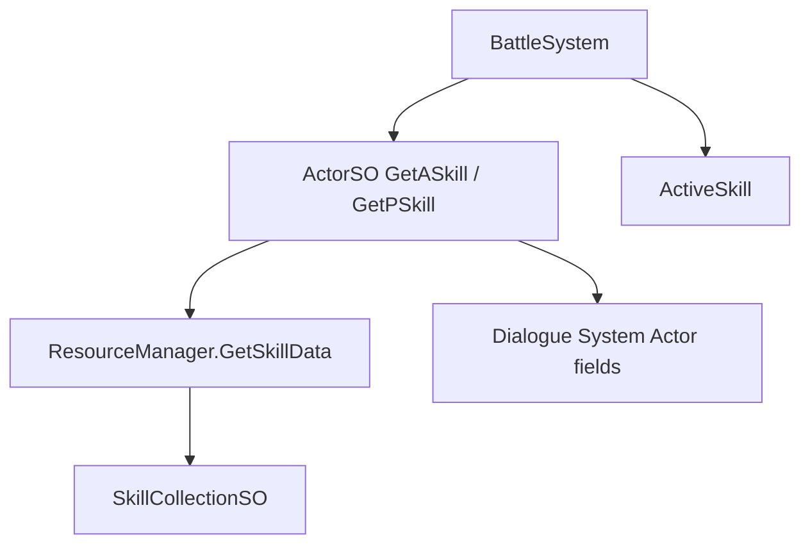

# Skill 시스템 — ⚠️ 레거시

**상태**: 레거시 (유지보수·버그픽스만, 신규 기능 금지)  
**판정일**: 2026-07-06  
**사유**: 전투·능력 표현을 **별도 시스템으로 교체할 가능성이 큼**. 인벤·아이템(`ItemDefinitionSO`) 작업과 분리하여 취급한다.

---

## 요약

| 항목 | 내용 |
|------|------|
| **하지 말 것** | 새 스킬 SO 추가, `ActiveSkill`/`PassiveSkill` 파생, `BattleSystem`·`ActorSO` 스킬 연동 확장 |
| **해도 되는 것** | 기존 맵·씬·에셋이 깨지지 않게 하는 최소 수정, 교체 시스템 설계·마이그레이션 문서화 |
| **대체 예정** | 미정 (신규 전투/능력 시스템 도입 시 이 문서의 마이그레이션 절차 참고) |

---

## 경로 (2026-07 폴더 정리 후)

### 스크립트 (SO 정의)

```
Assets/Dist/Scripts/Legacy/Skill/
├── SKILL_LEGACY.md          ← 이 문서
├── SkillSO.cs               # 추상 기반
├── ActiveSkill.cs           # 액티브 스킬 추상
├── PassiveSkill.cs          # 패시브 스킬 추상 (구현 거의 없음)
├── SkillCollectionSO.cs     # 카탈로그 SO
└── Active/
    └── MeleeAttack.cs       # 유일한 구체 액티브 구현 예시
```

**네임스페이스** (폴더와 무관, 변경 없음): `Garunnir.Runtime.ScriptableObject`

### SO 에셋

```
Assets/Dist/SOData/Gameplay/Skill/
├── 스킬목록.asset              # SkillCollectionSO 인스턴스
├── 0.이중공격.asset
├── 1.강타.asset
└── (Active/ Passive/ 하위 분류는 추후 정리 가능)
```

### 관련이지만 별도 레거시 후보

| 경로 | 비고 |
|------|------|
| `Assets/Dist/Scripts/Entity/Character/Skills.cs` | 초기 프로토타입 (`CharacterSkill` 등). **현재 런타임 미연결** |
| `Assets/Dist/Scripts/SerializedObject/ScriptableObject/ActorSO.cs` | Dialogue System `Actor` 필드에 스킬 인덱스 저장·에디터 UI |

---

## 타입 계층

```text
ScriptableObject
└── SkillSO                    # Excute(), DealDamage(), Dialogue Actor 연동
    ├── ActiveSkill            # Excute(Actor targetActor)
    │   └── MeleeAttack        # CreateAssetMenu: GameDataAsset/Character/MeleeAttack
    └── PassiveSkill           # 빈 추상 클래스

SkillCollectionSO
├── skill_Active[] : ActiveSkill[]
└── skill_Passive[] : PassiveSkill[]
```

---

## 런타임 의존 관계



| 소비자 | 역할 |
|--------|------|
| [`ResourceManager.cs`](../../../Manager/ResourceManager.cs) | `SkillCollectionSO skillCollection` 직렬화, `GetSkillData()` |
| [`ActorSO.cs`](../../../SerializedObject/ScriptableObject/ActorSO.cs) | `ConstDataTable.Actor.Skill.Active/Passive` 필드 → 카탈로그 인덱스 조회 |
| [`BattleSystem.cs`](../../../BattleSystem/BattleSystem.cs) | 턴 UI에서 `ActiveSkill.Excute(actor)` 호출 |
| [`ConstDataTable.cs`](../../../Static/ConstDataTable.cs) | `Skill.Active`, `Skill.Passive` 필드 키 |

**외부 패키지**: Pixel Crushers Dialogue System (`Actor`, `Field`)

---

## 데이터 흐름 (현재)

1. `ActorSO` / Dialogue `Actor`에 스킬 **인덱스**가 `Skill.Active0` 등 필드로 저장됨.
2. `ActorSO.GetASkill(actor, idx)`가 `ResourceManager.GetSkillData().skill_Active[value]` 반환.
3. `BattleSystem`이 액티브 스킬 목록을 UI 버튼으로 노출 후 `Excute(actor)` 실행.
4. `MeleeAttack` 등은 `DealDamage`로 `Actor` HP 필드 직접 수정 + `StringBuilder` 로그 반환.

---

## 레거시 규칙 (개발 시)

1. **신규 스킬 SO·서브클래스 추가 금지** — 교체 시스템 확정 전까지.
2. **인벤·아이템 파이프라인에 스킬 의존성 넣지 않음** — `ItemDefinitionSO` / `InventorySession`과 분리 유지.
3. **`[Obsolete]` 일괄 부착은 보류** — `BattleSystem`·`ActorSO`가 아직 참조 중. 교체 시스템 착수 시점에 단계적으로 적용.
4. **에셋 삭제 금지** — `스킬목록.asset` 등은 GM·캐릭터 SO가 참조할 수 있음.

---

## 교체 시스템 도입 시 체크리스트

- [ ] 신규 능력/전투 API 설계 문서 작성 (이 파일 하단 또는 `docs/`에 링크)
- [ ] `ActorSO` 스킬 필드(`Skill.Active*`, `Skill.Passive*`) 마이그레이션 또는 폐기
- [ ] `BattleSystem` 스킬 선택 UI 제거·대체
- [ ] `ResourceManager.GetSkillData()` 제거 또는 shim
- [ ] `SOData/Gameplay/Skill/` 에셋 보존·변환·아카이브 결정
- [ ] `Gameplay/Definitions/Skill/` 스크립트 삭제 또는 `Legacy/` 이동
- [ ] Dialogue System 연동 필드 스키마 정리

---

## 변경 이력

| 날짜 | 내용 |
|------|------|
| 2026-07-06 | 폴더 재배치: `SerializedObject/.../Skill` → `Gameplay/Definitions/Skill`, `SOData/Skill` → `SOData/Gameplay/Skill`, `Acive` → `Active` |
| 2026-07-06 | 레거시 문서 최초 작성 (교체 시스템 미정) |
