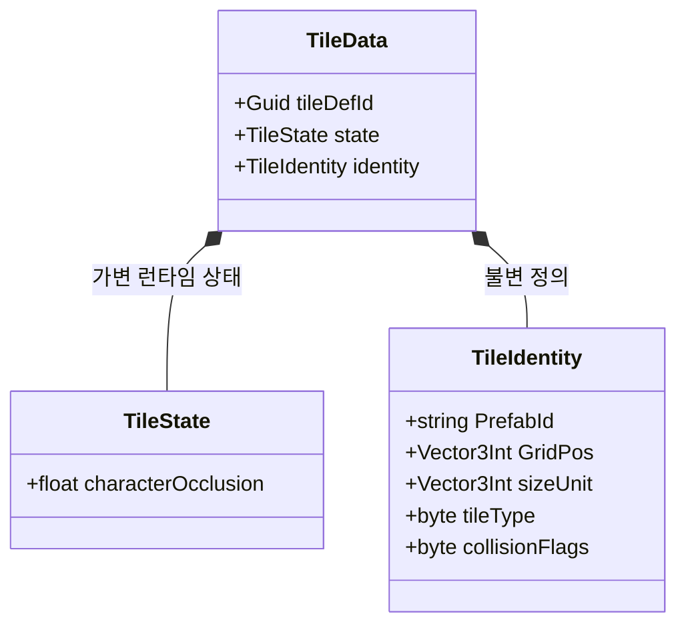

# Internal — 핵심 데이터 구조체

Unity 비의존 순수 구조체. 시스템 전체에서 공유.

---

## 필드 메모

| 필드 | 설명 |
|------|------|
| `tileDefId` | Guid — 런타임 바인딩 키. 저장하지 않으며 로드 시 `Guid.NewGuid()`로 생성. `TileMapVisualizer`가 TileData → TileView를 찾을 때 사용 |
| `characterOcclusion` | BFS 후보 여부 안에서 플레이어와 거리 등으로 표시 차단 정도 결정 (`0`=해제) |
| `PrefabId` | `TilePrefabDB` 딕셔너리 키 |
| `sizeUnit` | 점유 그리드 크기 (예: `2,1,1`) |
| `tileType` | `1`=Floor, `2`=Wall (`3`=legacy, 로드 시 `2`로 정규화), `4`=EdgeWall(JSON wallEdges). **building bake·구조 분류·visibility 레이어**용 |
| `collisionFlags` | `TileDefinition`에서 bake된 6비트 플래그. **이동 topology·physics collider·벽 오클루전** 판정 (`TileCollisionFlags`) |
| `buildingId` | bake: `0` 미할당, `-1` 광장 Floor, `>0` 건물 |
| `roomId` | 같은 buildingId·cellY 내 방 번호 |

### tileType vs collisionFlags

| 역할 | 필드 |
|------|------|
| building bake, 구조 분류, visibility 레이어 | `tileType` |
| 점유 셀 통행·논리 바닥·Physics Collider·엣지 통행·BFS 오클루전 후보 | `collisionFlags` |

### TileDefinition 필수

모든 타일은 `TilePrefabDB`에 등록된 `TileDefinition`을 가져야 합니다. JSON 로드·씬 export·배치 시 `prefabId`로 Definition lookup → `collisionFlags`·`sizeUnit` bake. Definition 없으면 **오류 로그 후 해당 타일 스킵** (tileType/prefabId 추론 폴백 없음).
