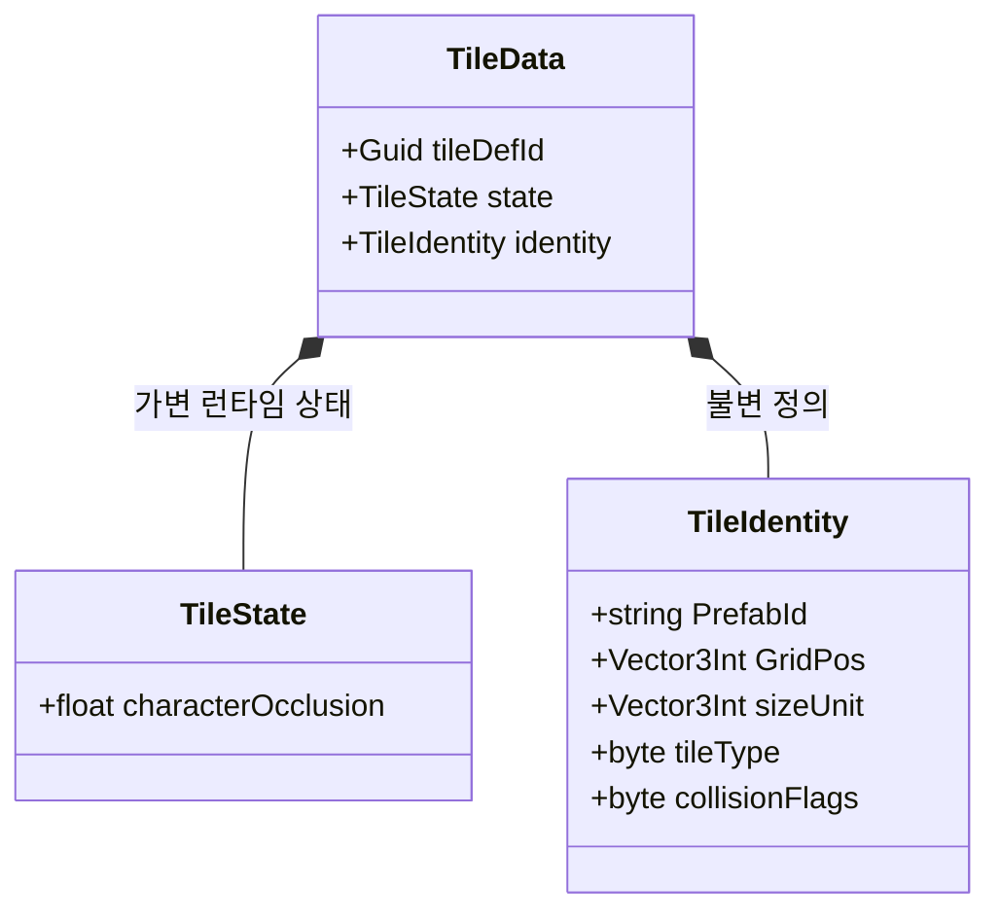

# Internal — 핵심 데이터 구조체

Unity 비의존 순수 구조체. 시스템 전체에서 공유.

## 좌표 규약

### 점유 인덱스를 우선 신뢰한다

**단일 진실원**은 bake 후 `FloorMapIndex.RebuildOccupancy`가 만든 점유 인덱스다.  
월드 좌표·시선·가시성에서 「어떤 셀에 타일이 있나」를 물을 때는 **인덱스 조회를 먼저** 한다.

- 존재 여부: `CellHasOccupancy(x, z, y)` / `HasAnyTile`
- 셀 내용: `TryGetCellTiles` + incident 면/엣지 (`CollectStructuralOccludersAtOccupiedCell` 등)
- 전역 스캔: `EnumerateOccupiedCells` (필요할 때만)

**바닥(HorizontalFace)은 그리드 층 사이 면**이지만, bake가 `CellBelow`·`CellAbove` **둘 다** 인덱스에 넣는다.  
따라서 시선·차단 코드에서 **런타임 y±1 수동 탐색을 추가하지 않는다** — 위·아래 등록은 인덱스가 이미 담당한다.

| 용어 | 의미 |
|------|------|
| **점유셀** | 인덱스에 등록된 `(x,y,z)` — 볼륨 footprint, edge 양쪽, floor `CellAbove`/`CellBelow` |
| **walkable 셀** | Floor `CellAbove` (`ProvidesLogicalFloor` 바닥 **위** 점유셀). **통행 가능 타일과 다름** |
| **막힘** | `BlocksOccupiedCells` / `BlocksEdge` 등 `collisionFlags` |
| Floor `GridPos` | 저장 앵커 = `CellBelow`. 게임플레이·가시성 좌표는 점유 인덱스 셀 |

### 월드 → 셀 (용도별 — 혼용 금지)

| 용도 | API | 설명 |
|------|-----|------|
| **플레이어가 몇 층 바닥 위?** | `OccupiedCellCoord.ResolveFromWorld` | seed `(x,y0,z)`에서 **`y--` 하향**, `CellHasOccupancy` + `CellHasFloor` + 발 높이 이하 **첫 바닥** |
| **시선 샘플·건물 차단·근접 블렌드** | `OccupiedCellCoord.TryResolveSightOccupiedCell` / `GridAtSightSampleHeight` | 차단: `ConvertWorldToGrid` + `CellHasOccupancy`. 블렌드 슬라이스: 높이만 그리드화 |
| **identity → 대표 점유셀** | `OccupiedCellCoord.PrimaryCellFromIdentity` | hub 불필요 |

**하지 말 것**

- 시선·차단·블렌드에 `ResolveFromWorld` (발밑 바닥 찾기 → 시선이 1층으로 끌려감)
- 시선 샘플마다 y±1 수동 probe (bake 인덱스와 중복·불일치)
- `ConvertWorldToGrid`만으로 **플레이어 층** 확정
- 맵 전역 Y `HashSet`/`int[]` (`distinctOccupiedCellYs`, `bandSet`), `(x,z)` 기둥 인덱스, `EnumerateOccupiedCells` 전수 필터로 층 찾기

**Y band 금지** (층 집합 캐시). **건물 sector 허용**: `buildingId`, `roomId`, bake `(buildingId, cellY)` slice.

타일 대표 점유셀(identity만): `OccupiedCellCoord.PrimaryCellFromIdentity` — hub 불필요.

---

## 필드 메모

| 필드 | 설명 |
|------|------|
| `tileDefId` | Guid — 런타임 바인딩 키. 저장하지 않으며 로드 시 `Guid.NewGuid()`로 생성. `TileMapVisualizer`가 TileData → TileView를 찾을 때 사용 |
| `characterOcclusion` | BFS 후보 여부 안에서 플레이어와 거리 등으로 표시 차단 정도 결정 (`0`=해제) |
| `PrefabId` | `TilePrefabDB` 딕셔너리 키 |
| `sizeUnit` | 점유 그리드 크기 (예: `2,1,1`) |
| `placementSlot` | `1`=OccupiedCell, `2`=VerticalFace, `3`=HorizontalFace — 배치 위치 |
| `wallFace` | VerticalFace일 때 `WallFace` (+X/+Z) |
| `floorFace` | HorizontalFace일 때 `FloorFace.PosY` (1) 필수 |
| `buildingId` | bake: `0` 미할당, `-1` 광장 Floor, `>0` 건물 |
| `roomId` | 같은 buildingId·cellY 내 방 번호 |

### HorizontalFace 좌표 규칙

| 필드 | 의미 |
|------|------|
| `GridPos` | **anchor** = `CellBelow` (EdgeWall의 앵커와 동일한 역할) |
| walkable 셀 | 저장하지 않음 — `OccupiedCellCoord.PrimaryCellFromIdentity` = `CellAbove` 파생 |
| 월드 pose Y | `CellAbove.y * cellSize` (격자 경계, 정수) |
| JSON | `floorFaces[]`의 `x,y,z` = anchor. `tiles[]` Floor 로드 없음 |

### placementSlot vs collisionFlags

| 역할 | 필드 |
|------|------|
| 배치 위치(셀/면), building bake·visibility | `placementSlot` |
| 점유 셀 통행·논리 바닥·Physics Collider·엣지 통행·BFS 오클루전 후보 | `collisionFlags` |

런타임 저장: **셀** `TileMapModel.tiles` + **면** `TileFaceBinder` (수직·수평 registry).

### TileDefinition 필수

모든 타일은 `TilePrefabDB`에 등록된 `TileDefinition`을 가져야 합니다. JSON 로드·씬 export·배치 시 `prefabId`로 Definition lookup → `collisionFlags`·`sizeUnit` bake. Definition 없으면 **오류 로그 후 해당 타일 스킵** (tileType/prefabId 추론 폴백 없음).
