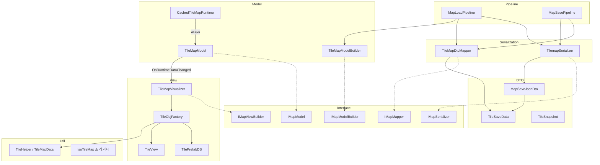
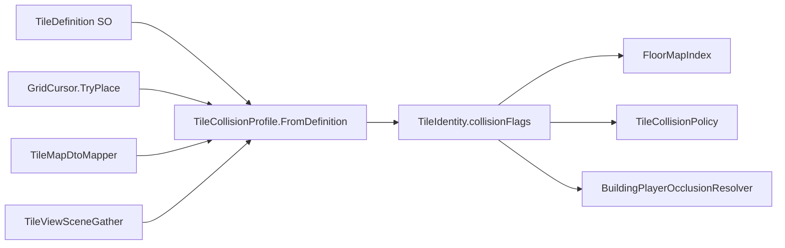

# TileMap — 핵심 로직

## 좌표 규약

→ 상세 용어·walkable 정의: [DATA.md §좌표 규약](../Internal/DATA.md) · 가시성 소비: [TILEMAP_VISIBILITY.md](TILEMAP_VISIBILITY.md)

**점유 인덱스를 우선 신뢰한다.** bake 후 `RebuildOccupancy` 인덱스가 「어떤 `(x,y,z)`에 무엇이 있나」의 단일 진실원이다.  
조회는 `CellHasOccupancy` / `TryGetCellTiles` / incident 면·엣지. 바닥 face는 bake가 `CellBelow`·`CellAbove` **둘 다** 등록하므로 시선 코드에서 y±1 수동 탐색 **하지 않는다**.

| 용도 | 방법 |
|------|------|
| 플레이어 층 | `OccupiedCellCoord.ResolveFromWorld` (발밑 바닥, `y--` 하향) |
| 시선 샘플·차단·근접 블렌드 | `ConvertWorldToGrid` → `CellHasOccupancy` true인 셀만 |
| 타일 대표 점유셀 | `OccupiedCellCoord.PrimaryCellFromIdentity` |

시선·차단에 `ResolveFromWorld` 쓰지 않음. 전역 Y 목록·기둥 인덱스 **금지**.

### 점유셀 — 통합 탐색 단위

bake·가시성·시선·building shell 태깅에서 **Wall / EdgeWall / ThickWall / Floor를 코드 경로마다 따로 나누지 않는다.**  
`Vector3Int (x,y,z)` **점유셀**이 공통 그래프 노드다. 타일 placement slot(VerticalFace 등)은 **저장·인덱스 구현 세부**일 뿐, 소비자는 **셀 단위**로 통일한다.

| API | 역할 |
|------|------|
| `CellHasOccupancy` / `HasOccupancy` | 셀에 무언가 등록됨 (OccupiedCell box + face/edge **incident** 포함) |
| **`TryCollectTilesAtOccupiedCell`** | **점유셀 SSOT 조회** — OccupiedCell + incident VerticalFace + HorizontalFace 전부 |
| `TryGetCellTiles` | OccupiedCell 박스 타일만 (저수준; 신규 코드는 collect 우선) |
| `FaceBinder.AppendWallFacesAtCell` 등 | 레거시·FaceBinder 직접 접근 시에만 |
| `TileIdentityUtil.CollectAffectedCells` | 타일이 차지하는 **전체** 점유 footprint |
| `EnumerateOccupiedCells` | bake 인덱스 전체 순회 |

**신규·수정 코드 규칙**: ad-hoc 타일 종류 루프 대신 **`TryCollectTilesAtOccupiedCell` → footprint(`CollectAffectedCells`)** 패턴을 쓴다.  
walkable floor·structural shell 모두 **점유셀 그래프** 위에서 bake한다. 상세: [건물 bake §점유셀 = bake 기본구조](TILEMAP_BUILDING_BAKE.md#점유셀--bake-기본구조).

#### 점유셀 = 기본 구조 (필수)

**맵 탐색·bake·building 그룹핑의 근본 단위는 `Vector3Int` 점유셀 하나다.**

| 원칙 | 내용 |
|------|------|
| **노드** | 그래프 노드 = 점유셀 `(x,y,z)`. `(x,z)` slice 좌표·타일 종류별 루프·pass 이름만으로 **두 번째 그래프를 만들지 않는다** |
| **조회** | `TryCollectTilesAtOccupiedCell` → `CollectAffectedCells` footprint |
| **엣지** | 연결 규칙만 다름 — 모두 **점유셀 쌍** (FloorHorizontal cardinal, Structural6, ColumnUp 등) |
| **금지** | walkable `(x,z)` BFS + merge 스캔 + occupied-cell flood를 **서로 다른 기본 구조**로 병렬 유지 |
| **예외** | `FloorRoomFloodFill`(roomId)은 buildingId 확정 **후** slice partition — building component SSOT **아님** |

신규 bake scratch·Union-Find·flood는 **`Dictionary<Vector3Int, …>`** 기준.

**Floor face와 Edge wall**: 배치 slot만 다를 뿐 **§4에서 동일 structural face** — `buildingId` flood만 동일 취급 ([대전제](TILEMAP_BUILDING_BAKE.md) §3). §7 leak과 혼동 금지.

## 내부 의존성 다이어그램

---

## 파일별 역할

### Interface
- **MapInterfaces.cs** — `IMapModel`, `IMapModelReadOnly`, `IMapViewBuilder`, `IMapSerializer`, `IMapMapper`, `IMapModelBuilder` 정의

### DTO
- **MapSaveJsonDto.cs** — JSON 루트 (`List<TileSaveData>`)
- **TileSaveData.cs** — 타일 1개 직렬화 (`x,y,z`, `sizeX,Y,Z`, `prefabId`, `tileType`)
- **TileSnapshot.cs** — 셀 스냅샷 (읽기 전용, 뮤테이션 없음)

### Model
- **TileMapModel.cs** — `Dictionary<Vector3Int, List<TileData>>`, 이벤트, BFS 오클루전
- **TileMapModelBuilder.cs** — `MapModelDTO → new TileMapModel().Initialize()`
- **CachedTileMapRuntime.cs** — Decorator, 청크 인덱스 래퍼 (topology cache와 별도)

### Cache (`TileMap/Cache/`)
- **TileMapCacheHub.cs** — topology·building·cellY·room geometry 통합 조회·무효화 진입점
- **FloorMapIndex.cs** — 셀·엣지·점유 (x, y, z) 인덱스
- **BuildingGroupRegistry.cs** — buildingId·광장(MinCellY) 바닥 XZ·room edge 역인덱스·**BuildingExtent**(slice footprint + AABB — [bake §6](TILEMAP_BUILDING_BAKE.md))
- **RoomKey.cs** — (buildingId, cellY, roomId) 캐시 키
- **FloorRoomFloodFill.cs** — 방 BFS 계산 (결과는 Hub가 캐시)

소비자(`BuildingGroupBuilder`, `PlayerFloorVisibilityPolicy`, `ProximitySightLineBlendPipeline`)는 `TileMap/` 루트에 두고 Hub만 참조.

### 맵 의미 bake / 런타임 읽기

| 경로 | 위치 | 규칙 |
|------|------|------|
| **쓰기** | `BuildingGroupBuilder` (`AssignAll`, slice rebuild) | outdoor·buildingId·room·BFS geometry bake — [건물 bake 논리](TILEMAP_BUILDING_BAKE.md) |
| **저장** | `TileMapModel` floor ids, `BuildingGroupRegistry`, `Hub.Rooms`/`CellYGeometry` | 역할별 분리(효율) |
| **읽기** | `TileMapCacheHub` / `BuildingLayer` | `IsOutdoorEvaluation`, `TryGetFloorBuildingRoom` — **buildingId로 야외 추론 금지** (bake: `0` 미할당, `-1` 광장 Floor, `>0` 건물) |

**buildingId bake (column-up)** — 논리 SSOT: [TILEMAP_BUILDING_BAKE.md](TILEMAP_BUILDING_BAKE.md) (구조 변경 전까지 재합의 불필요)

요약:

1. **minCellY seed** — room BFS → unassigned floor에 buildingId.
2. **same slice** — **floor**에 buildingId (column-up); structural shell은 §4 **occupied-cell flood**.
3. **column-up** — vertical probe·entry column으로 위 slice.
4. **floor merge** — 인접 floor id 충돌 시 min id 흡수 (구름다리, plaza 제외).
5. **room** — building×slice room BFS·perimeter → wall tag.

점유 조회는 [§점유셀](#점유셀--통합-탐색-단위) API만 사용. 폐기된 **floor-seed structural shell BFS**·structural merge는 **사용하지 않음**. §4 shell은 **floor 시드 점유셀 → occupied-cell flood**만.

### 층 가시성·가려짐

→ **상세 조건·표·흐름도**: [TILEMAP_VISIBILITY.md](TILEMAP_VISIBILITY.md)  
(층 hide diff·근접 에드온 blocking·BFS 오클루전 — 3시스템 분리)

### Serialization
- **TilemapSerializer.cs** — `JsonUtility` 기반 파일 읽기/쓰기
- **TileMapDtoMapper.cs** — `MapSaveJsonDto ↔ MapModelDTO` 변환

### Pipeline
- **MapLoadPipeline.cs** — Read → ToPrepared → Build 조합
- **MapSavePipeline.cs** — `Save()` / `SaveAsync()` / `SaveSafeAsync()` (Newtonsoft 스트리밍)

### View
- **TileMapVisualizer.cs** — `Dictionary<Guid, TileView>` 추적, Bind/Build/RefreshCell. Model이 이벤트로 보낸 `TileData.tileDefId`로 대응하는 TileView를 조회해 업데이트
- **TileObjFactory.cs** — PrefabDB 조회 → Instantiate → TileView 초기화
- **TilePrefabDB.cs** — ScriptableObject, `string → GameObject`·`TileDefinition` 캐시
- **TileDefinition.cs** — 타일 SO: prefabId, size, **충돌·오클루전** (`TileOccupiedCellCollision` / `TileEdgeCollision`)
- **TileView.cs** — 타일 MB, `UpdateTile()`, 씬뷰 기즈모

### TileDefinition — 충돌·오클루전 bake

- **점유 셀** (`occupied`): 논리 바닥, Physics Collider, 통행·오클루전 연동 토글 (`blocksPassageAndOcclusion`). `splitPassageAndOcclusion=true`이면 통행(`blocksOccupiedCells`)·오클루전(`occludesOccupiedCells`) 개별 제어.
- **엣지** (`edge`): 동일 패턴 — `blocksPassageAndOcclusion` / `splitPassageAndOcclusion` → `BlocksEdge` / `OccludesEdge`.
- **소비**: `FloorMapIndex`, `MapTopologyGridSegment`, `TileCollisionPolicy`, `BuildingPlayerOcclusionResolver` 등은 **`tileType`이 아닌 `collisionFlags`** 사용. 근접 블렌드(§3) 강도는 `collisionFlags`가 아닌 카메라↔플레이어 3D 선분 거리.
- **에디터 마이그레이션**: `Tools/Map/Apply collision presets to TileDefinitions`

### Util
- **TileMapData.cs** (클래스: TileHelper) — `WorldToGrid` / `GridToWorld` 변환
- **IsoTileMap.cs** — ⚠️ 레거시, 현재 미사용

### Debug
- **Debug/DebugTileRunner.cs** — BFS 기즈모 콜백 홀더 (`IFrameState`)

---

## 레이어 설계 원칙

| 레이어 | 알아도 되는 것 | 알면 안 되는 것 |
|--------|--------------|----------------|
| **Model** (`TileMapModel`) | `TileData` (순수 데이터) | `TileView`, `GameObject` 등 뷰 일체 |
| **Visualizer** (`TileMapVisualizer`) | `TileData`, `TileView`, `Guid` 매핑 | Model 내부 구현 |
| **View** (`TileView`) | 자신의 시각 상태 | `TileData`, Model |

`tileDefId`는 Model과 Visualizer 사이의 계약 — Visualizer가 어떤 TileView를 갱신해야 하는지 찾기 위한 런타임 전용 키.

---

## 런타임 데이터 계층 (조회·동기화)

| 계층 | 역할 | 조회 API |
|------|------|----------|
| **TileMapModel** `tiles` + `TileFaceBinder` | 쓰기 진실원 | `SetTile` / `RemoveTile` / `PatchTileIdentity` |
| **`_tilesById`** | Guid → `TileData` 파생 인덱스 | `TryGetTileById` (bake 후 `ReindexTilesByIdFromRuntime`) |
| **TileMapCacheHub** | topology·building·room bake 캐시 | `TryGetCellTiles` (스트리밍 시 Model이 hub 경유) |
| **OccupiedCellCoord** | 월드·identity → 점유셀 | 플레이어: `ResolveFromWorld`. 시선 차단: `TryResolveSightOccupiedCell`. 블렌드: `GridAtSightSampleHeight`. identity: `PrimaryCellFromIdentity` |

**규칙**

- **점유 인덱스 우선**: 존재·차단·시선 후보는 `CellHasOccupancy` / bake 인덱스. 시선에 `ResolveFromWorld`·y±1 probe 금지 (→ §좌표 규약).
- 셀 타일 읽기: `IMapModel.TryGetCellTiles` (hub topology 우선, 없으면 앵커 셀 dict 폴백).
- 점유 셀 순회: `IMapModel.EnumerateOccupiedCells` (Builder·전역 스캔 동일).
- ID 읽기: `TryGetTileById`만 사용. `tiles` dict 직접 접근 금지(어셈블리 `internal`).
- `BuildingGroupBuilder` / `BuildingVerticalLink` / 오클루전 셀 조회는 `IMapModel` API 사용. `FloorRoomFloodFill`용 `_topology.Index`만 hub 직접 참조.
- 전역 타일 읽기·집계: `IMapModelReadOnly.TilesSnapshot` (시점 스냅샷).
- 면 타일 읽기: `ITileFaceBinderReadOnly.CopyWallFacesTo` / `CopyFloorFacesTo` (`WallFaceIndex` 직접 `foreach` 지양).
- bake 중 identity 수정 순회: `IMapModel.ForEachRuntimeTileMutating` (내부 스냅샷, `PatchTileIdentity` 허용).
- bake로 `buildingId`/`roomId` 변경: `PatchTileIdentity` 또는 bake 배치 종료 시 재색인.
- building/room BFS·edge 집계: `CacheHub` / `BuildingGroupBuilder` (셀 조회와 질문이 다름).

---

## 근접 시선 블렌드

현재 구현은 `ProximitySightLineBlendPipeline`(카메라↔플레이어 3D 세그먼트 XZ `RadiusCells` + 3D 선분 수직 거리 가림 강도)입니다.  
상세는 [TILEMAP_VISIBILITY.md §3](TILEMAP_VISIBILITY.md)를 참고하세요.
