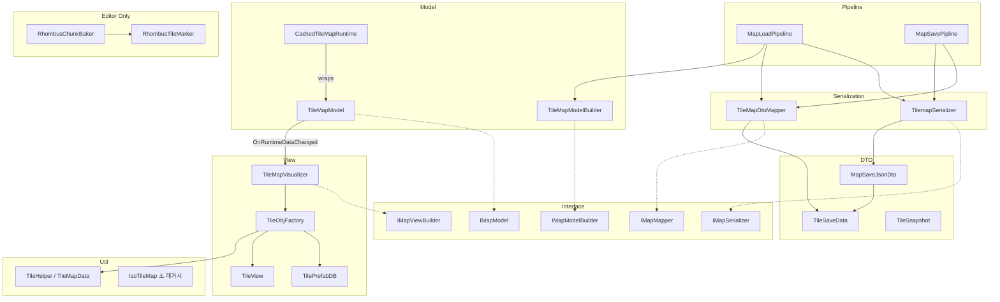

# TileMap — 핵심 로직

## 내부 의존성 다이어그램

---

## 파일별 역할

### Interface
- **MapInterfaces.cs** — `IMapModel`, `IMapModelReadOnly`, `IMapViewBuilder`, `IMapSerializer`, `IMapMapper`, `IMapModelBuilder` 정의

### DTO
- **MapSaveJsonDto.cs** — JSON 루트 (`List<TileSaveData>`)
- **TileSaveData.cs** — 타일 1개 직렬화 (`x,y,z`, `sizeX,Y,Z`, `prefabId`, `tileType`)
- **TileSnapshot.cs** — 셀 스냅샷 (읽기 전용, 뮤테이션 없음)

### Model
- **TileMapModel.cs** — `Dictionary<Vector3Int, List<TileData>>`, 이벤트, BFS 오클루전
- **TileMapModelBuilder.cs** — `MapModelDTO → new TileMapModel().Initialize()`
- **CachedTileMapRuntime.cs** — Decorator, 청크 인덱스 래퍼 (topology cache와 별도)

### Cache (`TileMap/Cache/`)
- **TileMapCacheHub.cs** — topology·building·band·room geometry 통합 조회·무효화 진입점
- **FloorMapIndex.cs** — 셀·엣지·점유 (x,z,band) 인덱스
- **BuildingGroupRegistry.cs** — buildingId·광장(minBand) 바닥 XZ·room edge 역인덱스
- **RoomKey.cs** — (buildingId, band, roomId) 캐시 키
- **FloorRoomFloodFill.cs** — 방 BFS 계산 (결과는 Hub가 캐시)

소비자(`BuildingGroupBuilder`, `PlayerFloorVisibilityPolicy`, `WallOcclusionFinder`)는 `TileMap/` 루트에 두고 Hub만 참조.

### 맵 의미 bake / 런타임 읽기

| 경로 | 위치 | 규칙 |
|------|------|------|
| **쓰기** | `BuildingGroupBuilder` (`AssignAll`, slice rebuild) | outdoor·buildingId·room·BFS geometry bake |
| **저장** | `TileMapModel` floor ids, `BuildingGroupRegistry`, `Hub.Rooms`/`Bands` | 역할별 분리(효율) |
| **읽기** | `TileMapCacheHub` / `BuildingLayer` | `IsOutdoorEvaluation`, `TryGetFloorBuildingRoom` — **buildingId==0 야외 추론 금지** |

### 층 가시성·가려짐

→ **상세 조건·표·흐름도**: [TILEMAP_VISIBILITY.md](TILEMAP_VISIBILITY.md)  
(층 스트리밍 despawn, 벽 BFS 오클루전, 야외 시선 차단 흔적 — 3시스템 분리 정리)

### Serialization
- **TilemapSerializer.cs** — `JsonUtility` 기반 파일 읽기/쓰기
- **TileMapDtoMapper.cs** — `MapSaveJsonDto ↔ MapModelDTO` 변환

### Pipeline
- **MapLoadPipeline.cs** — Read → ToPrepared → Build 조합
- **MapSavePipline.cs** — `Save()` / `SaveAsync()` / `SaveSafeAsync()` (Newtonsoft 스트리밍)

### View
- **TileMapVisualizer.cs** — `Dictionary<Guid, TileView>` 추적, Bind/Build/RefreshCell. Model이 이벤트로 보낸 `TileData.tileDefId`로 대응하는 TileView를 조회해 업데이트
- **TileObjFactory.cs** — PrefabDB 조회 → Instantiate → TileView 초기화
- **TilePrefabDB.cs** — ScriptableObject, `string → GameObject` 캐시
- **TileView.cs** — 타일 MB, `UpdateTile()`, 씬뷰 기즈모

### Util
- **TileMapData.cs** (클래스: TileHelper) — `WorldToGrid` / `GridToWorld` 변환
- **IsoTileMap.cs** — ⚠️ 레거시, 현재 미사용

### Editor Only
- **RhombusChunkBaker.cs** — 자식 타일 → 단일 MeshCollider 베이킹. Largest-Rect-First 알고리즘으로 인접 타일을 최대 직사각형으로 병합해 정점 수 최소화. → 상세: [CHUNK_BAKER.md](CHUNK_BAKER.md)
- **RhombusTileMarker.cs** — 베이킹 대상 마커 (빈 MB)

### Debug
- **Debug/DebugTileRunner.cs** — BFS 기즈모 콜백 홀더 (`IFrameState`)

---

## 레이어 설계 원칙

| 레이어 | 알아도 되는 것 | 알면 안 되는 것 |
|--------|--------------|----------------|
| **Model** (`TileMapModel`) | `TileData` (순수 데이터) | `TileView`, `GameObject` 등 뷰 일체 |
| **Visualizer** (`TileMapVisualizer`) | `TileData`, `TileView`, `Guid` 매핑 | Model 내부 구현 |
| **View** (`TileView`) | 자신의 시각 상태 | `TileData`, Model |

`tileDefId`는 Model과 Visualizer 사이의 계약 — Visualizer가 어떤 TileView를 갱신해야 하는지 찾기 위한 런타임 전용 키.

---

## BFS 벽 오클루전

현재 구현은 `WallOcclusionFinder`(방 BFS + +X/-Z 방향 벽 + 거리 곡선)입니다.  
레거시 `GetOccludingWalls` 요약은 [TILEMAP_VISIBILITY.md §3](TILEMAP_VISIBILITY.md)를 참고하세요.
