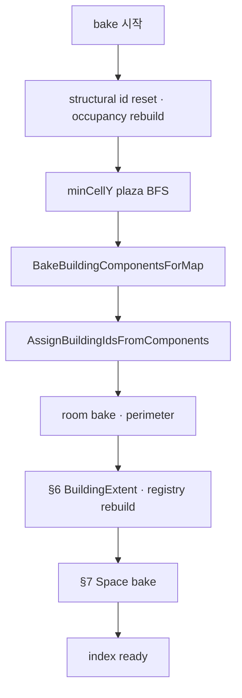
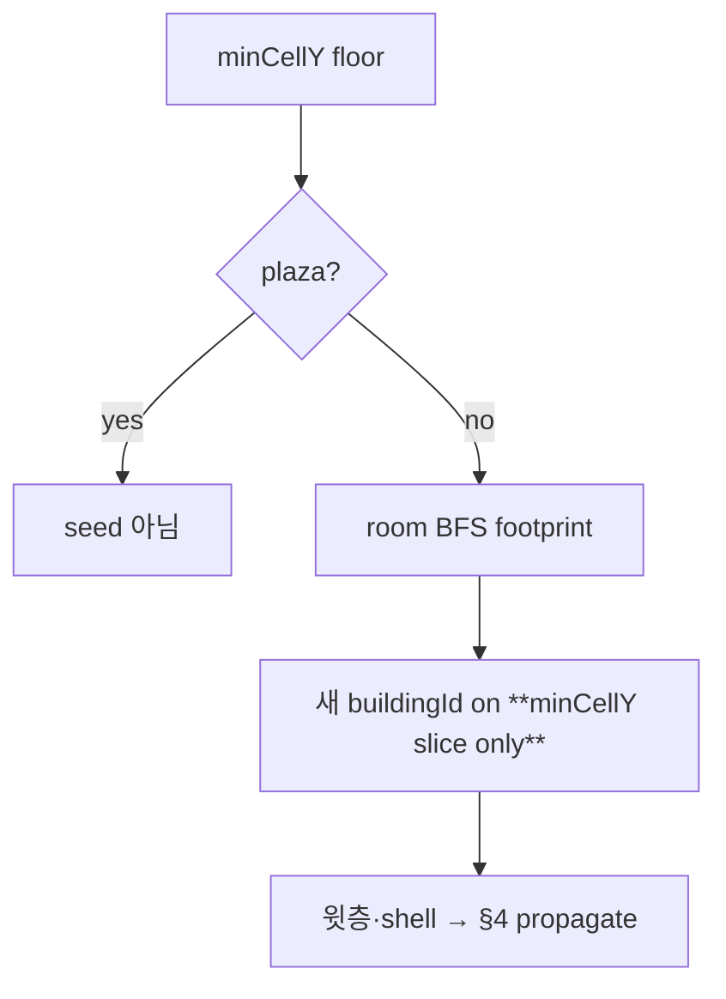
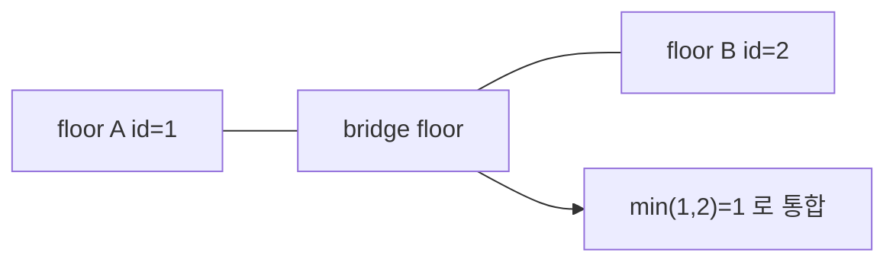
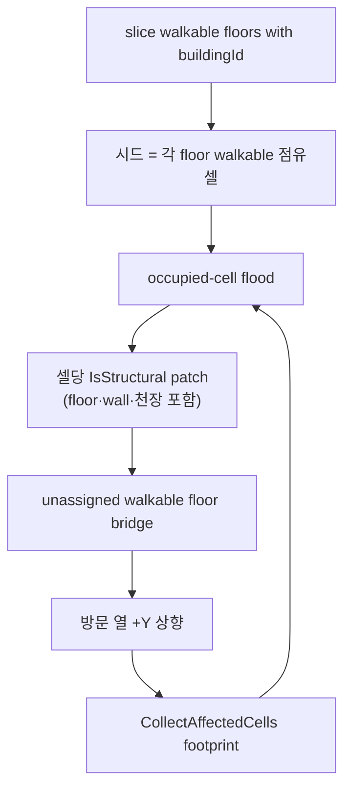
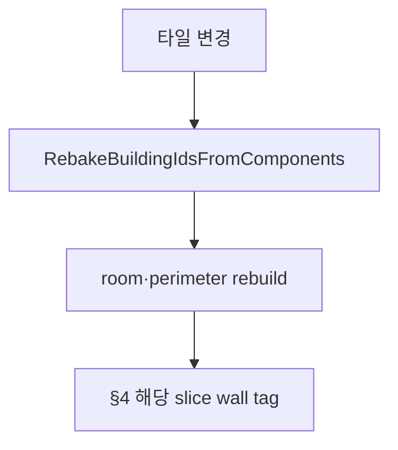
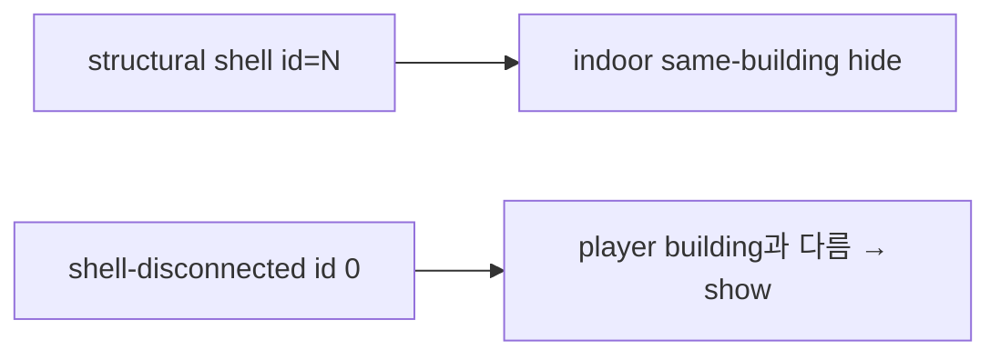

# TileMap — building·room bake 논리

맵 로드 시 **buildingId·plaza(야외)·roomId** 의미를 bake하는 규칙만 정리한다.

**이 문서가 bake 논리의 SSOT다.** 구현·리뷰·가시성 질문은 여기를 기준으로 하고, **논리 구조를 바꾸지 않는 한 다시 합의하지 않는다.**  
구현 심볼·좌표 매핑은 [TILEMAP.md](TILEMAP.md). 가시성은 [TILEMAP_VISIBILITY.md](TILEMAP_VISIBILITY.md).

---

## 대전제 (합의·재논의 금지)

1. **`collisionFlags`(논리 충돌)로 Space `isOutdoor` / 실내·야외 leak를 판정하지 않는다.**  
   오류·오탐 — [§5.1.1](#511-논리-충돌과-밀폐-추론-비대칭). room BFS·시선 occlusion용이지 **야외 분기·밀폐 증명**용이 아님.
2. **§7 `isOutdoor` 입력** = `buildingId` · `floorFootprint[cellY]` · `BuildingExtent` · 점유 인덱스(`TryGetCellTiles`) **만**.
3. **Floor face = Edge wall 동일** = [§4](#4-occupied-cell-flood--열-상향-shell-전파) `buildingId` flood (`IsStructural`) **한정**. §7 leak과 **혼동 금지**.
4. `isOutdoor=false`는 **물리 밀폐 증명이 아님** — topology상 plaza·타 building·개방 천장(`maxStructuralY` 초과) **미연결**일 때만 실내 **분기**.
5. **building·component bake = 점유셀 그래프만** — [§점유셀 = bake 기본구조](#점유셀--bake-기본구조). `(x,z)` slice 전용 pass·타일 종류별 id 전파 pass **금지**.

---

## 점유셀 = bake 기본구조

**building component·`buildingId` 확정은 점유셀 단일 그래프에서만 수행한다.**  
[TILEMAP.md §점유셀](TILEMAP.md)과 동일 전제.

### 노드·scratch

- **노드:** `Vector3Int` 점유셀 (walkable floor·structural shell 동일 좌표계)
- **bake scratch:** component·Union-Find — **점유셀 키** (`(x,z)` 별도 맵 금지)

### 엣지 종류 (별도 pass가 아님)

| 엣지 | 의미 |
|------|------|
| **FloorHorizontal** | 같은 `cellY` walkable floor 점유셀 cardinal 인접 (`SeparatesRoom`·solid wall 차단 동일) |
| **Structural6** | 점유셀 6방향 + `CollectAffectedCells` footprint |
| **ColumnUp** | 방문 열 `+Y` 상향 |

### 배치 union 라운드

시드·0 흡수·구름다리·shell은 **라운드마다**:

1. FloorHorizontal·0 footprint **union 후보 전부 수집**
2. Union-Find **한 번에** `Union`
3. component별 structural flood 1회

최대 `MaxComponentBakeRounds`(3). flood가 새 floor를 열면 다음 라운드에서 union 후보 추가.  
**`buildingId` 양수는 `AssignBuildingIdsFromComponents()` 맨 마지막에만** — bake 중 `0`/`-1`만.

---

## 왜 structural shell에서 floor 기준으로 번복했는가

> **나중에 까먹지 않도록 — 설계가 바뀐 이유.**

### 당시 문제 (structural shell BFS)

floor seed에서 **structural끼리 cardinal multi-hop** (floor→wall→wall→…)으로 `buildingId`를 wall에 붙이는 모델이었다.

| 의도 | 부작용 |
|------|--------|
| ThickWall·EdgeWall id 누락 방지 | 방에서 **멀리 떨어진 벽 체인**까지 같은 `buildingId` |
| 구름다리 등 structural 연결 시 merge | indoor floor hide가 **의도보다 넓은 범위**에 적용 |
| structural merge pass | plaza floor가 다리가 되어 **떨어진 building 전체 통합** (버그) |

가시성: indoor hide는 `tile buildingId == player buildingId`. shell로 멀리까지 id가 붙으면 **방 근처가 아닌 긴 외벽·지붕도 같은 building으로 hide** → 현장에서 “건물이 이상하게 가려진다”.

### 현재 결론 (floor SSOT)

| 원칙 | |
|------|---|
| **buildingId SSOT** | **walkable floor 시드** → **occupied-cell flood**(+열 상향)로 floor·shell **단일 전파** |
| **wall / EdgeWall / HorizontalFace** | flood가 **같은 buildingId**로 patch — 타일 종류별 분기 **금지** |
| **wall–wall 단독 전파 없음** | bake 시 벽끼리만 id 전파 **안 함** — floor 시드 점유셀 그래프만 |
| **구름다리 merge** | **floor끼리 cardinal 인접** → component union (plaza 제외). id는 맨 마지막 할당 |

structural shell BFS·structural merge pass는 **폐기**.

---

## 용어

| 용어 | 의미 |
|------|------|
| **minCellY** | 맵에서 가장 아래 floor가 있는 층 |
| **column** | 같은 (x,z), Y만 다른 칸들 |
| **room** | building×slice에서 room BFS로 묶인 **connected walkable floor (x,z)**. **밀폐 실내가 아님** — 개방 영역(발코니·난간 없는 테라스·개방 복도 등)도 동일 규칙으로 하나의 room이 될 수 있음 |
| **roomId** | 위 room에 부여되는 slice-local id (양수). **실내/야외·밀폐 여부와 무관** |
| **room BFS** | 한 층에서 `SeparatesRoom`·`BlocksEdge` edge·solid wall 경계 안 connected floor (x,z) 탐색 — **2D slice만**, +Y 없음 |
| **seed** | room BFS 시작 floor 칸 (building footprint용) |
| **footprint** | room BFS 한 번에 묶인 (x,z) 집합 |
| **buildingId** | bake 후 floor·structural shell에 붙는 id (양수) |
| **structural shell** | `IsStructural` 타일 전부 — flood 시 **HorizontalFace(바닥·천장) 포함** |
| **occupied-cell flood** | building floor **시드 점유셀**에서 6방향·footprint로 shell에 `buildingId` 전파 — [TILEMAP.md §점유셀](TILEMAP.md) |
| **shell-disconnected** | floor 시드와 **점유셀 그래프**로 연결되지 않아 id 0 — hide 대상 아님 (의도) |
| **plaza** | minCellY 야외 floor (building 아님) |
| **vertical link** | column에서 **Y+1**에 structural 있음 |
| **entry column** | vertical link로 위 slice에 진입하는 (x,z) |
| **BuildingExtent** | bake 후 `buildingId`별 **공간 인덱스** — §6. slice별 floor 칸 집합 + building 전체 AABB + `maxStructuralY` |
| **AABB** | Axis-Aligned Bounding Box. building **전체** 점유셀의 min/max X·Y·Z **상자 하나** (§6). slice마다 상자를 두는 것 **아님** |
| **floorFootprint[cellY]** | 한 slice에서 해당 `buildingId` walkable floor가 있는 **(x,z) 칸 집합** — AABB가 아닌 **정확한 칸 목록** |
| **structural face** | **HorizontalFace**(Floor)와 **VerticalFace**(EdgeWall·벽)는 **배치 방향만 다른 동일 개념** — §4 `buildingId` flood에서 **종류별 분기 금지** (대전제 §3) |

핵심: **시드 = walkable floor**. **buildingId 부여 = §4 occupied-cell flood 단일 경로**. column-up·이중 write **금지** — [TILEMAP.md §점유셀](TILEMAP.md).

### buildingId bake 값 (고정)

| 값 | 의미 | 전파 원점 | 전파 대상 |
|----|------|-----------|-----------|
| **-1** | plaza / outdoor (`BuildingIdOutdoor`) | **아님** | **아님** (덮어쓰기 금지) |
| **0** | 미할당 (`BuildingIdUnassigned`) | **아님** | **됨** (§2.2·§4·orphan) |
| **&gt;0** | building | **됨** | — |

코드 SSOT: `BuildingGroupBuilder.CanPropagateBuildingIdFrom` → `buildingId > 0` 만 merge·flood·§2.2 시드.

---

## 전체 흐름



| phase | 산출 | tile buildingId | roomId |
|-------|------|-----------------|--------|
| outdoor | plaza `-1` | -1 / 0 | 0 |
| component bake | `_occupiedComponent` scratch | **0** (plaza -1) | 0 |
| **AssignBuildingIdsFromComponents** | floor·shell stamp | **>0** | 0 |
| room bake | perimeter | >0 | >0 |
| extent rebuild | `BuildingExtent` | — | — |
| Space bake | `SpaceId` + `isOutdoor` | — | — |

---

## 1. minCellY plaza

| 단계 | 규칙 |
|------|------|
| seed | minCellY floor 한 칸에서 room BFS |
| 결과 | 바깥과 connected min floor → **plaza** |
| 이후 | plaza (x,z)는 building seed·footprint·merge에서 **제외** |

plaza는 런타임 outdoor 판정에 쓴다. **buildingId만으로 outdoor 추론 금지.**

---

## 2. minCellY building seed (slice only)



**column-up으로 윗층 floor에 buildingId를 붙이지 않는다.** 윗층·벽·천장은 §4에서 시드 floor와 **점유셀 그래프**로 일괄 전파한다.

### 2.1 floor 인접 충돌 → 흡수 (구름다리)

**structural이 아니라 floor끼리** cardinal 인접으로 서로 다른 `buildingId`가 맞닿으면 **min id가 흡수**.



| | |
|---|---|
| **감지** | 같은 slice에서 cardinal 인접 floor, 둘 다 `buildingId > 0`, 서로 다름 |
| **plaza 제외** | plaza/outdoor floor는 merge 그래프에 **넣지 않음** |
| **흡수** | `canonical = min(id)`, 나머지 floor·structural 전부 canonical |
| **시점** | seed·orphan **이후** 1차 merge, §4 propagate **이후** 2차 merge — room bake **이전** |

### 2.2 building 인접 → 미할당(0) 흡수

| | |
|---|---|
| **의미** | `buildingId==0` = **아직 building id 미부여** (plaza `-1`과 별도) |
| **규칙** | slice에서 `buildingId>0` floor에 **cardinal 인접**한 **연결된 0 footprint** 전체에 동일 id |
| **시점** | minCellY seed **직후**, §4 propagate **이후** 각 1회 이상 (fixpoint) |
| **편집** | `HandleSetOrApply`에서도 동일 — 나중에 건물이 인접 연결되면 0이 흡수됨 |

당장 건물 옆에 짓지 않아도, 이후 floor·shell로 연결되면 propagate·이 pass가 id를 붙인다. **고립 0만** §2.3 orphan.

### 2.3 orphan slice seed (고립 0만)

아직 `buildingId==0` 인 walkable floor 중 **§2.2·§4 후에도 남은** footprint → 새 buildingId → **해당 slice만** `SetFloorBuildingRoom`. column-up **없음**.

---

## 3. slice footprint assign (시드·orphan 공통)

| 상황 | 규칙 |
|------|------|
| **minCellY seed** | min **footprint**에 buildingId (**한 slice**) |
| **orphan** | propagate·§2.2 **이후에도 고립** `0` footprint에만 새 id |
| **윗층 floor** | 시드 단계에서 assign **안 함** — §4 flood·bridge·열 상향 |
| 다른 building floor | skip (overwrite 안 함) |
| plaza | exclude |

---

## 4. buildingId propagate (occupied-cell flood)

**room bake 이전** 실행. 점유셀 API 규약: [TILEMAP.md §점유셀](TILEMAP.md).



| 규칙 | |
|------|---|
| **시드** | `buildingId`별 **모든 slice** walkable floor 점유셀 + floor face `CollectAffectedCells` footprint |
| **전파** | building당 flood **1회** — 시드에서 **6방향** 인접 점유셀 + patched 타일 `CollectAffectedCells` (slice마다 끊지 않음) |
| **태깅 대상** | `TryCollectTilesAtOccupiedCell` 결과 중 **`IsStructural` 전부** — Wall·EdgeWall·ThickWall·**HorizontalFace** 별도 분기 금지 |
| **HorizontalFace** | flood patch **포함** — 바닥·천장 face가 벽과 **동일 buildingId** |
| **buildingId** | 해당 slice floor의 `buildingId` (floor SSOT) |
| **roomId** | perimeter가 붙인 값 **유지** |
| **차단** | 다른 building walkable floor · plaza/outdoor · 이미 다른 `buildingId > 0` structural |
| **plaza 보호** | `BuildingIdOutdoor`(-1) 타일은 flood patch **덮어쓰기 금지** — merge도 `<=0` id는 흡수 대상 아님 |
| **floor bridge** | `buildingId==0` walkable floor는 **통과 가능** — 벽 shell이 닿으면 floor에 `buildingId` 부여 후 footprint enqueue |
| **shell-disconnected** | floor 시드와 점유 그래프로 **연결 안 됨** → id 0 (의도) |

폐기된 floor-seed **structural shell BFS**(floor footprint에서 멀리 외벽까지 multi-hop)와 다르다. 시드는 **floor 점유셀만**, 확장은 **점유 연결 shell**뿐이다.

```text
  [F][F]     시드 = F 점유셀
   ‖ ‖      flood → 인접·footprint로 연결된 T·상부 span에 id
  [T][T]
```

---

## 5. room bake

buildingId 붙은 뒤 **building × slice**: room BFS → `roomId`, `TagPerimeter`, EdgeWall index.

도구: `FloorRoomFloodFill`. column-up과 **별 phase**.

### 5.1 room은 개방 영역일 수 있다

**`room` / `roomId`는 “밀폐된 실내 방”이 아니다.** bake 용어로 room은 **한 building × 한 slice 안에서 연결된 walkable floor (x,z) 묶음**뿐이다.

| 구분 | 내용 |
|------|------|
| **같은 room이 되는 경우** | `SeparatesRoom`·`BlocksEdge` edge·`BlocksOccupiedCells`(solid wall)로 **막히지 않은** floor끼리 cardinal 연결 |
| **개방 영역 예** | 난간·낮은 턱만 있는 발코니, 개방형 로비, 건물 안 뚫린 복도, 테라스형 floor — 벽으로 room BFS가 쪼개지지 않으면 **하나의 roomId** |
| **roomId가 보장하지 않는 것** | 밀폐·천장 유무·야외 연결·플레이어 실내/야외 — **별도 판정** (plaza bake, 가시성 정책, 향후 Space bake 등) |

```text
  [개방 로비 floor]~~~[발코니 floor]   ← SeparatesRoom edge 없으면 같은 roomId
        |
   [인접 실내 floor]                   ← edge/벽으로 분리되면 다른 roomId
```

Visibility 프로필의 `EmptyDiscovered`는 room **바깥** 인접 빈 칸 기록(peek·디버그용)이며, “이 room이 밀폐다”는 뜻이 **아니다**.

### 5.1.1 논리 충돌과 밀폐 추론 (비대칭)

타일 충돌은 **bake된 `collisionFlags`(논리)** 와 **Physics Collider(물리)** 가 공존한다. `UsePhysicsCollider`가 켜진 타일은 통행·막힘을 collider가 일부·전부 담당하고, `BlocksOccupiedCells`·`BlocksEdge`·`SeparatesRoom` 등 논리 비트가 **없거나 약할 수 있다** ([`TileCollisionPolicy`](Assets/Dist/Scripts/Map/MapCollision/TileCollisionRole.cs) — `WalkableOnly` vs `LogicalOnly`).

**밀폐 추론은 한 방향만 성립한다.**

| 방향 | 내용 |
|------|------|
| **허용 (→ 밀폐)** | 해당 slice에서 `collisionFlags` 그래프가 floor를 **닫힌 루프**로 막으면 → bake·room BFS·occlusion **그래프 안**에서는 **밀폐로 취급** |
| **금지 (¬밀폐 추론)** | 논리 비트가 비거나 bake 그래프상 열려 있다고 해서 **반드시 비밀폐·야외**로 결론 내리지 않음 — `UsePhysicsCollider`만 막거나 비트가 약한 구간이 있을 수 있음 |
| **금지 (우회 추론)** | room footprint·`EmptyDiscovered` 부재·불완전 둘레만으로 밀폐 추론 **하지 않음** — plaza·**§7 Space bake** 등 **별도 규칙** 필요 |
| **bake·BFS 관점** | room BFS·edge 차단·가시성 occlusion 후보는 **`collisionFlags`만** 본다. Collider mesh·틈·비표준 형상은 bake 그래프에 **미반영** |

```text
  (허용) [논리벽]—[floor]—[논리벽]—[논리벽]   닫힌 루프 → 그래프상 밀폐

  (금지) [논리벽]—[floor]—[PhysicsCollider 난간]   비트 없음 ≠ 밀폐 아님
         ↑ collider만 막혀도 bake 그래프는 열림 — "야외"로 단정 금지
```

타일 정의·비트 의미: [TILEMAP.md](TILEMAP.md) §collision.

### 5.2 BFS·부여 규칙

| 단계 | 규칙 |
|------|------|
| **seed** | slice 내 `buildingId` 일치 · floor 있음 · `roomId == 0` 인 점유 floor |
| **탐색** | `FloorRoomFloodFill` — cardinal XZ, 같은 `cellY`만 |
| **차단** | `EdgeSeparatesRoom`, 이웃 floor의 `CellHasSolidWall`, 다른 `buildingId` |
| **산출** | `occlusion.Visited` floor 전부에 동일 `roomId`; `visibility`는 빈 이웃을 `EmptyDiscovered`에 추가 |
| **perimeter** | 인접 floor의 roomId를 cardinal wall·EdgeWall에 복사 (`TagPerimeterForSlice`) |

---

## 6. BuildingExtent (building 공간 인덱스)

wall tag·`ReindexTilesByIdFromRuntime` **이후**, `buildingId > 0` 타일 스냅샷에서 **building별 공간 요약**을 registry에 적재한다. Space bake·측면 누수·천장 cap 등이 이 SSOT를 읽는다.

### 6.1 산출 필드

| 필드 | 집계 | 비고 |
|------|------|------|
| **`floorFootprint[cellY]`** | 그 slice walkable floor에 `buildingId`가 붙은 **(x,z) 집합** | **slice마다 AABB가 아님** — ㄱ자·발코니 등 **실제 바닥 칸**만 |
| **AABB** (`minX`…`maxZ`, `minOccupiedY`…`maxOccupiedY`) | 해당 id **모든** tagged 타일 점유셀( floor·structural, multi-`sizeUnit` 포함 )의 축정렬 **바운딩 상자 하나** | building **통째** 대략 범위 |
| **`maxStructuralY`** | `IsStructural` + `buildingId` 타일만의 최대 점유 Y | 천장 누수 cap (향후 Space) |

plaza·id 0 shell-disconnected wall은 집계 **제외** (§4·§5.1.1과 동일).

### 6.2 slice footprint vs AABB — 혼동 금지

```text
  slice AABB (하지 않음)     footprint[Y] (한다)
  ┌─────────┐                ┌──┐
  │ ㄱ 빈칸 │                │██│ ← 실제 floor 칸만 Set
  │ ██      │                └──┘
  └─────────┘

  building 전체 AABB (한다)  — 모든 층·벽 점유를 감싸는 큰 상자 하나 (대략용)
```

### 6.3 언제 무엇을 쓸지 (구현·리뷰 시)

**정밀한 “이 층에서 building 안/밖”** → `floorFootprint[cellY].Contains(x,z)`  
예: 측면 누수, 발코니 가장자리, slice별 가시성 후보.

**대략적 “이 점/영역이 building 근처인가”** → **AABB** 포함 검사 (`minX`…`maxZ`, Y 범위).  
예: 디버그 gizmo 박스, 청크/타일 enumeration **1차 필터**(후보 축소 후 footprint로 정밀화), 로그 요약.

| 필요 | 사용 | 사용하지 말 것 |
|------|------|----------------|
| 발코니·ㄱ자 층 윤곽 | `floorFootprint[cellY]` | slice AABB, building AABB만 |
| building 대략 위치·크기 | **AABB** | AABB를 측면 밀폐 판정에 단독 사용 |
| 천장 높이 상한 | `maxStructuralY` | floor footprint 최대 Y만 |
| 야외 분기용 topology leak | §7 `SpaceLeakEvaluator` (buildingId·footprint·extent) | collisionFlags·AABB 단독 (대전제·§5.1.1) |

AABB는 **있으니 필요 시 활용**하되, **footprint가 있는 질문에 AABB만으로 대체하지 않는다** — ㄱ자·발코니에서 바깥 빈 칸이 상자 안에 들어가 오판한다.

집계는 `collisionFlags`/identity bake 기준 — Physics Collider mesh는 §5.1.1과 같이 **미반영**.

### 6.4 읽기 API

- `BuildingGroupRegistry.TryGetBuildingExtent(buildingId, …)`
- `TileMapCacheHub` `BuildingLayer` / `SpaceLayer` 위임
- 편집 경로 후 `RebuildIndicesFromTiles` + `BakeAllSpaces`

---

## 7. Space bake (야외/실내 판정)

`RebuildIndicesFromTiles` **이후**. **가리기 집합이 아니라** `IsOutdoorEvaluation` → `IsPlayerOutdoor` **분기**만 담당 ([TILEMAP_VISIBILITY.md](TILEMAP_VISIBILITY.md) §1).

### 7.1 흐름

1. `RoomKey` 결정적 정렬 → 각 room `Occlusion.Visited` floor seed
2. seed에 **이미 `SpaceId` 있으면 skip**
3. `SpaceFloodFill3D` — 3D floor graph (cardinal slice + column `+Y`)
4. 경계 `SpaceId` 있으면 `min(id)` 흡수, 없으면 신규 id
5. `SpaceLeakEvaluator` — topology leak (`buildingId`·footprint·`maxStructuralY`) → `isOutdoor` — **collisionFlags 사용 금지** (대전제 §1)

**의미:** `isOutdoor=true` = 외부 연결 감지. `false` = 미감지 → 실내 파이프라인 (≠ 밀폐 증명).

### 7.2 구현

| 심볼 | 역할 |
|------|------|
| `SpaceFloodFill3D` | floor-graph flood |
| `SpaceLeakEvaluator` | 천장·측면 누수 |
| `SpaceRegistry` / `SpaceLayer` | floor cell → SpaceId, `isOutdoor` |
| `BuildingGroupBuilder.BakeAllSpaces` | 전체·편집 후 재 bake |

### 7.3 §4 structural face vs §7 topology leak

**HorizontalFace와 VerticalFace는 §4에서 동일** — `IsStructural` + occupied-cell flood로 **같은 `buildingId`** (대전제 §3).

**§7 leak은 별도** — [대전제 §1·§2](#대전제-합의재논의-금지). `collisionFlags`·`EdgeSeparatesRoom`·`CellHasSolidWall` **금지**.

| 누수 | 판정 (topology만) |
|------|-------------------|
| **측면** | footprint 밖 — 바닥 없음·plaza(`-1`)·unassigned → leak; **그 외 indoor floor 있음 = seal (buildingId 무관)** |
| **천장 (+Y)** | column 최고 walkable Y에서 상향 — **아무 structural 점유** 또는 **아무 floor**면 seal; `y > maxStructuralY`·비어 있으면 leak |

천장 seal은 §4 shell의 structural 점유·윗층 floor 존재로 본다 (`buildingId` 일치 조건 없음).

---

## 8. incremental (편집)



편집: indoor `buildingId` 리셋 후 **component 배치 bake** → id 할당 → room. 벽 추가/제거 시 **인접 floor buildingId**로 §4 slice wall tag.

---

## 9. 가시성과의 관계



상세: [TILEMAP_VISIBILITY.md](TILEMAP_VISIBILITY.md).

---

## 하지 않는 것

| 금지 | 이유 |
|------|------|
| structural shell BFS | hide 범위 과대 — **폐기** |
| structural merge pass | plaza 오통합 — **폐기** |
| wall–wall id 전파 (bake) | 먼 벽 체인 hide — **폐기** |
| column-up buildingId (윗층 floor) | §4 propagate와 이중 write — **폐기** |
| column 전체 wall id | shell-disconnected까지 id |
| buildingId만으로 outdoor | plaza bake 분리 |
| roomId로 실내/야외·밀폐 추론 | room = slice floor graph partition; 개방·밀폐 구분 없음 |
| 논리 비트 부재만으로 비밀폐·야외 확정 | `UsePhysicsCollider` 등 물리 막힘이 flags에 없을 수 있음 — §5.1.1 역방향 금지 |
| bake 중 `AbsorbBuildingId` 전역 id 갈아끼우기 | component 확정 전 양수 id → 오통합 |
| `(x,z)`·merge·shell 이중 그래프로 building bake | 점유셀 SSOT 위반 — [§점유셀 = bake 기본구조](#점유셀--bake-기본구조) |

---

## 구현 대응

| 논리 | 구현 |
|------|------|
| 전체 bake | `BuildingGroupBuilder.AssignAll` |
| component bake | `BakeBuildingComponentsForMap` — `InitComponentsFromMinCellYFloorOccCells`, `RunComponentBakeRounds`, `AssignOrphanComponents` |
| 배치 union | `CollectFloorHorizontalUnionCandidates`, `CollectZeroFootprintUnionCandidates`, `UnionAllCandidates` |
| component flood | `FloodStructuralComponentFromSeeds` (`BuildingGroupBuilder.Components.cs`) |
| **buildingId 할당** | `AssignBuildingIdsFromComponents` — **유일한** `AllocateBuildingId` 시점 |
| 전파·patch 규칙 SSOT | `BuildingIdBakeRules`, `ComponentBakeRules` |
| §4 slice wall tag (편집·EnsureRoom) | `TagAllWallsFromFloorAdjacency` (buildingId 확정 후) |
| room·perimeter | `BakeAllRooms`, `TagPerimeterForSlice` |
| §6 extent | `BuildingGroupRegistry.RebuildIndicesFromTiles`, `BuildingExtent`, `TryGetBuildingExtent` |
| §7 Space | `BakeAllSpaces`, `SpaceFloodFill3D`, `SpaceLeakEvaluator`, `SpaceRegistry` |
| incremental | `HandleSetOrApply` → `RebakeBuildingIdsFromComponents` + `RebuildRooms` + wall tag |
| read | `TileMapCacheHub` / `BuildingGroupRegistry` |
| 레거시 (미사용) | `MergeBuildingsOnFloorAdjacency`, `AssignBuildingsFromSeeds`, `PropagateBuildingIdThroughAdjacentUnassignedFloorsUntilFixed` |

---

## 구현 결정 (고정)

| # | 결정 |
|---|------|
| 1 | **시드 = walkable floor (slice footprint)** — 윗층은 §4 |
| 2 | buildingId 전파 = **occupied-cell flood 단일 경로** (`IsStructural` **포함** HorizontalFace) |
| 3 | **column-up buildingId assign 폐기** — 이중 write 금지 |
| 4 | 구름다리 = **floor 인접 component union** (plaza 제외). `buildingId`는 맨 마지막 |
| 9 | **component bake** = 점유셀 scratch + 배치 union 라운드 → `AssignBuildingIdsFromComponents` |
| 5 | plaza/outdoor = merge·wall tag **제외** |
| 6 | **BuildingExtent**: slice = `floorFootprint` 칸 집합; building 전체 = **AABB** + `maxStructuralY`. 정밀 판정은 footprint, 대략·필터는 AABB (§6.3) |
| 7 | **Space bake**: `isOutdoor` = topology leak (`buildingId`·footprint·`maxStructuralY`). **collisionFlags 금지** (대전제). 분기만 — peek·blocking·hide 불변 |
| 8 | **buildingId 전파 원점**: `CanPropagateBuildingIdFrom` — **&gt;0 만**. `0` 수신만, `-1` plaza 확장·덮어쓰기 금지 |

---

## 한 줄 요약

> **점유셀 그래프에서 component 확정(배치 union 라운드) → 맨 마지막 `buildingId` 할당 → room bake.**
