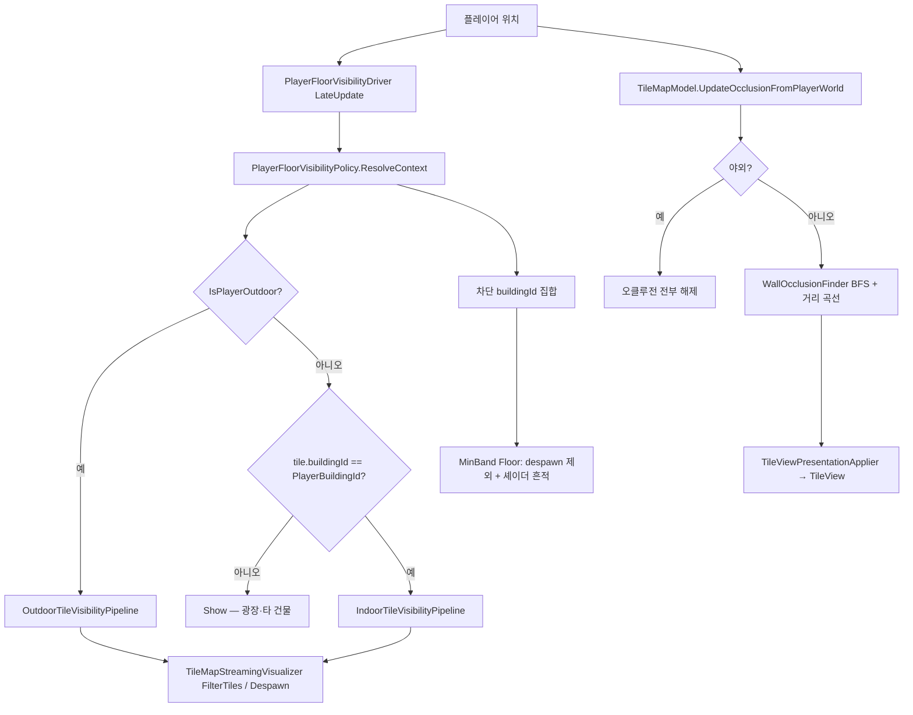

# TileMap — 가려짐·가시성 조건

타일맵에서 “안 보이게” 만드는 경로는 **서로 독립된 3개 시스템**이다. 혼동을 막기 위해 먼저 구분하고, 각각의 판정 조건을 아래에 정리한다.

| 시스템 | 목적 | 적용 단위 | 결과 |
|--------|------|-----------|------|
| **층 가시성** | 실내 층·야외 시선 차단 건물 | 스트리밍 spawn/despawn | GameObject 미생성 또는 제거 |
| **벽 캐릭터 오클루전** | 플레이어 앞 벽이 시야를 가림 | 이미 스폰된 Wall/EdgeWall | 셰이더 `_CharacterOcclusion` (0~1) |
| **시선 차단 건물 흔적** | 야외에서 가린 건물 1층 바닥 윤곽 | MinBand Floor (스폰 유지) | `_SightLineBuildingHidden` 어둡게 |

추가로 **Ghost**(`SetGhosted`)는 별도 표현 플래그이며, 층 가시성·BFS 오클루전과 자동 연동되지 않는다.

---

## 전체 흐름



**틱 순서**: `PlayerFloorVisibilityDriver` (`DefaultExecutionOrder -100`) → 청크 스트리밍. 차단 building context가 먼저 반영된 뒤 청크 Load.

---

## 1. 플레이어 실내/야외 판정

단일 API: `TileMapCacheHub.IsOutdoorEvaluation(band, x, z)`  
**`buildingId == 0`만으로 야외를 추론하지 않는다.**

| 조건 | 야외(true) |
|------|------------|
| MinBand 광장 바닥 | `BuildingGroupRegistry.IsPlazaFloor(band, x, z)` |
| visibility bake | 해당 셀의 `FloorRoomBfsProfile.Visibility` 결과에서 `EmptyDiscovered.Count > 0` **이고** `Visited`에 `(x,z)` 포함 |

플레이어 **층(band)** 은 월드 높이 `playerHeightWorldY + bandEpsilon` 기준으로, 맵에 존재하는 band 중 `band * cellSize <= ceiling` 을 만족하는 최대 band (`PlayerFloorVisibilityPolicy.ResolveFloorBand`).

---

## 2. 층 가시성 (스트리밍)

진입: `PlayerFloorVisibilityPolicy.IsTileVisible` → `TileMapStreamingVisualizer`의 `GatherAndFilter` / `ApplyBlockingBuildingDelta`.

### 2.1 분기 요약

| 플레이어 | 타일 | 파이프라인 | 기본 결과 |
|----------|------|------------|-----------|
| 야외 | 모든 타일 | Outdoor | 아래 2.2 |
| 실내 | `buildingId != PlayerBuildingId` | (없음) | **Show** — 광장·다른 건물 |
| 실내 | `buildingId == PlayerBuildingId` | Indoor 3레이어 | 아래 2.3 |

### 2.2 야외 — `OutdoorTileVisibilityPipeline`

레이어 순서 (첫 `Show`/`Hide`에서 종료):

1. **`BlockingBuildingFullHideLayer`**
   - `buildingId`가 `ctx.PlayerBlockingBuildingIds`에 있으면 → **Hide**
   - **예외**: `tileBand == MinBand` 이고 타입이 `Floor` → Continue (다음 레이어로)
2. **`ShowAllLayer`** → **Show**

**차단 buildingId 수집** (`BuildingPlayerOcclusionResolver`, 야외 전용):

- 카메라 지면 교차점 ↔ 플레이어 월드 선분을 그리드로 샘플
- 선분 상(플레이어 셀 제외) 셀·엣지에 `Wall` / `EdgeWall` / `Obstacle` 이 있으면 해당 `buildingId` 추가
- `buildingId`가 타일에 없으면 `TryGetFloorBuildingRoom`으로 바닥에서 해석

**안정화**: 동일 차단 집합이 **연속 3프레임** 유지될 때만 `_blockingStable` 반영 (`BlockingStableFramesRequired`).  
**토글**: `PlayerFloorVisibilityDriver._outdoorSightLineBuildingHideEnabled` / `OutdoorSightLineBuildingHideEnabled == false` → 차단 집합 비움.

**적용 방식**:

- 차단 building 추가: 해당 building 타일 **전체 despawn** (단, MinBand Floor는 despawn 제외)
- 차단 building 제거: 가시성 통과 타일만 respawn
- 셀 `Prune` 시 차단 building 소속 뷰는 **building 단위 despawn**으로 승격

### 2.3 실내 — `IndoorTileVisibilityPipeline`

레이어 순서:

| 레이어 | Hide 조건 | Show 조건 |
|--------|-----------|-----------|
| `SameBuildingUpperFloorHideLayer` | 같은 building **이고** `tileBand > FloorBand` | — |
| `BuildingScopeLayer` | `tileBand >= FloorBand` 이고 `buildingId != PlayerBuildingId` | 같은 building |
| `BelowFloorPeekLayer` | `tileBand < FloorBand` 이고 아래 조건 불만족 | `Wall`/`EdgeWall`/`Obstacle` **또는** `VisibleBelowCells`에 `(x,z,band)` 포함 |

**아래층 peek** (`VisibleBelowCells`):

- 플레이어 층 visibility BFS의 `EmptyDiscovered`(구멍)에서 아래 band로 내려가 첫 점유 층의 visibility `Visited` 셀을 수집
- `floorBand <= MinBand` 이면 빈 집합

---

## 3. 벽 캐릭터 오클루전 (실내 전용)

진입: `TileMapModel.UpdateOcclusionFromPlayerWorld`  
야외(`IsOutdoorEvaluation`)이면 **멤버십·강도 모두 즉시 클리어** — BFS 벽 숨김 없음.

### 3.1 숨김 후보 집합 (`WallOcclusionFinder`)

1. **시작 셀**
   - 플레이어 셀에 solid wall(`Wall`/`Obstacle`)만 있으면 → 인접 빈 셀로 이동, 없으면 **+X/-Z 인접 벽·엣지만** 반환 후 종료
   - `Topology.ResolveFloorBfsStart`로 BFS 시작점 보정

2. **방 BFS** (`FloorRoomFloodFill`, `collectEmptyNeighbors: false`)
   - Hub에 Occlusion 프로필이 있으면 **캐시 Visited 재사용**

3. **방문 바닥 셀의 4방 이웃 검사**
   - 이웃이 방문 집합 안이면 스킵
   - `EdgeWall`이면 방향별 below/top 분류 (**top 엣지는 최종 숨김에 미포함**)
   - 셀 벽: `Wall`/`Obstacle`만 solid
   - **아래 방향** (`+X`, `-Z` = `BottomOcclusionDirections`) 벽·엣지만 최종 후보

4. **코너 보강**
   - top 분류 벽 주변에서 “빨간 벽 셀”과 2방향 이상 맞닿는 비-검사 벽 셀 추가

5. **플레이어 근접 마스크** (`OcclusionMaskOptions`, `PlayerProximityMaskEnabled`)
   - 전역 Wall/EdgeWall 후보 중 플레이어 기준 **+X/-Z 하단 밴드** 안
   - **삼각형 마스크** (깊이마다 좌우 허용 1타일 확장) 안이면 `FinalOccluding`에 **추가**
   - 기본 축: `DownAxis (+1,0,-1)`, `RightAxis (+1,0,+1)`

### 3.2 거리 강도 (0~1)

멤버십은 **셀 이동 시** 재구축; 매 프레임 **XZ 거리**만 갱신.

| 설정 (`OcclusionProximitySettings`) | 기본값 | 의미 |
|-------------------------------------|--------|------|
| `OcclusionFullWithinDistance` | 0.75 | 이 거리 미만 → occlusion ≈ 1 |
| `OcclusionNoneBeyondDistance` | 8 | 이 거리 초과 → 0 |
| `ApplyEpsilon` | 0.015 | 변화 미만이면 이벤트 스킵 |
| `PlayerProximityMaskEnabled` | true | 근접 삼각 마스크 on/off |

`TileView` 파생 표현 (occlusion > ε):

| 임계값 | 효과 |
|--------|------|
| ≥ 0.4 | Blocked trace 오브젝트 표시 |
| ≥ 0.55 | 추가광 off |
| ≥ 0.99 | ShadowCastingMode ShadowsOnly |

기본 상태 우선순위: **HiddenByCharacter > Ghosted > Visible**.

---

## 4. 시선 차단 건물 흔적 (야외)

차단 building의 **MinBand Floor** 타일은 despawn하지 않고 스폰 유지.

- `BuildingGroupRegistry.RebuildMinBandFloorIndex` — bake 시 building별 MinBand Floor guid 집합
- `TileViewPresentationApplier.ApplySightLineBlockingDelta` → `SetSightLineBuildingHidden`
- 셰이더: `SpriteUV4Point._SightLineBuildingHidden` (`ShadeObjectController`)

차단 집합이 바뀔 때만 building 단위로 on/off.

---

## 5. Ghost · 선택 (가려짐과 별도)

| API | 역할 |
|-----|------|
| `TileViewPresentationApplier.SetGhosted` | 반투명 ghost 셰이더 (`_Ghost`) |
| `TileView.SetSelected` | URP RenderingLayer + Selection RendererFeature |

런타임 타일 상태 DTO의 `isGhosted`는 applier 경로와 별도; 표현은 applier만 신뢰.

---

## 6. 디버그

| 플래그 | 표시 |
|--------|------|
| `Config.DebugMode.FloorAlgorithm` | BFS 로그 |
| `Config.DebugMode.TileBfsSceneOverlay` | 씬 오버레이: 방문 바닥(초록), 벽 검사 셀(빨강), 최종 오클루전(노랑), 플레이어 마스크(자홍) 등 — `TileMapBfsDebugOverlay` |

---

## 7. 관련 소스 (빠른 참조)

| 주제 | 파일 |
|------|------|
| 층 정책·context | `PlayerFloorVisibilityPolicy.cs` |
| 실내/야외 레이어 | `TileVisibility/VisibilityLayers.cs` |
| 카메라 시선 building | `BuildingPlayerOcclusionResolver.cs` |
| BFS 벽 | `WallOcclusionFinder.cs` |
| 오클루전 갱신·야외 클리어 | `TileMapModel.cs` |
| 스트리밍 despawn/흔적 | `TileMapStreamingVisualizer.cs` |
| 뷰 표현 | `TileView.cs`, `TileViewPresentationApplier.cs` |
| 야외 판정 | `TileMapCacheHub.IsOutdoorEvaluation` |
| bake | `BuildingGroupBuilder.cs`, `BuildingGroupRegistry.cs` |
| 드라이버 | `PlayerFloorVisibilityDriver.cs` |

---

## 8. 의사결정 치트시트

```
타일이 안 보인다?
├─ GameObject 자체가 없다
│  ├─ 청크 미로드 → 스트리밍 (가시성과 무관)
│  └─ FloorVisibility Hide → §2 (야외 차단 building / 실내 위층·스코프)
├─ 오브젝트는 있는데 벽이 투명/윤곽만
│  └─ §3 characterOcclusion > 0 (실내, 플레이어 근처 BFS 벽)
└─ 1층 바닥만 어둡다 (야외)
   └─ §4 sight-line building hidden (차단 building MinBand Floor)
```
