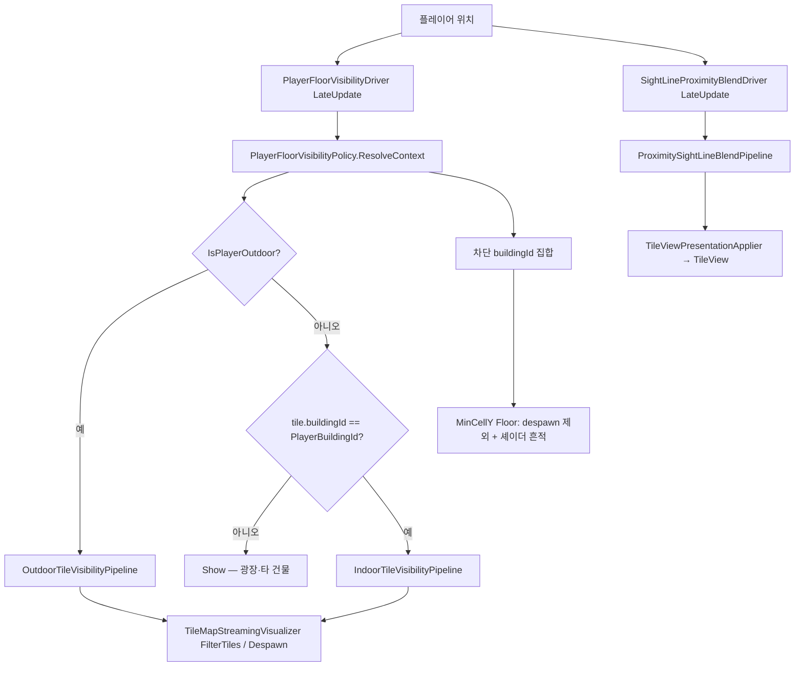

# TileMap — 가려짐·가시성 조건

타일맵에서 “안 보이게” 만드는 경로는 **서로 독립된 3개 시스템**이다. 혼동을 막기 위해 먼저 구분하고, 각각의 판정 조건을 아래에 정리한다.

| 시스템 | 목적 | 적용 단위 | 결과 | TileDefinition |
|--------|------|-----------|------|----------------|
| **층 가시성 — 야외 시선 차단** | 카메라↔플레이어 사이 건물 숨김 | **buildingId** (건물 전체) | despawn (MinCellY Floor 제외) | (없음 — `buildingId`로 판정) |
| **근접 시선 블렌드** | 카메라↔플레이어 시선에 가리는 타일 블렌드 | 시선 밴드 내 **모든 타일** | 셰이더 `_CharacterOcclusion` (0~1) | — |
| **시선 차단 건물 흔적** | 야외에서 가린 건물 1층 바닥 윤곽 | MinCellY Floor (스폰 유지) | `_SightLineBuildingHidden` 어둡게 | — |

**혼동 주의**: “플레이어를 가리는 타일 블렌드”는 **근접 시선 블렌드**(§3). 야외 **건물 despawn**(§2.2)은 타일 블렌드가 아니라 buildingId 단위 스트리밍 숨김이다.

추가로 **Ghost**(`SetGhosted`)는 별도 표현 플래그이며, 층 가시성·근접 블렌드와 자동 연동되지 않는다.

---

## 전체 흐름



**틱 순서**: `PlayerFloorVisibilityDriver` (`-100`) → `SightLineProximityBlendDriver` (`-95`) → 청크 스트리밍. 차단 building context가 먼저 반영된 뒤 청크 Load.

---

## 1. 플레이어 실내/야외 판정

단일 API: `TileMapCacheHub.IsOutdoorEvaluation(cellY, x, z)`  
**`buildingId == 0`만으로 야외를 추론하지 않는다.**

| 조건 | 야외(true) |
|------|------------|
| MinCellY 광장 바닥 | `BuildingGroupRegistry.IsPlazaFloor(cellY, x, z)` |
| visibility bake | 해당 셀의 `FloorRoomBfsProfile.Visibility` 결과에서 `EmptyDiscovered.Count > 0` **이고** `Visited`에 `(x,z)` 포함 |

플레이어 **층(cellY)** 은 월드 높이 `playerHeightWorldY + cellEpsilon` 기준으로, 맵에 존재하는 cellY 중 `cellY * cellSize <= ceiling` 을 만족하는 최대 cellY (`PlayerFloorVisibilityPolicy.ResolvePlayerFloorCellY`).

---

## 2. 층 가시성 (스트리밍)

진입: `PlayerFloorVisibilityPolicy.IsTileVisible` → `TileMapStreamingVisualizer`의 `GatherAndFilter` / `ApplyBlockingBuildingDelta`.

### 2.1 분기 요약

| 플레이어 | 타일 | 파이프라인 | 기본 결과 |
|----------|------|------------|-----------|
| 실내·야외 공통 | `buildingId ∈ PlayerBlockingBuildingIds` | `BlockingBuildingFullHideLayer` | **Hide** (MinCellY Floor 제외) — 아래 2.2 |
| 야외 | 그 외 모든 타일 | Outdoor `ShowAllLayer` | **Show** |
| 실내 | `buildingId != PlayerBuildingId` (차단 목록 밖) | (없음) | **Show** |
| 실내 | `buildingId == PlayerBuildingId` | Indoor 3레이어 | 아래 2.3 |

### 2.2 시선 차단 건물 — `BlockingBuildingFullHideLayer` (+ 야외 `ShowAllLayer`)

`IsTileVisible`에서 **`BlockingBuildingFullHideLayer`를 실내·야외 공통 선적용**합니다.

- `buildingId`가 `ctx.PlayerBlockingBuildingIds`에 있으면 → **Hide**
- **예외**: `tileCellY == MinCellY` 이고 타입이 `Floor`
- 야외 분기(`OutdoorTileVisibilityPipeline`)는 차단 통과 타일에 **`ShowAllLayer`** 만 적용

**차단 buildingId 수집** (`BuildingPlayerOcclusionResolver` — 실내·야외 공통):

- 카메라 월드 위치 ↔ 플레이어 월드 **3D** 선분을 샘플 (플레이어 셀 포함)
- 각 샘플 → `ConvertWorldToGrid` → 그리드 셀 `(x, y, z)` (x·y·z 동일한 셀 좌표)
- 경로상 셀 타일 중 `occludesOccupiedCells` / `occludesEdge` bake 플래그가 있는 타일만 `buildingId > 0` 수집 (§3 벽 오클루전과 동일 정의; Floor는 일반적으로 제외)
- **`PlayerBuildingId` 제외** — 플레이어 소속 building은 차단 목록에 넣지 않음 (셀 스킵 없이 buildingId로 필터)
- 수집된 `buildingId`마다 건물 **전체**가 Hide 대상 (MinCellY Floor만 예외)
- resolver 산출 집합을 **즉시** context에 반영 (`BuildingBlockingController`가 추가/제거 델타 적용)
- `IsTileVisible` 진입 시 차단 building Hide를 **실내·야외 모두** 선적용 (`BlockingBuildingFullHideLayer`)

**토글**: `PlayerFloorVisibilityDriver._outdoorSightLineBuildingHideEnabled` / `OutdoorSightLineBuildingHideEnabled == false` → 차단 집합 비움.

**적용 방식**: 차단 building 추가 시 **building 전체 despawn** (MinCellY Floor 제외·흔적 유지). 근접 타일 블렌드(§3)와 독립.

- 차단 building 추가: despawn (MinCellY Floor는 despawn 제외·흔적 유지)
- 차단 building 제거: 가시성 통과 타일만 respawn
- 셀 `Prune` 시 차단 building 소속 뷰는 **building 단위 despawn**으로 승격

### 2.3 실내 — `IndoorTileVisibilityPipeline`

레이어 순서:

| 레이어 | Hide 조건 | Show 조건 |
|--------|-----------|-----------|
| `SameBuildingUpperFloorHideLayer` | 같은 building **이고** `tileCellY > PlayerFloorCellY` | — |
| `BuildingScopeLayer` | `tileCellY >= PlayerFloorCellY` 이고 `buildingId != PlayerBuildingId` | 같은 building |
| `BelowFloorPeekLayer` | `tileCellY < PlayerFloorCellY` 이고 아래 조건 불만족 | `Wall`/`EdgeWall` **또는** `VisibleBelowCells`에 `(x,z,y)` 포함 |

**아래층 peek** (`VisibleBelowCells`):

- 플레이어 층 visibility BFS의 `EmptyDiscovered`(구멍)에서 아래 cellY로 내려가 첫 점유 층의 visibility `Visited` 셀을 수집
- `PlayerFloorCellY <= MinCellY` 이면 빈 집합

---

## 3. 근접 시선 블렌드 (카메라↔플레이어 — 플레이어 가림 강도)

진입: `SightLineProximityBlendDriver` → `ProximitySightLineBlendPipeline`  
실내·야외 구분 없음. **청크 스트리밍과 무관** — `ITileViewRegistry`에 스폰된 `TileView`에만 `TileViewPresentationApplier`가 반영합니다.  
§2.2 건물 despawn과 **독립** (despawn된 뷰는 블렌드 대상 아님).

### 3.1 후보 셀

1. 카메라↔플레이어 3D 세그먼트 샘플 (`BuildingPlayerOcclusionResolver`와 **동일 step·3D 셀**; 플레이어 셀 **포함**)
2. 각 샘플의 `(x, y, z)`에서 Y를 바꾸지 않고 `BandRadiusCells` Chebyshev XZ 확장 (플레이어 셀도 동일)
3. 확장 셀 좌표로 Hub 조회 — 점유 셀 타일 + 카드널 이웃 `TryGetEdgeBetween` **EdgeWall** (`Floor` 면제는 §3.2). 가림 포인트는 점유 셀 중심(EdgeWall은 변 중점).
4. **사분면 필터**: 점유 셀이 플레이어 XZ 기준 **+X·-Z** 사분면(`dx≥0`, `dz≤0`)에 있을 때만 후보.
5. **실내 구조벽 제외**: 플레이어가 실내이면 `Wall`·`EdgeWall`은 후보에서 제외 — BFS(`WallOcclusionFinder`) 전담. (윗층·비-BFS -XZ 벽에 근접 시선이 겹치지 않음)

### 3.2 가림 강도 (0~1)

**플레이어를 강하게 가릴수록 `_CharacterOcclusion` ↑** (셰이더에서 더 투명).

가림 포인트(점유 셀 중심 / EdgeWall 변 중점)와 **카메라↔플레이어 3D 선분** 사이의 수직 거리(XYZ)로 강도를 산출합니다:

- 선분에 가까울수록 occlusion ↑ (`InverseLerp` on `perpDist`)
- 선분에서 멀수록 occlusion ↓
- 플레이어 뒤(`SegmentTEpsilon` 셀 여유 밖) → 0

| 설정 (`SightLineBlendSettings`) | 기본값 | 의미 |
|---------------------------------|--------|------|
| `FullBlendWithinPerpDistance` | 0.75 | 3D 선분 수직 거리가 이 값 미만이면 occlusion ≈ 1 |
| `NoneBeyondPerpDistance` | 8 | 수직 거리가 이 값보다 크면 0 |
| `BandRadiusCells` | 2 | 샘플 셀 주변 확장 |
| `SegmentTEpsilon` | 0.15 | 플레이어 뒤쪽 여유(셀 단위) |
| `ApplyEpsilon` | 0.015 | 변화 미만이면 스킵 |

**Floor 오탐 방지**: `Floor`이고 `(x,z)`가 플레이어와 같고 `y <= PlayerFloorCellY` → occlusion 0 (발밑 기둥).

### 3.3 표현·entry store·합성

`TilePresentationEntryStore`가 Concern×Source×Priority entry를 보관합니다. Store는 합성하지 않으며, `TileViewPresentationApplier`가 `PresentationEntryQueries`로 해석해 `TileView`에 반영합니다.

**Concern / Source**

| Concern | Source | Priority | 프로듀서 |
|---------|--------|----------|----------|
| `CharacterOcclusion` | `BfsWallOcclusion` | 100 | `TileMapModel` BFS delta |
| `CharacterOcclusion` | `ProximitySightLine` | 50 | `SightLineProximityBlendDriver` |
| `GhostAmount` | `Ghost` | 10 | `SetGhosted` |
| `SightLineBuildingHidden` | `BlockingBuildingMinFloor` | 80 | `ApplySightLineBlockingDelta` |

**관여(engagement)**: `Set`된 타일만 per-tile 관여. Query·`TryGetEngagedEntry`는 관여 타일 entry만 반환. `SetSourceEngaged(source, false)`는 제공자 비활성 시 해당 Source entry 전부 제거 (예: proximity driver Shutdown).

**파이프라인 역할**: `ProximitySightLineBlendPipeline`은 후보·강도 산출만 담당. 이전 값은 entry store `CopyScalarsForSource`에서 읽고, 반영은 applier가 store에 Set.

**CharacterOcclusion 해석** (`PresentationEntryQueries`):

후보: engaged `BfsWallOcclusion`, model BFS 캐시(engaged 없을 때), engaged `ProximitySightLine`.  
**`PresentationPriorityTable`이 가장 높은 Source의 `Scalar01`을 선택** (`Mathf.Max` 합성 없음).  
기본값: BfsWallOcclusion 100, ProximitySightLine 50 — 동일 타일에 둘 다 있으면 BFS가 이김.

| 타일 | 비고 |
|------|------|
| BFS·근접 entry 동시 존재 | **우선순위 높은 Source** 값 (보통 BFS) |
| BFS entry 없음, model 캐시만 | BFS 캐시 (priority 100) |
| 근접만 engaged | `ProximitySightLine` |
| 실내 `Wall`·`EdgeWall` (BFS 밖) | 근접 파이프라인 후보 제외 → 보통 0 |

**디버그 조회**: `TileViewPresentationApplier.QueryEntriesForTile(tileId)` — 관여 중인 entry만.

`TileView.SetCharacterOcclusion` — 파생: shadow/trace/추가광 (§3.2 임계값).

기본 상태 우선순위: **HiddenByCharacter > Ghosted > Visible**.

---

## 4. 시선 차단 건물 흔적 (야외)

차단 building의 **MinCellY Floor** 타일은 despawn하지 않고 스폰 유지.

- `BuildingGroupRegistry.RebuildMinCellYFloorIndex` — bake 시 building별 MinCellY Floor guid 집합
- `TileViewPresentationApplier.ApplySightLineBlockingDelta` → `SetSightLineBuildingHidden`
- 셰이더: `SpriteUV4Point._SightLineBuildingHidden` (`ShadeObjectController`)

차단 집합이 바뀔 때만 building 단위로 on/off.

---

## 5. Ghost · 선택 (가려짐과 별도)

| API | entry / 역할 |
|-----|----------------|
| `TileViewPresentationApplier.SetGhosted` | `GhostAmount` / `Ghost` → `_GhostAmount` |
| `TileView.SetSelected` | entry store 밖 — URP RenderingLayer |

런타임 타일 상태 DTO의 `isGhosted`는 applier 경로와 별도; 표현은 entry store만 신뢰.

---

## 6. 디버그

| 플래그 | 표시 |
|--------|------|
| `Config.DebugMode.FloorAlgorithm` | BFS 로그 |
| `Config.DebugMode.TileBfsSceneOverlay` | 씬 오버레이: 방문 바닥(초록), 벽 검사 셀(빨강), 최종 오클루전(노랑), 플레이어 마스크(자홍) 등 — `TileMapBfsDebugOverlay` |
| `Config.DebugMode.TileBuildingIdLabels` | 구조 타일별 `buildingId` 라벨 |
| `Config.DebugMode.TileIndoorOutdoorOverlay` | 플레이어 층 바닥의 야외(청록)/실내(주황) 판정 셀 외곽선 — `PlayerFloorVisibilityDriver` 갱신 |
| `Config.DebugMode.TileSightLineBuildingOverlay` | **§2.2 건물 차단 전용** — 흰선(카메라↔플레이어 3D), 회색(세그먼트 샘플 셀), 빨강(`occludes*` 타일이 기여한 차단 셀). `BuildingPlayerOcclusionResolver` 스냅샷 |

**§3 근접 블렌드** 전용 씬 오버레이는 없음. 블렌드는 동일 3D 세그먼트 샘플 + `BandRadiusCells` 밴드·3D 선분 수직 거리로 동작하며, 밴드 셀·`occlusion01` 값은 디버그에 표시되지 않음.

---

## 7. 관련 소스 (빠른 참조)

| 주제 | 파일 |
|------|------|
| 층 정책·context | `PlayerFloorVisibilityPolicy.cs` |
| 실내/야외 레이어 | `TileVisibility/VisibilityLayers.cs` |
| 카메라 시선 building | `BuildingPlayerOcclusionResolver.cs` |
| 시선 세그먼트 샘플 | `TileBlend/SightLineSegmentSampler.cs` (건물·블렌드 공통 step) |
| 근접 시선 블렌드 | `TileBlend/ProximitySightLineBlendPipeline.cs`, `SightLineOcclusionStrength.cs` |
| 블렌드 드라이버 | `SightLineProximityBlendDriver.cs` |
| 스트리밍 despawn/흔적 | `TileMapStreamingVisualizer.cs`, `BuildingBlockingController.cs` |
| 뷰 표현·entry store | `Presentation/TilePresentationEntryStore.cs`, `Presentation/PresentationEntryQueries.cs`, `TileView.cs`, `TileViewPresentationApplier.cs` |
| 야외 판정 | `TileMapCacheHub.IsOutdoorEvaluation` |
| bake | `BuildingGroupBuilder.cs`, `BuildingGroupRegistry.cs` |
| 층 가시성 드라이버 | `PlayerFloorVisibilityDriver.cs` |

---

## 8. 의사결정 치트시트

```
타일이 안 보인다?
├─ GameObject 자체가 없다
│  ├─ 청크 미로드 → 스트리밍 (가시성과 무관)
│  └─ FloorVisibility Hide → §2 (야외 차단 building / 실내 위층·스코프)
├─ 오브젝트는 있는데 벽이 투명/윤곽만
│  └─ §3 characterOcclusion > 0 (카메라↔플레이어 시선 근접 블렌드)
└─ 1층 바닥만 어둡다 (야외)
   └─ §4 sight-line building hidden (차단 building MinCellY Floor)
```
