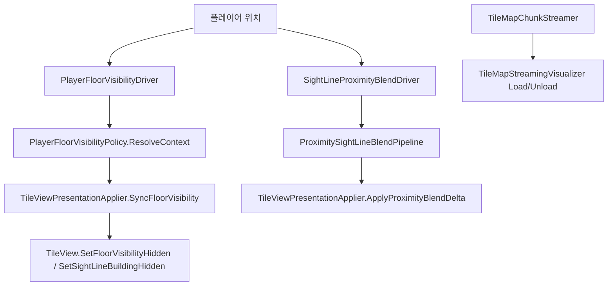

# TileMap — 가려짐·가시성 조건

## 좌표 규약

**점유 인덱스를 우선 신뢰한다** (`CellHasOccupancy`, bake `RebuildOccupancy`). 가시성·시선에서 셀 후보는 **인덱스에 등록된 점유셀만** 쓴다.

| 대상 | 월드 → 셀 |
|------|-----------|
| **플레이어 층** | `OccupiedCellCoord.ResolveFromWorld` (발밑 바닥, `y--` 하향) |
| **시선 샘플** (건물 차단 §2.2) | `TryResolveSightOccupiedCell` (`CellHasOccupancy` true만) |
| **시선 높이 슬라이스** (근접 블렌드 §3) | `GridAtSightSampleHeight` (높이 그리드, 점유 무관) |
| **타일 대표 셀** | `OccupiedCellCoord.PrimaryCellFromIdentity` |

바닥은 그리드 층 사이 면이나 bake가 `CellBelow`/`CellAbove` 둘 다 인덱스에 넣는다 → 시선에서 y±1 수동 탐색 **금지**.

- walkable = Floor `CellAbove` (논리 바닥 위 점유셀). 통행 가능과 **다른 용어**.
- Y 층 band/`distinctOccupiedCellYs` **금지**. XZ Chebyshev만 `RadiusCells`.
- 상세: [DATA.md §좌표 규약](../Internal/DATA.md), [TILEMAP.md §좌표 규약](TILEMAP.md).

---

타일맵에서 “안 보이게” 만드는 경로는 **서로 독립된 3개 시스템**이다.

| 시스템 | 목적 | 적용 단위 | 결과 |
|--------|------|-----------|------|
| **층 가시성** | 야외 시선 차단·실내 층/스코프 | buildingId·cellY | `FloorVisibilityHidden` (renderer off) |
| **근접 시선 블렌드** | 카메라↔플레이어 시선 XZ 반경 | 타일별 | 셰이더 `_CharacterOcclusion` |
| **시선 차단 건물 흔적** | 야외 차단 building **건물별 최하층** 바닥 윤곽 | `BuildingGroupRegistry.IsBottomFloorTile` | `_SightLineBuildingHidden` |

**스트리밍(`TileMapStreamingVisualizer`)은 청크 로드/언로드만 담당한다.** 층 가시성은 despawn하지 않으며 `TileViewPresentationApplier`가 처리한다.

---

## 전체 흐름



**틱 순서**: `PlayerFloorVisibilityDriver` (`-100`) → `SightLineProximityBlendDriver` (`-95`) → `CharacterVisibilityBroadcaster` → `CharacterOcclusionDisplayDriver` (`50`) → 청크 스트리밍.

---

## 1. 플레이어 실내/야외 판정

`TileMapCacheHub.IsOutdoorEvaluation(cellY, x, z)` — **`buildingId == 0`만으로 야외를 추론하지 않는다.**

플레이어 점유셀: `PlayerFloorVisibilityPolicy.ResolvePlayerOccupiedCell` → `OccupiedCellCoord.ResolveFromWorld`. `ResolvePlayerFloorCellY` = `.y` 래퍼. 타일 대표 셀: `OccupiedCellCoord.PrimaryCellFromIdentity`.

---

## 2. 층 가시성 (presentation)

진입: `PlayerFloorVisibilityPolicy.IsTileVisible` → `TileViewPresentationApplier.SyncFloorVisibility`.

### 2.1 분기

| 플레이어 | 타일 | 결과 |
|----------|------|------|
| **야외** | `buildingId ∈ PlayerBlockingBuildingIds` | Hide (`FloorVisibilityHidden`), **건물별 최하층** Floor 제외 → §4 흔적 |
| **야외** | 그 외 | Show |
| **실내** | `buildingId != PlayerBuildingId` | Show |
| **실내** | 같은 building | `IndoorTileVisibilityPipeline` (위층 Hide·스코프·아래 peek) |

### 2.2 야외 시선 차단 building

`BlockingBuildingFullHideLayer` — **`IsPlayerOutdoor`일 때만** 적용.

차단 buildingId: `BuildingPlayerOcclusionResolver` — 시선 샘플 경로에 `CellHasOccupancy` 점유셀(바닥·벽 포함) + `buildingId > 0`이면 차단. `PlayerBuildingId` 제외.

토글: `OutdoorSightLineBuildingHideEnabled == false` → 차단 집합 비움.

**적용**: `SyncFloorVisibility`가
1. 차단/해제된 building 전체 타일을 `BuildingGroupRegistry`로 일괄 갱신
2. 스폰된 모든 뷰를 순회해 `IsTileVisible` 반영

MinCellY Floor는 Hide 대신 `SightLineBuildingHidden` 셰이더.

---

## 3. 근접 시선 블렌드

`SightLineProximityBlendDriver` → `ProximitySightLineBlendPipeline` → `ApplyProximityBlendDelta`.

- 청크 스트리밍과 무관. 스폰된 `TileView`만 대상.
- 시선 3D 샘플 슬라이스: `GridAtSightSampleHeight` (§좌표 규약). `ResolveFromWorld` **금지**.
- `FloorVisibilityHidden`인 타일은 occlusion tick 스킵.
- Floor face 면제: 타일 대표 점유셀 `y <= PlayerFloorCellY` → occlusion 0.

### entry store

| Concern | Source | Priority |
|---------|--------|----------|
| `CharacterOcclusion` | `BfsWallOcclusion` | 100 |
| `CharacterOcclusion` | `ProximitySightLine` | 50 |
| `FloorVisibilityHidden` | `FloorVisibilityPolicy` | 90 |
| `SightLineBuildingHidden` | `BlockingBuildingMinFloor` | 80 |
| `GhostAmount` | `Ghost` | 10 |

---

## 4. 시선 차단 건물 흔적

차단 building의 MinCellY Floor — 스폰 유지, `SetSightLineBuildingHidden` + `_SightLineBuildingHidden` 셰이더.

---

## 5. Ghost · 선택

`SetGhosted` / `SetSelected` — 층 가시성과 별도.

---

## 6. 디버그

| 플래그 | 용도 |
|--------|------|
| `TileBuildingIdLabels` | buildingId 라벨 |
| `TileIndoorOutdoorOverlay` | 야외/실내 판정 |
| `TileSightLineBuildingOverlay` | 시선 차단 building (§2.2) |

---

## 7. 관련 소스

| 주제 | 파일 |
|------|------|
| 층 정책 | `PlayerFloorVisibilityPolicy.cs` |
| 레이어 | `TileVisibility/VisibilityLayers.cs` |
| 시선 building | `BuildingPlayerOcclusionResolver.cs` |
| 근접 블렌드 | `TileBlend/ProximitySightLineBlendPipeline.cs` |
| presentation | `TileViewPresentationApplier.cs`, `TileView.cs` |
| 청크 스트리밍 | `TileMapStreamingVisualizer.cs` |
| 드라이버 | `PlayerFloorVisibilityDriver.cs`, `IFloorVisibilitySync` |
| bake | `BuildingGroupBuilder.cs`, `BuildingGroupRegistry.cs` |

---

## 8. 치트시트

```
타일이 안 보인다?
├─ 청크 밖 → 스트리밍 (가시성 무관)
├─ renderer off, 오브젝트는 있음 → §2 FloorVisibilityHidden
├─ 반투명/윤곽 → §3 CharacterOcclusion
└─ 1층 바닥만 어둡다 (야외) → §4 SightLineBuildingHidden
```
