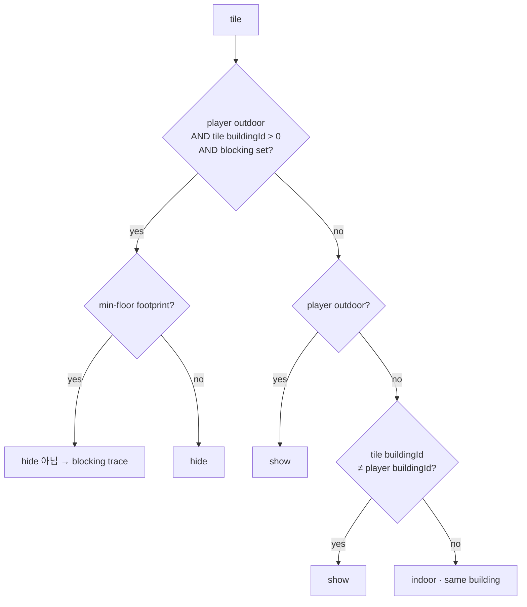
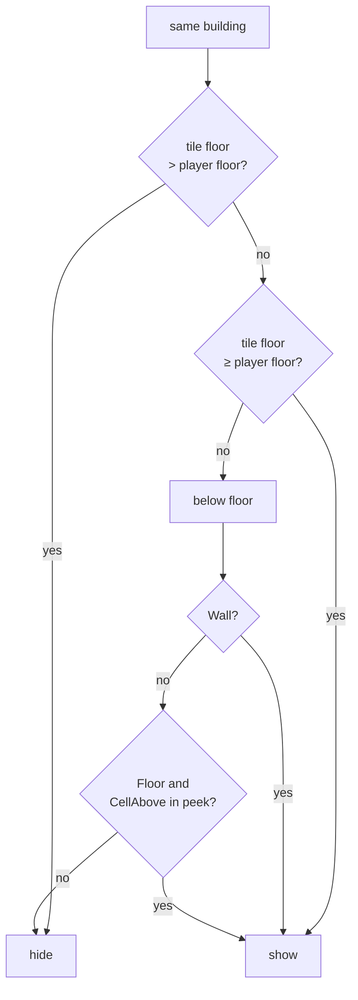
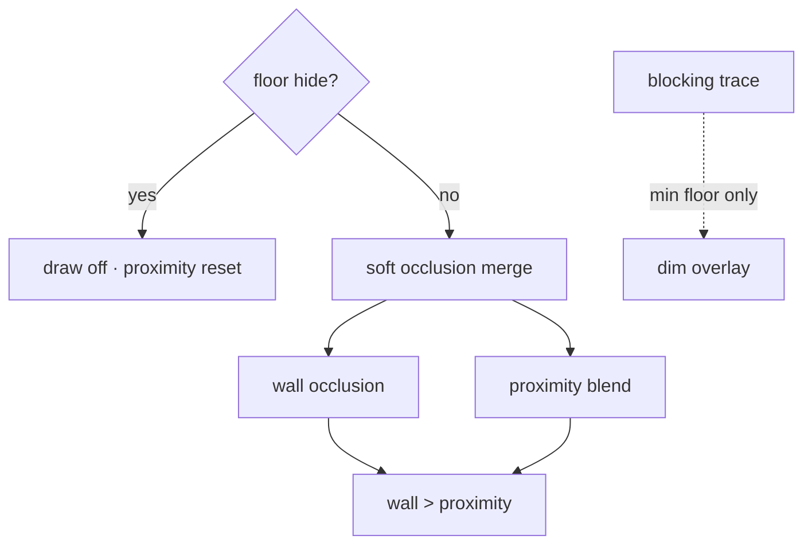
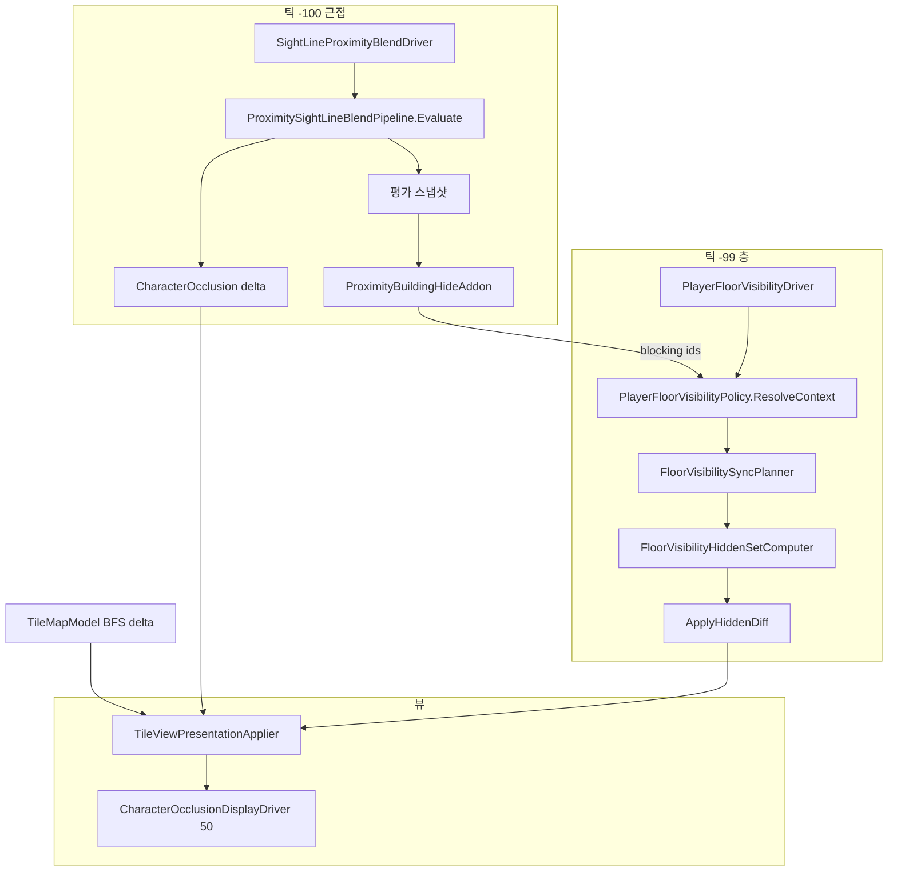

# TileMap — 가려짐·가시성 조건

## 좌표 규약

**구현·좌표 매핑은 이 절만 본다.** [가리기 논리](#가리기-논리)의 player floor·buildingId·peek 등이 코드에서 어떻게 읽히는지는 여기서 정의한다.

**점유 인덱스를 우선 신뢰한다** (`CellHasOccupancy`, bake `RebuildOccupancy`). 가시성·시선에서 셀 후보는 **인덱스에 등록된 점유셀만** 쓴다.

| 대상 | 월드 → 셀 |
|------|-----------|
| **플레이어 층** | `OccupiedCellCoord.ResolveFromWorld` (발밑 바닥, `y--` 하향) |
| **시선 높이 슬라이스** (근접 블렌드·야외 blocking 후보) | `GridAtSightSampleHeight` (높이 그리드, 점유 무관) |
| **타일 대표 셀** | `OccupiedCellCoord.PrimaryCellFromIdentity` |

**가리기 논리 ↔ 구현 대응** (규칙 수정 시 이 표만 따라 코드를 찾는다)

| 논리 용어 | 구현에서의 읽기 |
|-----------|----------------|
| player floor | `ResolvePlayerOccupiedCell` → 점유 cell Y |
| tile floor | 타일 대표 cell Y |
| buildingId | 타일·플레이어 `identity.buildingId` (0 = terrain) |
| blocking building set | context blocking building id 집합 |
| peek cells | player floor room BFS hole → below-floor room cells (room은 개방 floor 묶음일 수 있음 — [bake §5.1](TILEMAP_BUILDING_BAKE.md)) |
| min-floor footprint | building registry MinCellY Floor tile |
| walkable / CellAbove | Floor `CellAbove` |

바닥은 그리드 층 사이 면이나 bake가 `CellBelow`/`CellAbove` 둘 다 인덱스에 넣는다 → 시선에서 y±1 수동 탐색 **금지**.

- walkable = Floor `CellAbove` (논리 바닥 위 점유셀). 통행 가능과 **다른 용어**.
- Y 층 band/`distinctOccupiedCellYs` **금지**. XZ Chebyshev만 `RadiusCells`.
- 상세: [DATA.md §좌표 규약](../Internal/DATA.md), [TILEMAP.md §좌표 규약](TILEMAP.md).

---

타일맵에서 “안 보이게” 만드는 경로는 **서로 독립된 3개 시스템**이다.

| 시스템 | 목적 | 적용 단위 | 상태 저장 |
|--------|------|-----------|-----------|
| **층 가시성** | 야외 시선 차단·실내 층/스코프 | 건물·층 | applier 숨김 집합 |
| **근접 시선 블렌드** | 카메라↔플레이어 시선 XZ 반경 | 타일별 | entry `CharacterOcclusion` |
| **시선 차단 건물 흔적** | 야외 차단 building **건물별 최하층** 바닥 윤곽 | MinCellY Floor | `_appliedSightLineTrace` (applier) |

**스트리밍(`TileMapStreamingVisualizer`)은 청크 로드/언로드만 담당한다.** 층 가시성은 despawn하지 않으며 `TileViewPresentationApplier`가 처리한다.

---

## 가리기 논리

**판정 규칙 전용 절.** code 필드명·API 이름 없음.

- **규칙 변경** → 이 절만
- **좌표·index 변경** → [좌표 규약](#좌표-규약)만
- **tick·diff·store** → §2~§4

### 용어

| 용어 | 의미 |
|------|------|
| **player floor** | 플레이어가 서 있는 slice Y |
| **tile floor** | 타일 대표 slice Y |
| **buildingId** | 타일·player 소속 building. 0 = terrain |
| **blocking building set** | outdoor에서 sight에 걸려 통째 hide할 building 목록 |
| **peek cells** | player floor hole 아래 slice에서 보이는 room cells |
| **min-floor footprint** | hide된 building의 가장 아래 Floor face |

### context (판정 전)

| context | 의미 |
|---------|------|
| player outdoor | 점유 cell 기준. buildingId만으로 outdoor 추론 금지 |
| player floor | 발밑 floor 기준 Y |
| player buildingId | indoor일 때 소속 |
| tile buildingId · tile floor | 판정 대상 타일 |
| blocking building set | outdoor 통째 hide 대상 |
| peek cells | indoor · player floor 아래 expose 집합 |

blocking set은 **proximity evaluate 이후** 채움 (outdoor · feature on).

peek cells: player floor **room BFS**로 hole 찾고, 아래 slice connected room cells 수집.

**buildingId 출처 (bake SSOT)**: [TILEMAP_BUILDING_BAKE.md](TILEMAP_BUILDING_BAKE.md) — **floor SSOT**, structural shell은 **occupied-cell flood** ([TILEMAP.md](TILEMAP.md) §점유셀). indoor hide는 tile `buildingId` vs player `buildingId`; **shell-disconnected**(id 0)은 step ③ **show** (의도).

---

### 판정 종류

| 종류 | 단위 | 결과 |
|------|------|------|
| **floor hide** | tile | show / hide (draw off) |
| **proximity blend** | tile | occlusion 0~1 (반투명) |
| **blocking trace** | tile | hide된 building min-floor 어둡게 |
| **wall occlusion** | tile | indoor BFS occlusion (blend와 합성) |

floor hide와 proximity blend는 **병렬**. apply 시 floor hide 우선.

---

### floor hide — 판정 순서

타일마다 **아래 순서**. Hide 나오면 종료.



**indoor · same building**:



| step | 조건 | 결과 |
|------|------|------|
| ① outdoor block | outdoor + blocking set building | hide (min-floor footprint **제외**) |
| ② outdoor default | outdoor + ① 아님 | show |
| ③ indoor other building | tile buildingId ≠ player | show |
| ④ upper floor | same building + tile floor > player | hide |
| ⑤ player floor+ | same building + tile floor ≥ player | show |
| ⑥ below peek | same building + tile floor < player | Wall show; Floor+peek show; else hide |

outdoor block은 **player floor 변경과 무관** — blocking set 같으면 동일.

indoor ④~⑥은 **player floor·peek** 변경에 반응.

---

### blocking building set

**전제** (하나라도 아니면 empty): player outdoor · outdoor building hide on.

proximity evaluate **filter 통과 tile** 기준 (occlusion 0이어도 포함).

| hit tile | set |
|----------|-----|
| buildingId > 0, ≠ player buildingId | add |
| terrain (0) | skip → blend only |
| = player buildingId | skip |

set에 들어간 building **전 tile**이 ① 대상 (min-floor footprint 제외).

---

### proximity blend

| 항목 | 규칙 |
|------|------|
| range | camera↔player sight line, sample height에서 XZ radius |
| cells | occupancy index만 (Y ±1 manual 금지) |
| filter | quadrant · indoor structural · floor exempt 등 |
| output | hit tile마다 occlusion strength |
| building | 무관 — terrain·building 모두 blend 가능 |

**blend ≠ floor hide.** draw off 안 함.

---

### blocking trace

| 조건 | 표시 |
|------|------|
| ① 예외 tile | building **min-floor footprint** |
| floor hide | 별도 track |

---

### apply 우선순위



| priority | 규칙 |
|----------|------|
| floor hide | 최우선 — soft skip |
| soft | wall occlusion vs proximity — **stronger wins** (wall 우선) |
| blocking trace | floor hide와 병행 (footprint only) |
| Ghost · Selected | floor hide와 독립 |

floor hide 전환 시 proximity state **reset**.

---

### context diff 시 re-eval

| change | scope |
|--------|-------|
| blocking set only (outdoor) | add/remove building tiles |
| player floor · peek (indoor) | player building + peek symmetric diff |
| outdoor ↔ indoor | prior hide + both sides |
| context equal | floor hide sync skip |

chunk spawn tile은 **그 tile 하나**만 re-eval.

---

## 전체 흐름 (구현·틱)



**틱 순서**: `SightLineProximityBlendDriver` (`-100`) → `PlayerFloorVisibilityDriver` (`-99`) → `CharacterVisibilityBroadcaster` → `CharacterOcclusionDisplayDriver` (`50`) → 청크 스트리밍.

`PlayerFloorVisibilityDriver`는 `FloorVisibilityContext.Equals`가 바뀔 때만 `SyncFloorVisibility`를 호출한다.

---

## FloorVisibilityContext

| 필드 | 용도 |
|------|------|
| `IsPlayerOutdoor` | 야외 blocking·실내 pipeline 분기 |
| `PlayerFloorCellY` | 실내 위층 hide·peek |
| `PlayerBuildingId` | 실내 scope·에드온 exclude |
| `PlayerBlockingBuildingIds` | 야외 통째 hide 대상 (근접 에드온 주입) |
| `VisibleBelowCells` | indoor peek cells |

---

## 1. 플레이어 실내/야외 판정

`TileMapCacheHub.IsOutdoorEvaluation(cellY, x, z)` — **`buildingId == 0`만으로 야외를 추론하지 않는다.**

**Space bake는 가리기가 아니라 분기만 바꾼다.** `IsPlayerOutdoor` → outdoor/indoor pipeline 선택. peek cells·blocking building set·upper-floor hide **규칙은 변경 없음**.

| 순서 | 규칙 |
|------|------|
| 1 | plaza (`IsPlazaFloor`) → **야외** |
| 2 | building floor 없음 / `buildingId <= 0` → **실내** (`false`) |
| 3 | 점유 floor에 `SpaceId` → `SpaceBakeResult.isOutdoor` |
| 4 | building floor인데 Space 없음 → **야외** (`true`) — bake 누락·개방 area indoor pipeline 고착 방지 |

`isOutdoor` 산출: [건물 bake §7](TILEMAP_BUILDING_BAKE.md) — `SpaceLeakEvaluator`(천장 `maxStructuralY` + footprint 측면).

**room / `roomId`와 혼동하지 않는다.** room은 §5.1 slice floor 묶음(peek용). 실내/야외는 Space.

**논리 충돌로 둘러싸였다고 밀폐로 확정하지 않는다.** §5.1.1 — Physics Collider·`UsePhysicsCollider` 한계 동일.

플레이어 점유셀: `PlayerFloorVisibilityPolicy.ResolvePlayerOccupiedCell` → `OccupiedCellCoord.ResolveFromWorld`.

---

## 2. 층 가시성 (presentation)

**규칙**: 위 [가리기 논리 §floor hide](#floor-hide--판정-순서)

**SSOT**

| 역할 | 담당 |
|------|------|
| 누가 숨길지 (판정) | 층 가시성 정책 |
| 어떻게 그릴지 (합성·적용) | `TileViewPresentationApplier.Resolve` → `ApplyResolved` |
| 구조적 숨김 표현 | `FloorHidePresentationMode` — 기본 GameObject off, Renderer off (`TileMapManager`) |

**적용**: `_appliedHidden`은 후보 타일만 patch. 후보 0이면 **no-op** (야외·차단 목록 불변 시 층만 바뀌어도 기존 숨김 유지).

### 2.1 분기·레이어

`IsTileVisible`은 **선행** `BlockingBuildingFullHideLayer`(야외만) 후 outdoor/indoor pipeline.

실내 `IndoorTileVisibilityPipeline` 순서: `SameBuildingUpperFloorHideLayer` → `BuildingScopeLayer` → `BelowFloorPeekLayer`.

| 플레이어 | 타일 | 결과 |
|----------|------|------|
| **야외** | `buildingId ∈ PlayerBlockingBuildingIds` | Hide, **최하층 Floor** 제외 → §4 흔적 |
| **야외** | 그 외 | Show |
| **실내** | `buildingId != PlayerBuildingId` | Show |
| **실내** | 같은 building | indoor pipeline |

### 2.2 야외 blocking (근접 에드온)

- **주**: `ProximitySightLineBlendPipeline.Evaluate` (블렌드 수식 동일)
- **에드온**: `ProximityBuildingHideAddon` — 스냅샷 `EvaluatedHits` 중 `buildingId > 0 && != PlayerBuildingId` → `SetProximityBlockingBuildingIds`
- **조건**: `IsPlayerOutdoor` + `OutdoorSightLineBuildingHideEnabled`
- **실내**: blocking 비움

스냅샷 타일 = quadrant·실내 구조·Floor 면제 필터 **통과 후** occlusion 평가에 들어간 타일 (occ 강도와 무관).

### 2.3 sync 후보 universe (`FloorVisibilitySyncPlanner`)

| ctx 변경 | 후보 타일 |
|----------|-----------|
| 야외 blocking만 | blocking added∪removed building 타일 |
| 실내 | `PlayerBuildingId` building + peek symmetric diff |
| 실내↔야외 | `_appliedHidden` + 양쪽 blocking/building/peek |
| 동일 ctx | sync 생략 (driver) |

청크 스폰: `SyncPresentationForTile` — **해당 타일 1개**만 `IsTileVisible` 판정.

---

## 3. 근접 시선 블렌드

`SightLineProximityBlendDriver` → `Evaluate` → `ApplyProximityBlendDelta`.

- 청크 스트리밍과 무관. 스폰된 `TileView`만 대상.
- `_appliedHidden` 타일은 occlusion display tick 스킵.
- hide 전환 시 proximity entry reset.

### BFS 벽 오클루전

`TileMapModel.OnTileOcclusionPresentationDelta` → `ApplyOcclusionDelta(BfsWallOcclusion)` (실내).

### entry store (CharacterOcclusion만)

| Concern | Source | Priority |
|---------|--------|----------|
| `CharacterOcclusion` | `BfsWallOcclusion` | 100 |
| `CharacterOcclusion` | `ProximitySightLine` | 50 |
| `GhostAmount` | `Ghost` | 10 |

층 hide·흔적은 entry가 아닌 applier `_appliedHidden` / `_appliedSightLineTrace`.

---

## 4. 시선 차단 건물 흔적

차단 building의 MinCellY Floor — `SetSightLineBuildingHidden` + `_SightLineBuildingHidden` 셰이더. hide 집합과 별도 diff.

---

## 5. Ghost · 선택

`SetGhosted` / `SetSelected` — 층 가시성과 별도.

---

## 6. 디버그

| 플래그 | 용도 |
|--------|------|
| `TileBuildingIdLabels` | buildingId 라벨 |
| `TileIndoorOutdoorOverlay` | 야외/실내 판정 |
| `TileSightLineBuildingOverlay` | 근접 에드온 blocking (policy `LastSightLineDebug`) |

---

## 7. 관련 소스

| 주제 | 파일 |
|------|------|
| 층 정책 | `PlayerFloorVisibilityPolicy.cs` |
| hide diff | `FloorVisibilityHiddenSetComputer.cs`, `FloorVisibilitySyncPlanner.cs` |
| 레이어 | `TileVisibility/VisibilityLayers.cs`, `IndoorTileVisibilityPipeline.cs` |
| 근접·에드온 | `ProximitySightLineBlendPipeline.cs`, `ProximityBuildingHideAddon.cs` |
| presentation | `TileViewPresentationApplier.cs`, `TilePresentationResolved.cs`, `TileView.cs` |
| 드라이버 | `SightLineProximityBlendDriver.cs`, `PlayerFloorVisibilityDriver.cs` |
| bake | `BuildingGroupBuilder.cs`, `BuildingGroupRegistry.cs` |

---

## 8. 치트시트

```
타일이 안 보인다?
├─ 청크 밖 → 스트리밍 (가시성 무관)
├─ draw off, despawn 아님 → §2 floor hide
├─ 반투명/윤곽 → §3 CharacterOcclusion
└─ 1층 바닥만 어둡다 (야외) → §4 SightLineBuildingHidden
```
