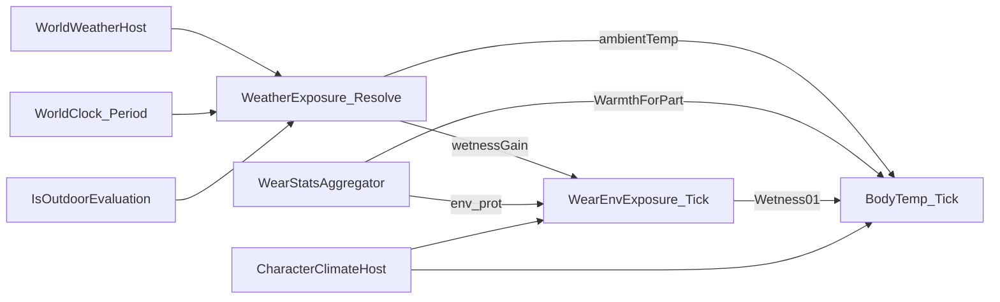

# Body (anatomy / climate)

> LLM/에이전트용 Dist 신체 트리·체온·절단·기후 호스트 SSOT.
> 인덱스: `docs/README.md`
> **anatomy / BodyTemp / sever / CharacterClimateHost 스크립트를 쓰거나 고치기 전에 이 문서를 읽는다.**
> **밸런스 상수(출혈·감염·붕대·고통 등) 인덱스:** [`TUNING.md`](TUNING.md) — 숫자는 코드 SSOT만.

경로: `Assets/Dist/Scripts/Gameplay/Definitions/BN/` · `Assets/Dist/Scripts/Gameplay/Gear/BodyTemp.cs` · `Assets/Dist/Scripts/Entity/Character/CharacterClimateHost.cs`

관련: Wear/Wield·env 공식 [`docs/equipment/GEAR.md`](../equipment/GEAR.md) · 생성 스펙·PC/NPC [`docs/character/DEFINITION.md`](../character/DEFINITION.md) · 이동 배율 [`docs/locomotion/LOCOMOTION.md`](../locomotion/LOCOMOTION.md) · 시간 [`docs/time/TIME.md`](../time/TIME.md)

PC와 NPC를 이 문서에서 나누지 않는다. `CharacterKind` 없음. 조종 여부는 [`DEFINITION.md`](../character/DEFINITION.md) (`CharacterMotor.IsPossessed`).

---

## 역할

| Type | Role |
|------|------|
| `ICharacterBody` / `CharacterBody` | 소유권 트리. `RemovePart` / `TryAttach` / `ToDto` / `FromDto` |
| `BodyPartNode` / `BodyPartKind` | 노드. `Organic` / `Prosthetic` |
| `BodyPartIds` | ID·`ThermalParts`·`SeverableParts`·`FrostbiteParts`·`VitalOrgans` SSOT |
| `CharacterBodyHost` | 엔티티별 `ICharacterBody` 소유 (플레이어·NPC 공용) |
| `CharacterClimateHost` | 공용 체온·습윤 틱. frostbite/heat. 엔티티별 outdoor |
| `BodyTemp` | 부위별 °C. 코어 getter = chest |
| `WearEnvExposure` | 습윤 0..1 (공식은 GEAR Phase E) |
| `WeatherExposure` | `Resolve(kind, period, outdoor)` → ambient °C / wetness gain |
| `BodyDamageService` | HP 타격. severable 0은 `BodySeverOverkill` 후 `RemovePart` + 소켓 Bleed. 뇌 제외 장기/몸통 0 → 강한 Bleed |
| `BodyCapacity` | 의식·펌프·호흡·여과·소화·이동·조작. **IsFatal = 의식 ≤ 0만** |
| `BodyIllness` / `BodyPain` / `BodyInjury` / `BodyInjuryTend` | 출혈·감염 상수 / PainTotal / 조직 부상 SSOT / tend |
| `OrganHitResolver` | 머리/가슴/배 피격 → 장기 분배 (mitigate 후) |
| `BodyPartRestoreService` | `TryRegenerate` / `TryAttachProsthetic` |
| `BodyHealApply` | heal 사용: 지정 `partId`에 즉시 HP + `bandaged` / 지혈(`hemostatic`) |
| `BodyEffectTicker` | 부상 tend·효과 지속·Bleed→Blood01(붕대 부위는 drain 스킵→dirty)·감염 onset/레이스·독소 감쇠 (World delta) |
| `CharacterActionDelay` | 효과 배율 × Manipulation TickScale. [`../character/ACTION.md`](../character/ACTION.md) |
| `BodyLocomotionPenalties` | 절단 절뚝 × `GearEnvPenalties` (이속; Moving 용량과 곱하지 않음) |
| `CharacterBodyDto` / `BodyTempDto` | JsonUtility 왕복. **세이브 UI 없음**. Blood/Toxin/감염은 DTO 없음 |

---

## Anatomy

`CharacterBody.CreateHumanDefault` 트리. 루트: head, chest, 양 상완, 양 대퇴.

`VitalOrgans` (조준·절단·체온 밖): `brain`(head), `heart`/`lung_l`/`lung_r`(chest), `liver`/`stomach`/`kidney_l`/`kidney_r`(belly). 장기 HP는 `OrganCondition*` (STR 가산 없음).

`ThermalParts` (10, 체온 틱·표시): `head`, `chest`, `upper_arm_l/r`, `hand_l/r`, `thigh_l/r`, `foot_l/r`.

`SeverableParts`: 팔/다리 체인 + 손가락(`finger_thumb_*` / `finger_index_*`). `head`/`neck`/`chest`/`belly`/`pelvis`·장기 제외. 손가락은 자체 HP(`FingerCondition` 8). 손 조준은 `OrganHitResolver`가 엄지/검지로 분배(`HandToFingerEach`).

`FrostbiteParts`: `head`, `hand_l/r`, `foot_l/r`.

`StatusConditionParts`: Main + VitalOrgans (상태창 행). Status 호버(`UIPlayerStatusDetailPanel`)는 특이사항이 있는 노드만 띄운다: 상실, `ConditionCur < Max`, 효과, 의체. 하위도 이상이 있는 것만. 없으면 패널 Hide. 인체도 실루엣은 항상 둔다.

소켓: `GetSocketParentId`. 상완/대퇴는 루트(`null`) — `TryAttach(null, …)`이 루트로 채운다. 부모는 남고 하위는 소유권으로 함께 도달 불가.

심각도 스케일 (림월드와 같음). **부상을 0–1로 정규화하지 않는다.** 유기 부위 진실원은 부상 엔트리. `ConditionCur` = max − (bruise+cut+gunshot+fracture intensity 합).

| 종류 | 스케일 | Dist |
|------|--------|------|
| 부상 (`bruise` / `cut` / `gunshot` / `fracture`) | 그 부위 **HP 점수** | `BodyPartEffect.Intensity`. HitTag: bash·무태그→bruise, cut→cut, bullet→gunshot |
| 부위 Bleed | 상처의 출혈량(점수). 혈량 막대가 아님. HP에 안 들어감 | intensity int. 틱이 Blood01을 깎음 |
| 혈량·독·감염 진행 | **0–1** (1이 끝) | `Blood01` / `Toxin01` / `InfectionProgress01` / `InfectionImmunity01` |

---

## Death / capacity

**사망 (`IsDeadState` / `BodyCapacity.IsFatal`)** = **의식 ≤ 0** 만. 바닐라 림월드의 심장·간 즉사는 Dist에 없음.

`ICharacterDefeat.StatCollapse`는 기본 능력치 **최종값(Buffed) ≤ 0** (`IsCollapsed`). 래치 시 콘솔 `[StatCollapse]` 덤프. `BodySkillModifierAggregator`는 **`CharacterSkillsHost`만** 붙인다. HUD / `GameplayData` / `DefaultPlayerStats`는 수식기를 붙이거나 Refresh하지 않는다.

의식이 0이 되는 원인:

| 원인 | 설명 |
|------|------|
| 뇌 없음/HP0 또는 머리 부모 HP0 | 유일한 장기 즉사 |
| `Blood01` ≤ 0 | 과다출혈 |
| `InfectionProgress01` ≥ 1 | 감염이 면역을 이김 |
| `Toxin01` ≥ 1 | 독소 |

펌프·호흡·여과·소화·이동·조작 0은 사망이 아님. 심장·폐·간·신장·위·목·가슴·배 HP0 → **강한 Bleed** (`BodyIllness.OrganDestroyedBleed*`), 즉사 아님. 가슴/배 0이면 무효 자식 장기마다 Bleed. Bleed는 디버프가 아니라 상처에서 Blood01이 빠지는 중인 상태다. 유기 부위에 `cut`이 남아 있으면 그 부위는 파생 Bleed를 유지한다(`BodyIllness.BleedIntensityForCut`, 영구). tend로 베임이 0이 되면 그 기여분만 제거한다. 소켓·장기 파괴 Bleed는 베임과 별개. 완화 후 태그가 여전히 cut일 때만 베임이 생긴다 (`WearCombatDefense` 튕김·Sharp→bash면 없음).

`bash`/무태그 타격은 유기 부위에 `bruise`. cut→`cut`, bullet→`gunshot`. Blood01은 안 깎는다(Bleed만). intensity = 입은 HP 점수, 합이 부위 max를 넘지 않음. `BodyInjuryTend`가 종류별 초당 1 HP만큼 intensity를 줄이고 `ConditionCur`를 다시 맞춘다(타박 1×, 베임·총상 2×, 골절 4× `InjuryHealSecondsPerHp`). 의체는 부상 없이 HP를 직접 깎음. 절단 성공 부위는 노드가 없어 부상 없음(소켓 Bleed만). 피 히트 VFX는 이번 히트가 `cut`을 남기면 `Vfx_HitBleed`, 절단이면 `Vfx_HitBleedSever` (`WeaponImpactVfxDefaults` 오버레이).

쓰러짐 (`CharacterPainHost.IsPainShocked`): 고통 ≥ 0.8로 **진입**, 래치 중에는 ≥ `PainWakeThreshold`(0.5)면 유지. 또는 `BodyCapacity.IsCapacityDowned` (의식 &lt; 0.3 / Moving &lt; 0.15 / Breathing ≤ 0). Defeat/Dead 아님.

이속: `BodyLocomotionPenalties` 절뚝 유지. Moving을 이속에 곱하지 않음.

런타임만 (DTO 없음, FromDto 후 리셋): `Blood01`(기본 1), `Toxin01`, `InfectionProgress01`, `InfectionImmunity01`.

출혈 틱: Bleed intensity 합 → Blood01 감소 (부위 ApplyHit 없음). **`bandaged` 부위는 drain만 스킵**하고 Bleed 판정은 남긴다. 스킵한 흡수량(`BleedIntensity × BleedBloodPerIntensityPerSecond × dt`)이 `bandage_dirty`로 쌓인다. 베임이 남은 부위는 틱마다 파생 Bleed를 영구로 맞춘다(`hemostatic`이면 재부착 금지). 약의 `MedBleedIntensityReduce`는 베임이 남은 부위에선 다음 틱에 되돌아간다(소켓·장기 Bleed만 지속 감소). drain 누적 ≥ 문턱 시 발 월드에 맵 혈흔 스탬프 (`MapBloodHost`, [`docs/map/DATA.md`](../map/DATA.md)). 출혈 age ≥ `InfectedOnsetSeconds` → Infected. 깨끗한 붕대는 onset 적립을 늦추고(`BandageCleanInfectedOnsetMul`), dirty가 오를수록 가속한다(`BandageDirtyInfectedOnsetMul`). 부상·Bleed 없이 더러운 붕대만으로는 Infected 없음. 면역 × 여과 vs 진행. 독소는 여과로 감쇠. 항생제 `use_action` (`antibiotic` / `weak_antibiotic` / `strong_antibiotic`)은 감염 진행을 절대 깎지 않고 가슴 `antibiotic` 효과로 면역 획득만 배율한다(BN 12시간 = 기본 시계 World 720초). 소독제 계열은 이 경로가 아님 (`heal`).

heal `use_action`: **부위 지정 필수** (`ConsumeService.TryBegin(..., partId)`). 인벤 Use 서브메뉴·HUD/Status 실루엣 RMB. 자동 최악 픽으로 실행하지 않는다. `limb_power` / `head_power` / `torso_power`는 그 부위 **즉시** 부상 감소(머리·몸통 JSON이 0이면 limb ×0.8 / ×1.5). **`bandages_power`**: 그 부위 `bandaged` 영구(수동 벗기만). Bleed 판정은 유지, Blood01 drain만 막고 tend `BandageTendMul`. BN 붕대 JSON의 `bleed`는 Dist가 무시. **`bleed`만 있고 `bandages_power` 없음**(예: quikclot): 지혈제 — Bleed 제거 + `hemostatic`(새 `cut`이면 플래그 해제). HUD 붕대·dirty·tend 없음. `disinfectant_power` / firstaid 스케일은 Parked. 스캔 범위: 몸통 인벤 + 들기만.

---

## ClimateHost vs PlayerGearHost

경계 SSOT. Wear 합·헬멧 시야는 Gear. 체온 틱·실내외는 ClimateHost.

| | `PlayerGearHost` | `CharacterClimateHost` |
|--|------------------|------------------------|
| 누가 | 플레이어 Wear 호스트 (인벤 의존) | `CharacterBodyHost` 있는 엔티티 |
| 틱 | Gear timed + `HelmetVision` | `BodyTemp` / `WearEnvExposure` / frostbite·heat / env 이동 |
| 날씨 Kind | `WorldWeatherHost` **포워드** (`WorldWeatherKind`) | `WorldWeatherHost.TryGetKindAt` (발 셀; stub=글로벌) |
| ambient 캐시 | ClimateHost에서 **포워드** (`Weather`) | `WeatherExposure` 1개. `Resolve(kind, period, outdoor)` |
| 실내외 | 안 함 | `TileMapCacheHub.IsOutdoorEvaluation` per entity |
| BodyTemp 소유 | ClimateHost에서 **포워드** | `_bodyTemp` 소유. `ApplyBodyTempDto` |
| Wear 없을 때 | (호스트 없음) | warmth 0, env_prot 0. Kind는 WorldWeatherHost 또는 `Clear` |

`PlayerGearHost.BodyTemperature` / `EnvExposure` / `Weather`는 ClimateHost 참조. 틱·ambient 캐시는 ClimateHost `Update`만 (`TimeScaleService.Delta(World)`). Kind SSOT: [`docs/weather/WEATHER.md`](../weather/WEATHER.md).

Checklist: [`.claude/checklists/migration-parity.md`](../../.claude/checklists/migration-parity.md).

### Parity (체온 호스트)

| Before | After (기본 경로) |
|--------|-------------------|
| `PlayerGearHost`가 `BodyTemp.Tick` + `WearEnvExposure.Tick` | `CharacterClimateHost`가 같은 World dt로 틱 |
| 단일 코어 °C (`TotalWarmth`) | `ThermalParts`별 °C. 코어 getter = chest |
| NPC env 배율 = 1 (Phase H 스탠드인) | ClimateHost → `CharacterMotor.SetEnvMovement` |
| outdoor 없음 | 엔티티 바닥 셀 `IsOutdoorEvaluation` |
| Kind만 `WeatherExposure.Resolve()` | `Resolve(kind, WorldClock.Period, outdoor)` |

---

## BodyTemp (per-part)

코어: `BodyTempC` / `Feeling` / `TargetTempC` = chest. 가슴 없으면 `ComfortBodyTempC`.

`Tick(dt, wetness01, ambientTempC, warmthIn, presentIn)` — 배열 길이 = `ThermalParts`. 없는 부위는 스킵.

| Name | Formula |
|------|---------|
| `Target` | `ambient + WarmthForPart × DegreesPerWarmth − Wetness01 × WetnessCool` (부위 min/max clamp) |
| 수렴 | `temp + (target − temp) × ConvergencePerSecond × dt` |
| Heat flow | arms←chest, hands←arms, legs←chest, feet←legs (`HeatFlow*PerSecond`) |

Consts: `ComfortBodyTempC=37`, 코어 min/max `27`/`43`, 말단 min/max `-10`/`48`, `FrostbiteOnsetTempC=0`, `BaseAmbientTempC=18`, `DegreesPerWarmth=0.5`, `WetnessCoolDegreesC=2`, `ConvergencePerSecond=0.08`, `ComfortBandHalfWidthC=1`, `HypothermiaBodyTempC=32`.

`Feeling` / `GearEnvPenalties`는 **코어 Feeling만** (부위별 Feeling은 frostbite 판정용 `FeelingForPart`).

---

## Weather / outdoor

`WeatherExposure.Resolve(WeatherKind kind, DayPeriod period, bool outdoor)`:

- 실내: `IndoorAmbientTempC` (= Clear 18°C), wetness 0. 비/바람·기간 오프셋 무시
- 야외: kind ambient + `ResolvePeriodOffsetC` (`Night=-6`, `Dawn=-3`, Day/Dusk=0)
- Kind: Clear 18 / Rain 10 / Wind `Clear − WindChillDegreesC(4)` / Snow −4
- Wetness/s 야외: Clear 0 / Rain 0.02 / Wind 0.002 / Snow 0.004

`CharacterClimateHost.ResolveOutdoor`: 에디터 `DebugOutdoorOverride`(ForceOutdoor/ForceIndoor)가 있으면 그걸 쓰고, 없으면 `OccupiedCellCoord` → `TileMapCacheHub.Runtime.IsOutdoorEvaluation(floor.y, x, z)`. 허브 없으면 outdoor true. Play 디버그: `Tools/Environment Runtime Debug` (`docs/time/TIME.md`). 체온·습윤 값은 `Tools/Character Runtime Debug` Climate.

레거시 `Resolve()` = Day + outdoor true (Kind만 바꿀 때).

---

## Frostbite / heat

ClimateHost, World초.

| 효과 | 조건 | 부여 |
|------|------|------|
| `BodyPartEffectIds.Frostbite` | `FrostbiteParts`가 `FrostbiteOnsetTempC`(0°C) 이하 `FrostbiteOnsetSeconds`(30) 유지. Feeling Cold(~34°C)·야간 맑음(~12°C)과 분리. Snow+Night ≈ −10°C로 도달 가능 | 해당 부위, 이미 있으면 스킵 |
| `BodyPartEffectIds.Heat` | 코어 Feeling ≥ Hot `HeatOnsetSeconds`(20) | `chest` |
| 극단 코어 피해 | `BodyTempC` ≤ min 또는 ≥ max | `BodyDamageService.ApplyHit(chest, ExtremeCoreDamage=1)` 매 `ExtremeCoreDamageIntervalSeconds`(4) |

HUD: `PlayerStatusMoodEffectCatalog` — Frostbite→`Hypothermia`, Heat→`Overheated`. 코어 Feeling 행은 `PlayerStatusMoodEntries.CollectCoreFeeling` (`HypothermiaBodyTempC` / TooCold / TooHot / Warm / Comfortable).

`BodyEffectSkillModifierCatalog` Frostbite는 DEX **Base의 −10%/intensity** (`FrostbiteDexPercentPerIntensity`). `FrostbiteParts` 5부이면 −50% (DEX 8 → 4). 절대 −2×5=−10이 아니다.

체온 탭 그래픽: `PlayerStatusBodyGraphicDisplay` — 부위 `TryGetPartTempC` vs Comfort 편차. 없는 부위 `present=false`.

---

## Sever / restore

| API | 계약 |
|-----|------|
| `ICharacterBody.RemovePart` | 부모 컬렉션에서 노드 제거. 소켓(부모) 유지 |
| `ICharacterBody.TryAttach(parentId, node)` | 런타임 복원 전용. `parentId` 비면 루트. 같은 partId 있으면 false |
| `BodyDamageService.ApplyHit` | 메인 컨디션 HP. severable이 0이 될 타격은 `BodySeverOverkill` 주사위. 실패=1 HP. 성공=`RemovePart` + 소켓 Bleed (`ApplySeverStumpBleed`) |
| `BodyPartRestoreService.TryRegenerate` | `TryCreateLimbFrom` + `TryAttach` + `Regenerating` 효과 |
| `BodyPartRestoreService.TryAttachProsthetic` | 같은 부착, `BodyPartKind.Prosthetic`, Regenerating 없음 |

이미 있는 부위·비-severable·부모 없음 → restore false. Prosthetic는 `BodyEffectTicker` 출혈 스킵.

절단 오버킬 (`BodySeverOverkill`, 림월드식). 초과분/최대HP. inverse lerp가 파괴 확률. 머리/가슴 즉사 없음.

잘린 부위의 Bleed는 노드와 함께 사라지므로, 남는 소켓에 `ApplySeverStumpBleed` (`GetSocketParentId`, 상완/대퇴는 `chest`). intensity: 손가락 2 / 손·발 3 / 전완·종아리 4 / 상완·대퇴 5. 상태창 디버그 `RemovePart`만 호출하면 출혈 없음.

| HitTag | 구간 |
|--------|------|
| `cut` | 0–10% |
| `bullet` | 0–70% |
| `bash`·그 외 | 40–100% |

질량: `CharacterAppearanceHost.RemainingMassKg` = `bodyMassKg` − 없는 `partMasses` kg. **과적(encumbrance) 미연동** — [`DEFINITION.md`](../character/DEFINITION.md).

---

## DTO (왕복, 저장 UI 아님)

`JsonUtility.ToJson` / `FromJson`. 세이브 슬롯·파일 경로 없음. 에디터 ContextMenu: `CharacterBodyHost` `CharacterBodyDtoRoundTrip.Execute`, `CharacterClimateHost` `BodyTemp.ExecuteDtoRoundTripVerify`. 런타임 적용: `CharacterBodyHost.ApplyBodyDto`, `CharacterClimateHost.ApplyBodyTempDto`.

| DTO | 필드 | 왕복 |
|-----|------|------|
| `CharacterBodyDto` | `parts[]` | `ICharacterBody.ToDto` / `FromDto` |
| `CharacterBodyPartDto` | `partId`, `parent`, `kind`, `hasCondition`, `conditionCur`/`Max`, `effects[]` | 트리 재부착 |
| `BodyPartEffectDto` | `effectId`, `intensity`, `remainingSeconds` | |
| `BodyTempDto` | `parts[]` (`partId`, `tempC`)만. wetness 없음 | `BodyTemp.ToDto` / `FromDto`. 생략 부위는 tracked 아님 |

---

## Locomotion env

ClimateHost가 **같은 값**을 넣는다:

- `CharacterMotor.SetEnvMovement(factor)` — NPC·비possessed 포함
- possessed: `PlayerMovement.SetEnvMovement(factor)` 동일 값

`factor = BodyLocomotionPenalties.CombinedMoveSpeedFactor(body, Feeling, Wetness01)`  
= `GearEnvPenalties.MoveSpeedFactor` (코어 Feeling + wetness) × 절뚝.

절뚝: 대퇴 없음 `0.5` (그 쪽 발은 스택하지 않음). 대퇴 있고 발만 없음 `0.8`. 양측 곱.

LiftStrain 배율만 `PlayerGearHost` (별 슬롯). 히트 배율: `ResolveAttackerEnvAccuracyFactor` (ClimateHost Feeling+wetness, 없으면 1) × `ResolveAttackerImbalanceAccuracyFactor` (`1 − Imbalance`, 호스트 없으면 1). 근접 확정 히트는 미적용.

관성 질량(밀침): `RemainingMassKg` + 착용·들기 kg. 과적 이동 배율에 kg를 다시 넣지 않는다. 소비처: `CombatImpulse.InertialMassKg` → `CharacterHitReact` / `CharacterAttacker.AddRecoilKick`.

상세: [`LOCOMOTION.md`](../locomotion/LOCOMOTION.md) · [`GEAR.md`](../equipment/GEAR.md) Phase H.

---

## PainTotal / 고통 쇼크

`BodyPain` / `CombatPain.PainTotal01` = 부위 조직 부상 intensity × `InjuryPainPerHp`(골절은 `FracturePainPerIntensity`) + Bleed 가산. 잃은 HP·부위 가중으로 고통하지 않음. `InjuryPainPerHp=0.01` — 한 부위 부상 합 ~80이면 고통 쇼크(0.8). HitTag는 J가 아님.

`EffectivePain01` = PainTotal × painFactor (`adrenaline`이면 `AdrenalinePainFactor`).  
고통은 의식에 곱하지 않는다. ≥ 0.8이면 쓰러짐(고통 쇼크). 고통 1이어도 혈량·뇌·독·감염이 남아 있으면 사망 아님. `BodyInjuryTend`가 부상 심각도를 줄이면 고통이 내려간다. 베임 tend 시 파생 Bleed intensity도 같이 줄어 가산이 내려간다. 소켓·장기 파괴 Bleed는 베임 tend로 지우지 않는다.

`CharacterPainHost`: effective ≥ `PainShockThreshold`(0.8)로 진입 **또는** `BodyCapacity.IsCapacityDowned`이면 살아 있는 다운 — `SetMoveLocked` + 액션/큐 취소. Defeat/Dead가 아니다. 고통 래치 기상은 `PainWakeThreshold`(0.5) 아래. 용량 다운은 대칭 문턱.

루팅: `PlayerInventoryHost.IsAvailableToPlayer`가 self이거나 `IsDefeated || IsPainShocked`.

HUD: `PlayerStatusMoodEntries`가 effective Pain ≥ `PainHudMin`이면 `MoodIconId.Pain`, ≥ `SeverePainHudMin`이면 `SeverePain`. 부위 Bleed로 Blood01이 빠지는 중이면 `Bleed`(디버프 아님). `Blood01` &lt; `BloodHudMin`이면 `Pale`. 의식만 `Fading`: &lt; `ConsciousnessHudMin` → 흐릿하다, &lt; `ConsciousnessDownedThreshold` → 가물거린다, ≤ 0 → 끊겼다. `StatCollapse`는 능력치 **Buffed ≤ 0**일 때 `MoodIconId.StatCollapse`(정신이 무너졌다). `IsDefeated`로 Fading을 덮지 않는다. 독소·저여과(`LowImmunity`)도 수집. 슬롯은 엔트리 수만큼 늘린다.

HUD fill (`Grp_PlayerStatusSummary` `BodyGrapicSet`): `Img_Layer1BodyOutline_blood_Fill` = `Blood01`, `Img_Layer1BodyOutline_consciousness_Fill` = `BodyCapacity.Consciousness`. 항상 갱신. 무드 아이콘은 문턱 게이트 유지.

인체도 밴디지: 부위 `Image` 자식 `Img_Bandage`. 스프라이트는 `bodyStatBandage` × 파츠 알파 베이크 (`ChibiBody/Bandage/`). 그 부위 또는 자식에 `bandaged`가 있으면 표시. `bandage_dirty` 비율로 틴트(깨끗 파랑→더러움 노랑). 부상만으로는 안 뜸. 상실 부위는 숨김. Status 실루엣 **RMB**: 몸통 인벤+들기의 heal 아이템 + 감겨 있으면 벗기. 장비 탭 **LMB** 커버 필터는 유지. 패치: `Dist/MCP/PlayerStatus/Patch Body Bandage Overlays`.

생명 위험 화면: 빙의 본체(`GameplayData.Body`)에 `BodyCapacity.LifeThreat01` &gt; 0이면 HUD `Layer_HUD` 맨 아래 `Hud_LifeThreat` 빨간 비니엣. 의식 &lt; `ConsciousnessHudMin` 또는 혈량 ≤ `BloodHudCritical`. 고통 쇼크·용량 다운(Moving/Breathing)만으로는 안 뜬다. `Layer_Window` 위 창 본체는 물들지 않음.

절단된 부위는 `GetConditionMax==0`이라 PainTotal에서 skip. 소켓 Bleed는 부모 부위 상해 고통.

상수·Hurt 밀침: [`LOCOMOTION.md`](../locomotion/LOCOMOTION.md) 피격 밀침 / 상수 표.

---

## Pending

| 항목 | 상태 |
|------|------|
| 세이브/로드 UI | 없음 — DTO 왕복만 |
| 과적 ↔ `RemainingMassKg` | 이동 과적은 미연동. 밀침 질량은 `CombatImpulse.InertialMassKg`가 소비 |
| 낮/밤 라이팅 | TIME.md Pending. Period는 ambient만 |
