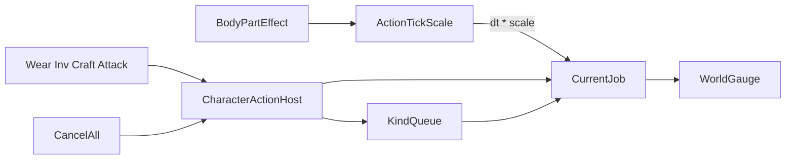

# Character Action (게이지·큐)

> LLM/에이전트용 행위자 행동 직렬화 SSOT.
> 인덱스: [`docs/README.md`](../README.md)
> 관련: [`DEFINITION.md`](DEFINITION.md) · [`../body/BODY.md`](../body/BODY.md) · [`../ui/SETTINGS.md`](../ui/SETTINGS.md) · [`../equipment/GEAR.md`](../equipment/GEAR.md)

경로: `Assets/Dist/Scripts/Entity/Character/CharacterActionHost.cs`  
지연: `CharacterActionDelayCatalog` / `CharacterActionDelay` (`Dist.Gameplay.Data`)  
UI: `Assets/Dist/Visual/Prefabs/UIComponents/Character/Grp_CharacterActionGauge.prefab`  
Patch: `Dist/MCP/Character/Patch Action Gauge On Player`

게이지·큐·취소는 **그 행동을 하는 행위자 GO**에 붙는다. 플레이어 전역/`GameplayData` 아님.

---

## 계약 (패리티)

| Before | After |
|--------|--------|
| 장비 타이머·인벤 이동·전투 쿨·제작이 겹칠 수 있음 | 같은 행위자에서 **한 줄만** 진행, 나머지는 종류별 큐 |
| busy면 거절 | `TryRunOrEnqueue` — idle이면 즉시 Start, busy면 종류 정책 |
| ESC가 행동을 안 끊음 | possessed만 `CancelAll` (현재 작업+큐). 전투 쿨은 스킵하지 않음 |
| 상태이상이 행동 시간에 무관 | `BodyPartEffect` → `TickScale`을 실제 dt에 곱함 |

```text
요청 → CharacterActionHost.TryRunOrEnqueue
         idle  → Start (기존 Gear/Inv/Craft/Attack 타이머)
         busy  → 종류별 EnqueueOrReplace
         완료  → dequeue 다음 Start
CancelAll → 현재 작업 취소(적용 없음) + 큐 전부 폐기
            (누가 호출하든 동일. possessed ESC / AI / 상호작용 중단)
```

종류별 큐 정책 (`EnqueueOrReplace`) — 이산 작업과 연타 입력을 같은 FIFO에 넣지 않는다.

| Kind | busy일 때 | 이유 |
|------|-----------|------|
| Gear / Inventory / Craft / Map | FIFO append | 클릭 1 = 작업 1. 착용 중 인벤 이동은 대기. Map = `CharacterArriveHost` 도착 |
| Combat | 큐에 **최대 1개**. 이미 Combat이 있으면 Start만 교체 | LMB 연타는 “지금 한 대”이지 N대 예약이 아님 |

교차 종류는 그대로 한 줄: 착용 중 공격은 Combat 1칸이 뒤에 앉는다. 쿨 중 연타는 그 1칸만 최신 클릭으로 덮는다.

애니 `_attackActionQueue`(길이 2, 초과 drop)와 별개. Auto 홀드 연사는 클릭 큐가 아니라 입력 유지 → 같은 Leaf 재시전 (`docs/PLAN.md`).

```text
현재 Gear, Combat 연타 → 큐 [Combat×1]
현재 Combat, 큐 비움, 클릭 → 큐 [Combat] (버퍼 1)
현재 Combat, 큐 [Combat], 클릭 → 그 잡 Start만 교체
현재 Combat, 큐 [Inv], 클릭 → 큐 [Inv, Combat]
```



타이머 **식**은 Host에 복붙하지 않는다. Start 콜백이 기존 시스템을 켠다. 완료는 해당 소스 idle 전이.

---

## TickScale

`CharacterActionDelay.TickScale(body)` — 트리 효과 순회, catalog 배율을 intensity만큼 곱. 미등록 1. 그다음 `BodyCapacity.ManipulationTickScale` 한 번 곱. 하한 `MinTickScale`.

적용: GearTimedAction, InventoryTimedMove, 전투 쿨, 제작 경과. 이동 속도(`BodyLocomotionPenalties`)와 별개. Feeling/습윤/과적은 후속 가산.

---

## CancelAll

모든 Host 공통. 전투 쿨은 남긴다. 작업/큐가 있으면 그것만 취소.

possessed ESC: `CharacterActionCancelConsumer` → `UiCancelPriority.CharacterAction` (60). 메뉴(100)가 먼저. 다른 오브젝트 큐를 ESC가 끊지 않음.

---

## UI

월드 캔버스 fill. idle이면 Canvas 비활성. 레이아웃은 프리팹 SSOT (`CharacterActionGaugeLayout`은 Patch 수치). 라벨/TMP 없음. 정면은 `WorldBillboard` (기본 Realtime, Inspector 토글).

---

## 검증

IsoLand `>PlayerCharacter`: 착용 중 인벤 이동은 큐. ESC는 미적용+큐 소멸. 컨텍스트 메뉴 ESC는 메뉴만. 쿨만 남은 ESC는 세팅. 골절 등이 있으면 진행이 더 김. 조준 중 LMB 연타 → 쿨 끝난 뒤 **한 대만** (손 뗀 뒤 지연 연타 없음).
