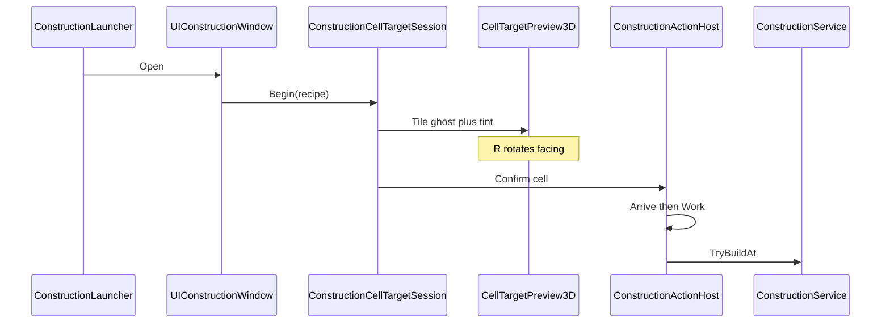

# Construction

> Dist **본편 건설** (재료·시간·Arrive→Work→맵 설치) vs **런타임 편집기** (PrefabDB 즉시 배치).
> 인덱스: [`docs/README.md`](../README.md)

경로(본편): `Assets/Dist/Scripts/Interactions/Construction/` · `Inventory/ConstructionService.cs` · `UI/Construction/`  
경로(프리뷰 SSOT): `Assets/Dist/Scripts/Map/Construction/CellTargetPreview3D.cs` · `ConstructionConsts.cs`  
경로(데이터): `Assets/StreamingAssets/GameData/constructions.json`  
경로(런타임 편집기): `UI/Component/UIConstruction.cs` · `UI/Construction/GridCursor.cs` · `TilePlacementState`

---

## 두 트랙

| 이름 | 역할 | 합치지 않음 |
|------|------|-------------|
| **본편 건설** | 레시피 → 셀 타겟 → Arrive → Work → 소비·설치 | HUD `ConstructionWindowLauncher` |
| **런타임 편집기** | PrefabDB 카탈로그 → `GridCursor.TryPlace` 즉시 `AddAndFlush` | IsoLand `UIConstruction` · 디버그 토글 |

공유: `GridCursor`(셀 픽), `TilePlaceUtil`, PrefabDB.

---

## 본편 흐름

- 재료: `CraftingMaterialPool` + `CraftingService.CanCraft` (레시피 어댑터)
- 설치: `HorizontalFace` → `TryReplaceFloorMaterial`; 그 외 → `TilePlaceUtil` + `AddAndFlush`
- `VerticalFace`: `wallFace` 사이클 (R). `OccupiedCell`: 프리뷰 Yaw만 (identity yaw Pending)
- 상호 배제: Farm / Fish / 런타임 편집기 / 본편 창·세션

---

## CellTargetPreview3D SSOT

Farm 심기 프리뷰와 **동일 호스트**.

| 모드 | 내용 | 회전 |
|------|------|------|
| Plant | `MapPlantOverlayVisual.Apply` | no-op |
| TileGhost | PrefabDB 프리팹 고스트 | R 90° (`VerticalFace`는 wallFace 2방향) |

틴트·Resources 루트: `ConstructionConsts` (`MapPlantConsts`가 동일 값 참조).

---

## 데이터

`GameData/constructions.json` → `ConstructionCatalog` (`GameDataLoader.Constructions`).  
BN `construction.json` bake: **Pending** (`CC_BUILDING` recipe 스킵 유지).

샘플: `construct_wood_floor` / `construct_bed` / `construct_slim_wall` (재료 `consumable_egg` — 플레이테스트용).

---

## Setup (MCP)

| 메뉴 | 역할 |
|------|------|
| `Dist/MCP/Construction/Create Construction Window Prefab If Missing` | 프리팹 일회 생성 |
| `Dist/MCP/Construction/Setup Canvas In Open Scene` | 컨트롤러·런처·`GridCursor` 배선 |
| `Dist/MCP/Construction/Fix Runtime Editor TileMap Refs In Open Scene` | 편집기 TileMap 참조 |
| `Dist/MCP/Construction/Toggle Runtime Tile Editor In Play Mode` | 편집기 토글 |

---

## 런타임 편집기 수리 (v1)

- `GridCursor` 런타임 `TileMapController`/`TileMapManager` Resolve
- `TryPlace` null 가드
- `UIConstruction` Open/Close 재진입 제거 (`OnEnable`이 `Open` 재호출 안 함)
- Dist `GridCursor` Setup으로 생성 가능 (Farm/Fish 공용)

---

## Pending

- BN construction.json → Dist 매핑
- OccupiedCell facing 저장(identity)
- 본편 UI chrome 손수 polish
- 런타임 편집기 Dist 전용 프리팹·3D 고스트 공유
