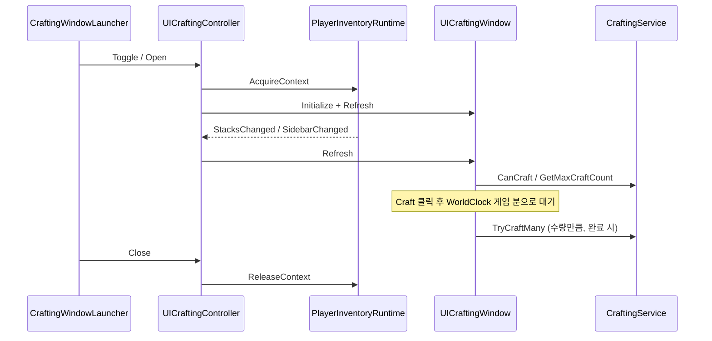

# Crafting

> Dist 제작: 아이템 컨텍스트 메뉴 제작 vs 제작 **창**. 재료 풀·대체재·소모 계약.
> 인덱스: [`docs/README.md`](../README.md)

경로: `Assets/Dist/Scripts/UI/Crafting/` · 프리팹: `Assets/Dist/Visual/Prefabs/UIComponents/Crafting/`  
백엔드: `CraftingService` · `CraftingMaterialPool` (`Assets/Dist/Scripts/Inventory/`) — 창이 이 경로를 재작성하지 않는다.

---

## 두 경로

| 경로 | 재료 범위 | 대체재 | 진입 |
|------|-----------|--------|------|
| 아이템 컨텍스트 메뉴 (`CraftContextAction`) | 클릭한 **단일 컨테이너** | 없음 (서비스 기본 픽) | 인벤 행 우클릭 |
| 제작 창 (`UICraftingWindow`) | 사이드바 전체 `CraftingMaterialPool` | 슬롯별 인덱스 + 드롭 선택 | HUD `CraftingWindowLauncher` (핫키 없음) |

창이 열려 있는 동안 `PlayerInventoryRuntime.AcquireContext`를 유지한다. 닫으면 `ReleaseContext`. 런타임이 사라지면 창을 닫는다. 창에서 Craft는 **즉시 소비하지 않고** `time_minutes × 수량` **게임 분**(`WorldClock.DeltaGameMinutes` = World delta × `WorldMinutesPerRealtimeSecond`)을 기다린 뒤 `TryCraftMany`한다. 월드 정지·배속은 시계와 같이 멈춘다/빨라진다. `SetTime` 점프는 제작을 건너뛰지 않는다. 닫으면 진행 중 제작은 취소되고 재료는 그대로다. 아이템 컨텍스트 메뉴 제작은 기존처럼 즉시 `TryCraft` 1회.

---

## Material pool

`new CraftingMaterialPool(session.GetSidebarContainers(), runtime.IsWorldLootContainer, PlayerInventoryHost.DefaultInstanceId)`

- 사이드바 컨테이너를 합산해 `CountItem` / `CountToolCharges` / `TryRemoveItem` / `TryConsumeToolCharges`.
- 소비 순서: 플레이어 바디 → 소유 컨테이너 → 월드 루트.
- 결과는 플레이어 바디에 추가.

창은 스택/사이드바 변경마다 풀을 다시 만든다. `ICraftingSource`는 쓰지 않는다. 레시피 목록은 `GameplayData.GetAllRecipes` / `GetRecipeCategories`.

---

## Recipe knowledge

SSOT: `RecipeKnowledge.GetFailureReason` (`null` = Known). `GameplayData.RecipeMemory` (decomp 영구 습득, 런타임만).

| 경로 | 조건 |
|------|------|
| memory | `RecipeMemory.IsKnown(recipe.id)` |
| trait `omniscience` (전지) | `GameplayData.Traits.Has(TraitIds.Omniscience)` → 전부 Known |
| `autolearn_skills` | 목록 **전부** 스킬 레벨 충족 |
| `autolearn` (bool만) | `skill_used` ≥ `difficulty` (`autolearn_skills` 없을 때만) |
| `book_learn` | 인벤에 책 + 스킬 |
| 게이트 없음 | Known (GameData 커스텀 등) |
| `decomp_learn`만 | Locked → 분해 성공 + 스킬 충족 시 `TryLearnFromDisassembly` |

`CanCraft` 재료·스킬·proficiency와 별개 (습득 ≠ 제작 가능).

---

## 대체재 · 드롭 ≠ 이동

- 기본 인덱스: 슬롯에서 **조건을 만족하는 첫 대체재**, 없으면 `0`. 레시피 변경 시 리셋. 품질 칸도 동일 — 요구 품질/레벨을 가진 아이템이 대체재다.
- 아이콘/스왑 클릭: `UIContextMenuHost.TryShow` + `CraftingAltSelectAction`. 대체재는 **전부** Leaf로 넣는다. 보유 중이면 활성·맨 위, 없으면 비활성. 비활성 Leaf가 많으면 공용 컨텍스트 오버플로(`docs/ui/ContextMenu.md`)가 `그 외 N개`로 접는다. 없는 항목은 고를 수 없다. 품질 대체재 라벨은 `이름 lv.레벨`.
- 카드 `IDropHandler`: `InventoryDragKind.Item`만. 그 슬롯 alternatives에 `itemId`가 있으면 해당 인덱스를 고르고 `InventoryDragState.MarkConsumed`. **스택 이동 없음** (`InventoryDragDrop.TryApplyTo` 금지). `End()`는 인벤 컨트롤러만.

---

## Consume vs keep vs charges

| 슬롯 | 아이콘 | 소비 |
|------|--------|------|
| components | consume (소모) | `TryRemoveItem` |
| tools `charges <= 0` | keep (유지) | 존재만 검사, 아이템 제거 없음 |
| tools `charges > 0` | fuel (충전) | `TryConsumeToolCharges` — 공구 아이템 자체는 제거하지 않음 |
| qualities | 요구 레벨 이상 도구 아이콘(대체재 스왑·드롭). 하단 기능명(`UITextPresenter.GetQuality`) + 우상단 `{보유}/lv.{요구}` | 품질 id/level 충족만 |

---

## Light · PSEUDO · proficiency

요리·광원·환경 도구 SSOT: [`cooking/COOKING.md`](../cooking/COOKING.md).

- `CraftingLightGate` + 헤더 `Img_Light`: 레시피 `flags`에 `DARK`일 때 조도 검사 → `CanCraft`.
- `CraftingEnvironmentProvider`: `PSEUDO` 도구(`fire`/`apparatus`/`sunlight`)·가구 `COOK` 품질.
- `ICharacterProficiencies`: required proficiency + `time_multiplier`.

작업대 라벨: 사이드바에서 플레이어 바디·바닥 루트를 제외한 **첫 월드 루트 컨테이너** 이름. 없으면 숨김. `Crafting.TitleOn` vs `Crafting.Title`.

---

## 창 UI

- 레이어 `UICanvasLayer.Window`. 루트에 `UIOverlayWindow` + `UIWindowResizeHandles` + 헤더 `UIWindowDragHandler` (프리팹 SSOT, 런타임 AddComponent 금지).
- 헤더 접기/끄기: 공용 `UIWindowChromeBar` (`Btn_Fold` / `Btn_Close`). 끄기는 `UICraftingController.Close` (런처로 다시 열림). 구 `Btn_Close` 전용 훅은 크롬 바가 있으면 쓰지 않음.
- 왼쪽: ALL / Favourites / `GetRecipeCategories` (`UITextPresenter.GetRecipeCategory` → `item_names.json` `recipe_categories`. `__all__` / `__favourites__`는 Loc 크롬. `RecipeCategoryLabels`는 같은 presenter — Dist.Inventory.UI 순환 없음).
- 가운데: 결과 이름 검색, 그리드/리스트 토글, 제작 가능(지식·재료·스킬 충족)을 맨 위·이름 녹색(`SkillMetColor`), 뷰포트 기반 셀 재활용 (ALL을 한 번에 Instantiate하지 않음). LeanPool 없음.
- 오른쪽: 결과 아이콘·이름, 스킬·지식(충족 녹 / 미달 적 텍스트 목록), 별·시간·책·작업대·라이트, 재료·도구품질·출력은 그리드 아이콘(우상단 `보유/요구`, 좌상단 kind 소모/충전/유지/품질, 품질 칸 하단 기능명, 대체재 시 우측 교체, 부족 시 아이콘 흐림), 수량 `±`/`MAX`, 소요 시간(제작 중에는 남은 시간으로 카운트다운), 진행바, Craft.
- 빠진 재료는 별도 이름 목록이 아니라 슬롯 수량 표시다.
- 즐겨찾기·뷰 모드: `CraftingFavoritesStore` PlayerPrefs (`Dist.Crafting.FavouriteRecipeIds`, `Dist.Crafting.ViewMode`).

Setup: `Dist/MCP/Crafting/Setup Canvas In Open Scene` — 프리팹 **로드만**. 없으면 LogError, 자동 bake 금지. 일회 bake factory는 프리팹 생성 후 삭제됨. 상세 열 추가분은 `Dist/MCP/Crafting/Patch Detail Outputs And Footer`. 재료 그리드는 `Dist/MCP/Crafting/Patch Ingredient Grid`.
