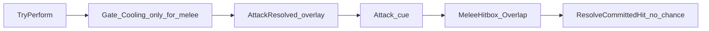
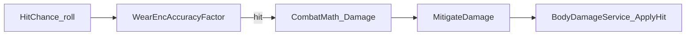
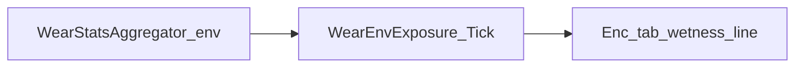
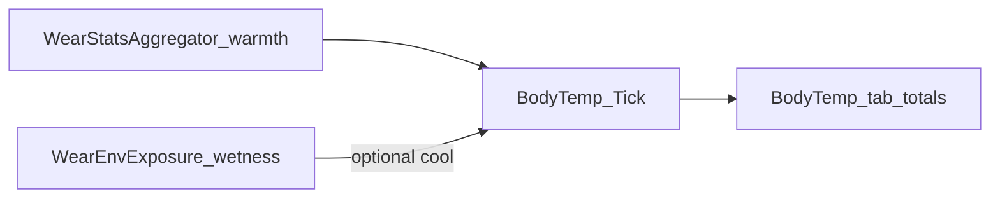
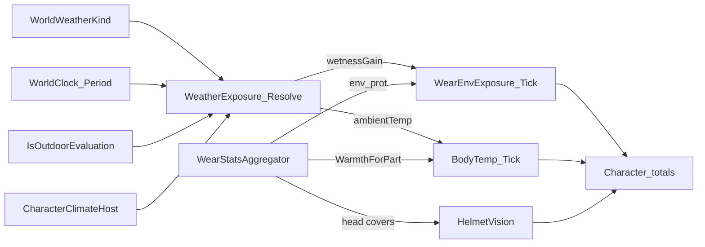
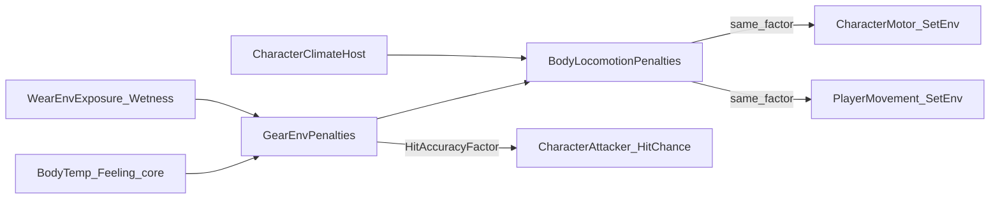

# Gear (Wear / Wield) — M0

Canonical for BN-style **착용(Wear)** vs **들기(Wield)** and the Character window equipment tab.

Related: [`docs/inventory/INVENTORY_UI.md`](../inventory/INVENTORY_UI.md) · Status parity lives in Character **상태** tab (`UICharacterWindow`).  
Anim/VFX 폴더 맵: [`WEAPON_VISUAL.md`](WEAPON_VISUAL.md).  
Anatomy / climate / sever: [`docs/body/BODY.md`](../body/BODY.md) (PC/NPC 분기는 [`DEFINITION.md`](../character/DEFINITION.md)).

## Terms

| Term | Meaning |
|------|---------|
| Wear | Armor/clothes with `armor.covers` → worn list only |
| Wield | L/R hand slots (weapons/tools). Two-hand = same stack on both slots; **no extra UI cell** |
| Character window | Tabs: 상태 \| 장비 \| 방해 \| 체온. Key = existing `StatusToggle` (`C`) |
| Primary | Highest DPS hand → `CharacterAttacker.SetWieldedItem` |
| SelectedAction | `ItemInstance.SelectedAction` — 손별 선택 **Leaf** (`WeaponAction`). 영속은 인스턴스 |
| Action layers | **Family** = 에디터·UI 묶음(Melee, Trigger; 없으면 평면). **Leaf** = 선택·시전·**Catalog 폴백 행**(Swing/Thrust/Raise/Semi/Burst/Auto — 줄 필수). **Override** = thin 덮어쓰기만(분류 아님·컨트롤러는 동작 모름). 할당한 클립 Speed=`WeaponAnimClipSpeeds`(슬롯 속도 아님, 없으면 1). 구 `Trigger`→Semi. [`BN_BAKE.md`](BN_BAKE.md) |
| Action rows | `WeaponPresentation` Entry = **Leaf** 라우팅 행 (가용 마스크 + Attack + 연출 + `useHold`). 가용 SSOT = Entry 존재 → `WeaponActionRows.Available` |
| Action VFX coalesce | Action: Entry.vfx → Catalog **같은 Leaf** 행. Hit: Entry → Attack VFX → Defaults[bash/cut/bullet] → fallback |
| Visual hub | `WeaponPresentationCatalog` — Pipeline / Tag Impact VFX / per-item Presentation 중간 진입점 |

## Domain SSOT

| Type | Role |
|------|------|
| `GearConstants` | GramsPerStr=500, TwoHandWeightFactor=2, SoftMargin, LiftStrainMoveFactor=0.9, OffHandDpsFactor |
| `GearHandleRules` | CanLift / RequiredStr / LiftStrain / IsWearable |
| `EquipmentWearState` | Worn stacks |
| `WieldSlots` | L/R (+ two-hand mode) |
| `CharacterGearService` | Timed Wear/Wield/Unequip + deposit |
| `PlayerGearHost` | Player Wear/Wield + Primary + LiftStrain + 씬 `WorldWeatherKind` + `HelmetVision`. BodyTemp / EnvExposure / **Weather(ambient 캐시)** 는 `CharacterClimateHost` 포워드 |
| `ItemInstance.SelectedAction` | 선택 동사 SSOT |
| `WeaponActionRows` | Presentation 행 → available / default / instance select |
| `PrimaryWieldResolver` | DPS primary; dual secondary score |
| `ToolUseWieldSession` | Snapshot → temp wield → restore (M0 API; consumers later) |
| `GearActionDuration` | Wear/TakeOff/Wield/Unwield seconds (proxy) |
| `InventoryTransferDuration` | MoveStacks / bag draw seconds — `draw_moves`→초(`CombatMath.MovesPerSecond`) **+** weight/volume/nest handling |
| `InventoryTimedMoveHost` | Per-stack sequential transfer (no summed delay); `ActiveStacks` = current only |
| `ItemTimedNameProgress` | Name-bar query SSOT: inv transfer → gear timed → durability |
| `WornPocketRules` | Wear 목록 → Nested ensure / owner lookup (사이드바) |
| `ArmorStorageNested` | Dist.Inventory — storage/pockets → Nested + draw_moves |
| `DualWieldAttackDriver` | TwoHand=1회; 듀얼=Primary→Offhand (`AttackResolved`); 양팔 overlay 동시·시전 트리거 교대; OffHandDpsFactor는 offense만 |
| `HandProficiencyIds` | `hand_l` / `hand_r` (skills.json seeded) |
| `WearStatsAggregator` | Wear-only armor aggregates (Phase A fields); combat reads via `WearCombatDefense` |
| `WearCombatDefense` | Phase D: ArmorEngage / ArmorAbsorb / MitigatedDamage + WearEncAccuracyFactor |
| `WearEnvExposure` | Phase E/G: weather wetness rate + env_prot → ExposureFactor |
| `BodyTemp` | 부위별 °C (`ThermalParts`). 코어 getter = chest. 틱 소유 = `CharacterClimateHost`. [`docs/body/BODY.md`](../body/BODY.md) |
| `WeatherExposure` | `Resolve(kind, period, outdoor)` → AmbientTempC + wetness gain |
| `HelmetVision` | Phase G: head covers → VisionFactor (host + Character UI + camera) |
| `GearEnvPenalties` | Phase H: **코어** `BodyTemp.Feeling` + wetness → move / HitChance. 부위별 Feeling 아님 |
| `WearOverlapRules` | Phase C: same part + layer(/sided) conflict → Wear **reject** |
| `WeaponPresentationCatalog` | 허브 (Fallbacks Catalog + Tag VFX + item→Presentation). Entry = **Leaf** 라우팅(가용·Attack·VFX) |
| `ArmAnimSlotCatalog` | **Leaf마다** 기본 동사 폴백(클립+VFX). Semi/Burst/Auto 줄 필수. Entry 빈 VFX → 같은 Leaf 행. 표시=Melee/Trigger 묶음 |
| `WeaponAnimClipSpeeds` | Override 서브에셋. 할당한 클립→재생 배속. thin 슬롯 속도 아님. 없으면 1 |
| `WeaponAttack` | 핸들러·cue·캐리어 VFX·탄 + **Recoil/Blocked on/off** + 근접 히트박스 반폭/반높이 (`Attack_MeleeHit` = logic 이름, **채널 아님**) |
| `AttackDamageTags` | 특성 채널. Trigger→탄 `damage_type`(없으면 bullet). 근접은 양 있는 채널 전부(cut+bash 가능). 원거리 양 = 탄 `damage` + 총 `ranged_damage`. 계산기·Hit 키 공유 |
| `MeleeHitbox` | 근접 cue OverlapBox. 겹침 = 확정 히트. `WeaponReach01` 기록(치명타 Pending) |
| `WeaponImpactVfxDefaults` | Hit 테이블(bash/cut/bullet + fallback). Recoil/Blocked(Reaction) 아님 |

### Melee connect (cue 히트박스)

**변경 전:** `GateAction`이 타깃·사거리를 막으면 스윙 없음. cue에서 잠긴 1명에게 `HitChance` 굴림.

**변경 후 (기본 경로):**

| 항목 | 계약 |
|------|------|
| 모션 | Cooling/pending/Unsupported만 시전 게이트. 근접 `NoTarget`/`OutOfRange`는 스윙을 막지 않음 |
| 판정 시점 | Attack 클립 cue (`CueNormalizedTime` / Animation Event) |
| 연결 | `MeleeHitbox` OverlapBox (조준 축, 길이 `CombatMath.RangeMeters`, 반폭/반높이 `WeaponAttack`) |
| 확정 | 겹친 `CharacterBodyHost`마다 `HitChance` 없이 피해. 방어는 `WearCombatDefense.MitigateDamage` 유지 |
| 허공 | 쿨·연습치만. `AttackJudged` Miss 없음 |
| 치명타 | `AttackOutcome.WeaponReach01` (0=손/자루 … 1=끝)만 기록. **로직 Pending** |
| 디버그 | `DebugLogController` Player → Melee Hitbox (`Config.DebugMode.MeleeHitbox`). GL 와이어. 노랑=현재 자세, 주황=cue 허공, 초록=cue 히트 + 접촉점 |

NPC는 여전히 사거리 안에서만 `TryPerform` (AI). 플레이어 시전은 조준(RMB) 입력 게이트 유지.

Checklist: `.claude/checklists/migration-parity.md`.

### CanLift

- One hand: `Ceil(weight_g / 500)`
- Two hand: `Ceil(weight_g / (500 * 2))`
- Wear uses one-hand formula only
- LiftStrain when lift succeeds but `(strength - RequiredStr) < SoftMargin` → move ×0.9, **hover only**

### Timing

- All Wear/TakeOff/Wield/Unwield are timed; wield/unwield short
- Bag → gear: `GearActionDuration + InventoryTransferDuration`
- Inventory MoveStacks / quick transfer / outside drop: `InventoryTransferDuration` (**SSOT**, same host)
- Transfer duration: `access`(source `draw_moves`→초 via `CombatMath.MovesPerSecond`, 0 if unset) **+** `handling`(base + weight + volume + nest). No storage-ml hint. **Multi-stack = sequential** (one `SecondsForStackFrom` + move each; no summed timer). Bag = item: `ItemStack.TotalWeight` includes Nested contents (volume = shell only).
- **이름 겹침 바**: 조회 SSOT=`ItemTimedNameProgress` (InventoryTimedMove → Gear Timed → 내구도). 소비자: 인벤 행·사이드 중첩가방 탭·Worn·Wield. Name 셀 stretch fill이 글자 **뒤**. 패널 Progress Slider 없음.

### Equip (from inventory)

- Inventory `Item` drag → Character L/R slot: `TryBeginWield` (`GearInventoryDrop`; two-hand item → `WieldHand.TwoHand`)
- Inventory `Item` drag → Worn list / worn row: `TryBeginWear` if wearable; else no-op
- Success: `InventoryDragState.MarkConsumed` (floor drop suppressed). Drop on registered overlay window never floors.

### Unequip

- Worn row / wield slot: take off / unwield
- Double-click → body inventory; drag outside Character window → floor (`toFloor`); slot RMB includes 바닥에 놓기
- Drag ghost: shared `UIItemDragGhostService` (same TopMost ghost as inventory) while dragging worn/wield; hide on EndDrag
- Worn filter: **body part click** (toggle); FilterLabel click → 전체; hover does not sticky-filter
- Worn hover uses `AppendItemArmorHover` (Phase A/C fields)
- Two-hand unwield once

## Phase A — Armor detail aggregates (UI only)

**Scope:** surface baked `ArmorDetailData` fields on Character **방해** tab + worn/item hover. Combat hit hooks = Phase D (`WearCombatDefense`). Wetness = E; BodyTemp tick = F; weather/vision = G. Layer/sided = Phase C (below). Pockets = Phase B (below).

### Aggregator contract (`WearStatsAggregator`)

Wear stacks only (Wield excluded).

| Field | Per body part | Totals (`WearArmorTotals`) | Rule |
|-------|---------------|----------------------------|------|
| `encumbrance` | sum | `TotalEncumbrance` | M0 (unchanged) |
| `warmth` | sum | `TotalWarmth` | M0 (unchanged; BodyTemp tab) |
| `coverage` | **max** | `MaxCoverage` | % semantics — sum would exceed 100 across layers |
| `max_encumbrance` | sum | `TotalMaxEncumbrance` | |
| `environmental_protection` | sum | `TotalEnvironmentalProtection` | **Phase E** → `WearEnvExposure` |
| `material_thickness` | sum | `TotalMaterialThickness` | combat absorb = Phase D |
| `power_armor` | any covering piece | `AnyPowerArmor` | boolean OR |

API: `Aggregate(wear) → WearArmorTotals`, `ForPart(wear, partId) → WearPartArmorStats`, plus thin `*ForPart` helpers.

### UI surfaces

| Surface | Behavior |
|---------|----------|
| 방해 tab body graphic | Still shows **enc** per part (M0). Part hover → per-part A stats text via gear hover |
| 방해 tab totals line | `FormatEncTotals` (+ Phase E `FormatEncTotalsWithWetness`) |
| Worn row hover | Item A fields via `AppendItemArmorHover` (enc, max_enc, coverage, env_prot, thickness, power_armor, warm) |
| 장비 / 체온 | Worn list + filter; wield slots only on **장비**; 체온 = warmth graphic + Phase F BodyTemp totals |

### Migration parity (Character UX)

- Status tab / Mood HUD / StatusToggle launcher unchanged
- 방해 adds totals + hover detail only; does not replace enc graphic
- Checklist: `.claude/checklists/migration-parity.md`

## Phase B — Worn storage pockets → inventory sidebar

**Scope:** worn armor with `storage` / `pockets` appears as PlayerOnly inventory sidebar containers (parity with nested bags). Multi-pocket BN/DDA defs are **aggregated** into one Nested per stack. Combat/layer = not B.

### Pocket model

| Piece | Contract |
|-------|----------|
| Capacity | `ArmorDetailData.storage` (ml) or sum of `pockets[].volume_ml` |
| Nested | One `ItemStack.Nested` `InventoryContainer` (`armor_pocket:{itemId}`) |
| Draw moves | `pockets[].moves` → max → `ContainerData.draw_moves`; 0 = access 0 (handling only) |
| Sidebar | `UIInventoryListWindow` PlayerOnly: body + nested bags + **worn pockets** |
| Wear change | `PlayerGearHost` → `InventorySession.NotifySidebarLayoutChanged` |
| Icon | `ContainerVisualPresenter` resolves worn owner via `WornPocketRules.TryFindOwnerStack` |
| Tab drag | Worn pockets are **fixed** tabs (not container-as-stack); body-held storage bags remain movable |

### Bake (`Tools/bn_converter/convert.py`)

- `storage` parsed with `parse_volume_to_ml` (BN `"3 L"` / `"500 ml"`)
- Optional `pocket_data` → `armor.pockets[{volume_ml, moves}]`; if storage missing, sum pocket volumes
- BN currently uses legacy `storage` more than `pocket_data` — moves often absent → formula OK

### Migration parity (inventory path)

- Existing nested bag tabs / NearbyOnly / floor promote unchanged
- PlayerOnly sidebar show rule: bags **or** worn storage
- Transfer duration: convert moves→seconds and **add** handling (not replace)
- Checklist: `.claude/checklists/migration-parity.md` · UI: [`docs/inventory/INVENTORY_UI.md`](../inventory/INVENTORY_UI.md)

## Phase C — Armor layer + sided + wear overlap

**Scope:** bake `layer` / `sided` on `ArmorDetailData`; Wear gate rejects incompatible overlap. **No** auto take-off/replace (unlike Wield displace). Combat consume = D.

### Data

| Field | Type | Default when missing |
|-------|------|----------------------|
| `armor.layer` | string | `GearConstants.DefaultArmorLayer` = `NORMAL` |
| `armor.sided` | bool | `false` |

Bake: `Tools/bn_converter/convert.py` `export_armor_detail` — BN `layer` field **or** flags (`SKINTIGHT`→`UNDER`, `OUTER`/`BELTED`/`WAIST`/`PERSONAL`/`AURA`); `sided` field or infer (`*_either` / single unilateral part); covers expand (`hands`→`hand_l`+`hand_r`, …). Full catalog → `StreamingAssets/BNData` (RefData). Demo seeds remain in `GameData/items.json`.

### Overlap policy (SSOT: `WearOverlapRules`) — **reject**

Conflict when candidate and a worn piece share ≥1 `covers` part **and** same normalized layer (case-insensitive; empty→`NORMAL`), except:

- Both `sided` → allow up to `GearConstants.MaxSidedPerLayer` (2) peers on that part+layer
- Sided candidate vs non-sided peer on same part+layer → conflict

**No replace:** Wear does not auto-remove the conflicting piece (Wield may displace; Wear does not). User must TakeOff first.

Gate: `CharacterGearService.GetWearBlockedReason` → context menu disabled reason / hover. Defense: `EquipmentWearState.TryAdd` also refuses.

### UI

| Surface | Behavior |
|---------|----------|
| Wear context menu | Disabled + reason `FormatWearOverlap(otherName)` |
| Worn / item armor hover | `layer` (+ `sided` when true) via `AppendItemArmorHover` |

### Migration parity (Wear path)

- Prior Wear gates (busy / tool session / strength / already equipped) unchanged order; overlap after already-equipped
- Phase B worn pockets: reject keeps Nested ownership intact (no half-worn state)
- Checklist: `.claude/checklists/migration-parity.md`

## UI

- `UICharacterWindow` + `UICharacterController` (StatusToggle)
- Equipment: L/R slots + worn list + cover filter via body part click
- Encumbrance / BodyTemp tabs: worn enc/warmth on body graphic (BodyTemp tick = phase F)
- Phase A: Encumbrance totals + armor hover (above)
- Phase C: Wear overlap reject reason + layer/sided hover

## BN Bake Omissions

Catalog SSOT: [`BN_BAKE.md`](BN_BAKE.md) (converter whitelist + not-baked list + rebake log). Gear-only Dist stand-ins:

| Dist stand-in | BN not baked |
|---------------|--------------|
| `GearActionDuration` | wear/wield move-cost field |
| `WeatherKind` | overmap climate JSON |
| `HelmetVision` | helmet / visor FOV JSON |

Promote fields in `BN_BAKE.md` + `convert.py` together — do not grow a second table here.

## Phase D — Coverage / thickness combat + WearEnc hit hook

**Scope:** On hit, mitigate damage with worn coverage + thickness (+ material resist when baked). Attacker WearEnc multiplies **ranged** HitChance. Melee connect is overlap (no HitChance). **No** E env/wetness, F BodyTemp, G weather/vision.

### Parity contract (combat path) — before switch defaults

| Before D | After D (default) |
|----------|-------------------|
| `HitChance` = `CombatMath.HitChance` × `offenseFactor` only | × **`WearEncAccuracyFactor`** (attacker `WearStatsAggregator.Aggregate.TotalEncumbrance`) — **원거리만**. 근접은 cue Overlap 확정 |
| Hit damage = `CombatMath.Damage` raw → `BodyDamageService.ApplyHit` | Same raw, then **`WearCombatDefense.MitigateDamage`** using **target** Wear |
| Aggregator unused by combat | Coverage/thickness via `ForPart`; material resist scanned on covering pieces only |
| No Wear → unchanged hit/damage | No `PlayerGearHost` / empty Wear → factor 1 / no mitigate (NPC targets OK) |
| Empty aimed part | Mitigate uses `BodyPartIds.Torso` |

Boundary SSOT: `CombatMath` = offense numbers; `WearCombatDefense` = Wear defense + WearEnc accuracy; `CharacterAttacker.TryPerform` wires both. Checklist: `.claude/checklists/migration-parity.md`.

### Named formulas (`WearCombatDefense`)

| Name | Formula |
|------|---------|
| `WearEncAccuracyFactor` | `1 − min(TotalEnc × WearEncHitPenaltyPerPoint, WearEncHitPenaltyCap)` |
| `ArmorEngageChance` | `Clamp01(coverage / CoveragePercentScale)` — roll; miss → raw damage |
| `ArmorAbsorb` | `thickness × ThicknessAbsorbPerUnit + materialResist × MaterialResistAbsorbPerUnit` |
| `MitigatedDamage` | engage ? `max(0, raw − ArmorAbsorb)` : raw |
| `MaterialResistForPart` | max resist among covering pieces' `ItemData.materials` → `MaterialData` (`bash`/`cut`/`bullet` by `AttackDamageTags.Resolve(item, action)`); missing data → 0 |

Consts: `CoveragePercentScale=100`, `ThicknessAbsorbPerUnit=1`, `MaterialResistAbsorbPerUnit=1`, `WearEncHitPenaltyPerPoint=0.01`, `WearEncHitPenaltyCap=0.35`.

### Migration parity (combat)

- Dual wield / OffHand factor / obstruction Miss unchanged
- Armor Engage is post-hit only (does not convert to Miss)
- Outcome damage = post-mitigation
- Phase B/C Wear/pockets/overlap untouched

## Phase E — env_prot + wetness

**Scope:** `TotalEnvironmentalProtection` reduces ambient wetness gain. Minimal 방해 UI. **No** BodyTemp tick (F), **no** weather/helmet vision (G).

### Parity contract (env path)

| Before E | After E (default) |
|----------|-------------------|
| Aggregator `env_prot` UI-only | Consumed by `WearEnvExposure.Tick` on `PlayerGearHost` |
| No wetness state | `Wetness01` 0..1 on host (`EnvExposure`) |
| No ambient moisture | Constant ambient pressure until Phase G weather replaces it |
| 방해 totals = A fields | + wetness / exposure% / env_prot line |

Boundary SSOT: `WearStatsAggregator` = armor sums; `WearEnvExposure` = wetness/exposure formulas; host ticks with `TimeScaleService.Delta(World)`. Checklist: `.claude/checklists/migration-parity.md`.

### Named formulas (`WearEnvExposure`)

| Name | Formula |
|------|---------|
| `ExposureFactor` | `1 − min(TotalEnvProt × EnvProtWetnessReductionPerPoint, EnvProtWetnessReductionCap)` |
| `WetnessDelta` | `(BaseAmbient × ExposureFactor − BaseDry × (1 − ExposureFactor)) × dt` |
| `Wetness01` | clamp 0..1 after delta |

Consts: `BaseAmbientWetnessGainPerSecond=0.005`, `EnvProtWetnessReductionPerPoint=0.05`, `EnvProtWetnessReductionCap=0.95`, `BaseDryRatePerSecond=0.01`.

### UI

| Surface | Behavior |
|---------|----------|
| 방해 totals | `FormatEncTotalsWithWetness` — A totals + wetness% / exposure% / env_prot |
| 방해 part hover | Part A stats + same wetness line |

### Migration parity (env)

- Phase D combat path unchanged
- Ambient stand-in only — weather intensity = G
- BodyTemp / 체온 tick = Phase F (below)

## Phase F — BodyTemp → 체온 탭

**Shipped now:** per-part `BodyTemp` + 틱 호스트 = `CharacterClimateHost`. 이 Phase F 표는 단일 코어 도입 계약. 현재 anatomy/틱 SSOT: [`docs/body/BODY.md`](../body/BODY.md).

**Scope (F 당시):** Tick body temperature from worn warmth (+ slight wetness cool). Wire Character **체온** tab. **No** weather/wind/helmet vision (G).

Time base: `TimeScaleService.Delta(World)` — F/G는 `PlayerGearHost`, 이후 ClimateHost. See [`docs/time/TIME.md`](../time/TIME.md).

### Parity contract (body temp path)

| Before F | After F (then) | Now |
|----------|----------------|-----|
| 체온 tab = warmth graphic + worn list only | + BodyTemp totals / feeling / target | 부위 그래픽 = `TryGetPartTempC` |
| No body °C state | `BodyTemp` on `PlayerGearHost` | ClimateHost 소유. GearHost는 포워드 |
| Warmth UI-only | `BodyTemp.Tick` (`TotalWarmth`) | `WarmthForPart` × `ThermalParts` |
| Ambient weather | Constant `BaseAmbientTempC` until G | `WeatherExposure.Resolve(kind, period, outdoor)` |

Boundary SSOT: `WearStatsAggregator` = warmth sums; `BodyTemp` = °C formulas (now per-part, ClimateHost 틱). Checklist: `.claude/checklists/migration-parity.md`.

### Named formulas (`BodyTemp`)

F 당시 단일 코어. **Shipped:** 부위 `WarmthForPart` + heat flow — [`BODY.md`](../body/BODY.md).

| Name | Formula |
|------|---------|
| `TargetTempC` | `clamp(ambient + warmth × DegreesPerWarmth − Wetness01 × WetnessCool, min, max)` — 부위별. 코어 min/max vs 말단 min/max |
| `BodyTempC` / `Feeling` | **chest**. 가슴 없으면 Comfort. Feeling 밴드 unchanged |
| Heat flow | arms←chest, hands←arms, legs←chest, feet←legs |

Consts: `ComfortBodyTempC=37`, `BodyTempMinC=27`, `BodyTempMaxC=43`, `ExtremityTempMinC=12`, `ExtremityTempMaxC=48`, `BaseAmbientTempC=18`, `DegreesPerWarmth=0.5`, `WetnessCoolDegreesC=2`, `ConvergencePerSecond=0.08`, `ComfortBandHalfWidthC=1`, `HypothermiaBodyTempC=32`.

### UI

| Surface | Behavior |
|---------|----------|
| 체온 body graphic | 부위 `TryGetPartTempC` vs Comfort 편차 (`PlayerStatusBodyGraphicDisplay`). 없으면 present=false |
| 체온 totals line | `FormatBodyTempTotals` — °C / feeling / TotalWarmth / target |
| 체온 part hover | Part warmth + `FormatBodyTempLine` |

### Migration parity (body temp)

- Phase E wetness / D combat unchanged
- Weather multipliers / wind / helmet vision = Phase G (below)

## Phase G — Weather / wind + helmet vision

**Scope:** WeatherKind drives BodyTemp ambient °C and WearEnvExposure wetness gain (replaces F/E hard ambient stand-ins on host path). Head-covering worn armor → `VisionFactor` on `PlayerGearHost` + Character totals/hover line. **No** new window/key; **no** M0–F redesign.

Time base: World delta on `CharacterClimateHost`. Kind는 `PlayerGearHost.WorldWeatherKind`. Period = `WorldClock.Period`. outdoor = `TileMapCacheHub.IsOutdoorEvaluation`. See [`docs/time/TIME.md`](../time/TIME.md) · [`docs/body/BODY.md`](../body/BODY.md).

### Parity contract (weather / vision path)

| Before G | After G (default) | Now |
|----------|-------------------|-----|
| BodyTemp ambient = const `BaseAmbientTempC` | Host passes `WeatherExposure.AmbientTempC` | `Resolve(kind, period, outdoor)` |
| Wetness ambient = const `BaseAmbientWetnessGainPerSecond` | Host passes `WeatherExposure.AmbientWetnessGainPerSecond` | 실내면 wetness 0 |
| No weather state | `WeatherKind` on host (`Clear`; `SetWeatherKind`) | Kind = GearHost. period/outdoor = ClimateHost |
| No helmet vision | `HelmetVision` → `PlayerGearHost.VisionFactor` | 동일 (GearHost) |
| 방해/체온 totals = E/F lines | + weather ambient + vision% | 체온 그래픽 부위별 |

Boundary SSOT: `WeatherExposure` = ambient; `HelmetVision` = GearHost; BodyTemp/wetness 틱 = ClimateHost. Checklist: `.claude/checklists/migration-parity.md`.

### Named formulas (`WeatherExposure` / `HelmetVision`)

| Name | Formula |
|------|---------|
| `Resolve(kind, period, outdoor)` | 실내 → `IndoorAmbientTempC` + wetness 0. 야외 → kind ambient + `ResolvePeriodOffsetC` |
| `AmbientTempC(Clear)` | `ClearAmbientTempC` (= `BodyTemp.BaseAmbientTempC`) |
| `AmbientTempC(Rain)` | `RainAmbientTempC` |
| `AmbientTempC(Wind)` | `ClearAmbientTempC − WindChillDegreesC` |
| Period offset | Night `-6` / Dawn `-3` / Day·Dusk `0` |
| `WetnessGain(Clear/Rain/Wind)` | `ClearWetnessGainPerSecond` / `RainWetnessGainPerSecond` / `WindWetnessGainPerSecond` |
| `BodyTemp.Target` | `ambient + WarmthForPart × DegreesPerWarmth − Wetness01 × WetnessCool` (부위) |
| `WetnessDelta` | `(weatherGain × ExposureFactor − BaseDry × (1 − ExposureFactor)) × dt` |
| `VisionFactor` | head covered → `HeadCoverVisionFactor`; else `FullVisionFactor` |

Consts: `ClearAmbientTempC=18`, `RainAmbientTempC=10`, `WindChillDegreesC=4`, `NightAmbientOffsetC=-6`, `DawnAmbientOffsetC=-3`, `IndoorAmbientTempC=18`, `ClearWetnessGainPerSecond=0`, `RainWetnessGainPerSecond=0.02`, `WindWetnessGainPerSecond=0.002`, `IndoorWetnessGainPerSecond=0`, `HeadCoverVisionFactor=0.85`, `FullVisionFactor=1`, cover part = `BodyPartIds.Head`.

### UI

| Surface | Behavior |
|---------|----------|
| 방해 / 체온 totals | weather label + ambient °C + vision% |
| Part hover (방해/체온) | same weather/vision line |
| Camera / tile FOV | **wired** — `CameraZoomController` ortho size × `PlayerGearHost.VisionFactor` (iso FOV stand-in) |

### Migration parity (weather / vision)

- Phase D combat / B pockets / C overlap unchanged
- Clear default preserves dry + 18°C ambient feel (wetness gain 0 vs legacy 0.005 stand-in — intentional G clear)
- No new Character key or window
- Ortho zoom target (scroll) unchanged; applied lens size = logical × VisionFactor; streaming `MaxOrthographicSize` unscaled

## Phase H — BodyTemp / wetness → move + combat

**Scope:** Consume Feeling + wetness for locomotion and attacker HitChance. Named consts in `GearEnvPenalties`. **No** Gear redesign; **no** new UI.

**Feeling still drives `GearEnvPenalties`:** 코어 `BodyTemp.Feeling` (chest) + `Wetness01`만. 부위별 °C/`FeelingForPart`는 frostbite용 — 이동·히트 배율에 안 넣음.

Boundary SSOT: Feeling + wetness → `GearEnvPenalties`; ClimateHost → `CharacterMotor.SetEnvMovement`와 possessed `PlayerMovement.SetEnvMovement` **같은 값** (`BodyLocomotionPenalties.CombinedMoveSpeedFactor`); `CharacterAttacker.ResolveAttackerEnvAccuracyFactor`는 ClimateHost Feeling+wetness (없으면 1). 근접 확정 히트는 미적용. Checklist: `.claude/checklists/migration-parity.md`. See [`docs/locomotion/LOCOMOTION.md`](../locomotion/LOCOMOTION.md) · [`docs/body/BODY.md`](../body/BODY.md).

### Parity contract (move / combat path)

| Before H | After H (then) | Now |
|----------|----------------|-----|
| Move = base × enc × LiftStrain | × **`GearEnvPenalties.MoveSpeedFactor`** | × combined (Feeling+wetness × limp) |
| HitChance = CombatMath × offense × WearEnc | × **`GearEnvPenalties.HitAccuracyFactor`** (원거리만) | ClimateHost Feeling. 호스트 없으면 1 |
| Feeling / wetness UI-only (E/F) | Consumed for gameplay penalties | 코어 Feeling 유지 |
| No `PlayerGearHost` | NPC factors = **1** (스탠드인) | **ClimateHost가 대체.** 모터 env + 공격자 ClimateHost |

### Named formulas (`GearEnvPenalties`)

| Name | Formula |
|------|---------|
| `MoveSpeedFactor` | `FeelingMove(feeling) × (1 − Wetness01 × WetnessMovePenaltyPerUnit)` |
| `HitAccuracyFactor` | `FeelingHit(feeling) × (1 − Wetness01 × WetnessHitPenaltyPerUnit)` |
| FeelingMove | Cold 0.88 / Cool 0.95 / Comfortable 1 / Warm 0.97 / Hot 0.9 |
| FeelingHit | Cold 0.9 / Cool 0.96 / Comfortable 1 / Warm 0.97 / Hot 0.92 |

Consts: `WetnessMovePenaltyPerUnit=0.15`, `WetnessHitPenaltyPerUnit=0.1`, plus per-feeling move/hit factors above.

### Migration parity (env penalties)

- Enc / LiftStrain / WearEnc / dual-wield paths unchanged order (multiplicative)
- Phase H NPC factor-1 스탠드인은 **ClimateHost로 대체** (모터 env + 공격자 Feeling). ClimateHost 없는 공격자만 1
- `GearEnvPenalties` 입력은 코어 Feeling 유지 (per-part 아님)
- Phase G weather still feeds BodyTemp/wetness; H only consumes
- Checklist: `.claude/checklists/migration-parity.md`

## ClimateHost vs PlayerGearHost (post-H)

체온·습윤 틱을 GearHost에서 분리. Wear 합·시야·월드 Kind는 Gear 유지.

| Before | After (기본 경로) |
|--------|-------------------|
| GearHost가 BodyTemp + EnvExposure + Weather 틱/캐시 | ClimateHost가 World dt로 틱·ambient 캐시. GearHost는 포워드 |
| 단일 코어 °C | `ThermalParts` 부위별. Feeling(코어)만 GearEnv |
| NPC move/hit env = 1 | ClimateHost → `CharacterMotor.SetEnvMovement`; possessed는 같은 값을 `PlayerMovement.SetEnvMovement` |
| `WeatherExposure.Resolve()` Kind만 | `Resolve(kind, period, outdoor)`. outdoor = `IsOutdoorEvaluation` |

경계: Kind/`HelmetVision`/Wear = `PlayerGearHost`. ambient °C·wetness gain 캐시·틱·실내외·frostbite/heat/env 이동 = `CharacterClimateHost` (`Weather` getter 포워드). 전문: [`docs/body/BODY.md`](../body/BODY.md).

## Migration parity (Status → Character)

- Status content preserved on **상태** tab (body / vitals / skills)
- Mood Summary HUD unchanged
- Key/launcher still StatusToggle / one launcher → Character window
- Checklist: `.claude/checklists/migration-parity.md`

## UI layout SSOT / audit

**Prefab SSOT:** `Assets/Dist/Visual/Prefabs/UIComponents/PlayerStatus/Grp_PlayerStatusWindow.prefab`  
**Patch (keep permanently, MCP):** `Dist/MCP/PlayerStatus/Patch Character Tabs And Gear Panel`

| Issue | Status |
|-------|--------|
| TabBar / GearPanel missing on prefab → runtime magic chrome | **Fixed** — prefab hosts `TabBar` + `GearPanelRoot`; `Ensure*` only fills missing, does not overwrite existing Rect sizes |
| Tab = Button+TMP same GO, weak hit | **Fixed** — Button+Image parent, child TMP `Label` |
| Progress Slider AddComponent-only (no fill) | **Fixed** — Background + Fill Area/Fill wired on prefab |
| `ApplyTabVisibility` hid only vitals/skills Text | **Fixed** — also toggles `_statusContentRoot` (`Area_Content`) |
| Equipment body diagram still HP | **Intentional** — keep HP on Equipment; Enc/BodyTemp remap only |
| Font for created TMP | **Fixed** — DistUiFont / Galmuri7 (copy from prefab Title) |
| Legacy `UIPlayerStatusWindow` | **Debt** — leave until unused/safe to delete; scene uses `UICharacterController` |

### Ensure behavior (after patch)

- Prefab refs preferred (`_tabBarRoot`, `_gearPanelRoot`, `_gearPanel`, `_statusContentRoot`)
- Missing chrome → warn + fallback create once
- Gear list rows / wield labels may still spawn dynamically; chrome roots stay prefab
- Non-Status tabs: hide `Area_Content` + vitals/skills; show gear panel; body diagram stays

### Remaining debt

- TabBar vs hand-tuned BodyProfile spacing may need a one-line Prefab Mode nudge after play test
- Worn row chrome still mostly runtime for list items (Icon+Label roots patched on create)
- Localization keys for Character.* tabs may still fall back to `CharacterGearLabels` defaults until Merge Localization covers them

## UI Plan Parity Checklist

Contract: M0 `UICharacterWindow` schema in equipment plan · this doc.  
Gate: all rows **Pass** before declaring Character gear UI done.  
Last run: **2026-08-06 post-P0** (Play MCP smoke Pass).

| # | Contract | Status | Evidence |
|---|----------|--------|----------|
| L1 | Equipment: body diagram **left** + wield/worn **right** (2-col) | Pass | `GearPanelRoot` right; `Area_BodyStatus` off on gear tabs |
| L2 | Wield L\|R **horizontal** | Pass | `WieldRoot` HorizontalLayoutGroup |
| S1 | Wield: **item icon** primary; **no always-on name** | Pass | `Icon` Image; Label alpha 0 for name-bar only |
| S2 | Wield: **action icon** corner (none = none icon) | Pass | `ActionIcon` + B/C/G/— |
| S3 | Worn: **icon** + name + covers + name-overlay bar | Pass | `UICharacterWornRow` Icon + Label + `ItemNameStatusBar` |
| H1 | Hover = DetailPanel (strain/need Str hover-only) | Pass | `ShowText` + Worn `AppendItemArmorHover` |
| A1 | Slot RMB = **사용 액션** group (WeaponActionRows.Available+None) + unwield/floor | Pass | `WieldSlotActionsContributor` → `HandActionGroup` |
| F1 | Worn filter by body **click** (toggle); FilterLabel clears | Pass | `OnPartClick` / not hover sticky |
| T1 | Enc tab: enc body + worn; wield hidden | Pass | `showWield` Equipment-only |
| T2 | BodyTemp tab: warmth + BodyTemp totals | Pass | `FormatBodyTempTotals` |
| T3 | Tabs 상태\|장비\|방해\|체온 + key C | Pass | TabBar + StatusToggle |
| P1 | Progress = name-overlay bar only (no panel Slider) | Pass | Progress/HoverDetail removed from prefab |
| U1 | Status tab vitals/skills parity | Pass | Area_Content + BodyStatus on Status |
