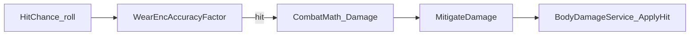
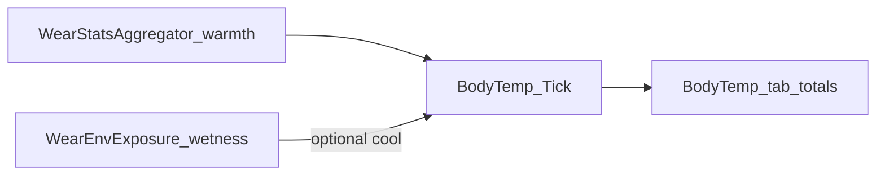
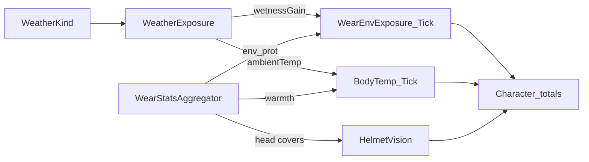
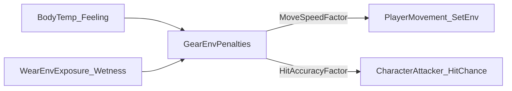

# Gear (Wear / Wield) — M0

Canonical for BN-style **착용(Wear)** vs **들기(Wield)** and the Character window equipment tab.

Related: [`docs/inventory/INVENTORY_UI.md`](../inventory/INVENTORY_UI.md) · Status parity lives in Character **상태** tab (`UICharacterWindow`).

## Terms

| Term | Meaning |
|------|---------|
| Wear | Armor/clothes with `armor.covers` → worn list only |
| Wield | L/R hand slots (weapons/tools). Two-hand = same stack on both slots; **no extra UI cell** |
| Character window | Tabs: 상태 \| 장비 \| 방해 \| 체온. Key = existing `StatusToggle` (`C`) |
| Primary | Highest DPS hand → `CharacterAttacker.SetWieldedItem` |
| HandActionBinding | `itemId → WeaponAction?` (null = 없음), persists across unequip |

## Domain SSOT

| Type | Role |
|------|------|
| `GearConstants` | GramsPerStr=500, TwoHandWeightFactor=2, SoftMargin, LiftStrainMoveFactor=0.9, OffHandDpsFactor |
| `GearHandleRules` | CanLift / RequiredStr / LiftStrain / IsWearable |
| `EquipmentWearState` | Worn stacks |
| `WieldSlots` | L/R (+ two-hand mode) |
| `CharacterGearService` | Timed Wear/Wield/Unequip + deposit |
| `PlayerGearHost` | Player host + Primary + LiftStrain + EnvExposure + BodyTemp + Weather + VisionFactor |
| `HandActionBinding` | Per-item action map |
| `PrimaryWieldResolver` | DPS primary; dual secondary score |
| `ToolUseWieldSession` | Snapshot → temp wield → restore (M0 API; consumers later) |
| `GearActionDuration` | Wear/TakeOff/Wield/Unwield seconds (proxy) |
| `InventoryTransferDuration` | MoveStacks / bag draw seconds — **prefer** `ContainerData.draw_moves` / pocket moves when &gt;0; else weight/volume/(storage) proxy |
| `InventoryTimedMoveHost` | Per-stack sequential transfer (no summed delay); `ActiveStacks` = current only |
| `ItemTimedNameProgress` | Name-bar query SSOT: inv transfer → gear timed → durability |
| `WornPocketRules` | Wear 목록 → Nested ensure / owner lookup (사이드바) |
| `ArmorStorageNested` | Dist.Inventory — storage/pockets → Nested + draw_moves |
| `DualWieldAttackDriver` | Primary then off-hand; OffHandDpsFactor on offense only (no UX) |
| `HandProficiencyIds` | `hand_l` / `hand_r` (skills.json seeded) |
| `WearStatsAggregator` | Wear-only armor aggregates (Phase A fields); combat reads via `WearCombatDefense` |
| `WearCombatDefense` | Phase D: ArmorEngage / ArmorAbsorb / MitigatedDamage + WearEncAccuracyFactor |
| `WearEnvExposure` | Phase E/G: weather wetness rate + env_prot → ExposureFactor |
| `BodyTemp` | Phase F/G: body °C tick; warmth + weather ambient + wetness cool |
| `WeatherExposure` | Phase G: Clear/Rain/Wind → AmbientTempC + wetness gain |
| `HelmetVision` | Phase G: head covers → VisionFactor (host + Character UI + camera) |
| `GearEnvPenalties` | Phase H: BodyTemp feeling + wetness → move / HitChance factors |
| `WearOverlapRules` | Phase C: same part + layer(/sided) conflict → Wear **reject** |

### CanLift

- One hand: `Ceil(weight_g / 500)`
- Two hand: `Ceil(weight_g / (500 * 2))`
- Wear uses one-hand formula only
- LiftStrain when lift succeeds but `(strength - RequiredStr) < SoftMargin` → move ×0.9, **hover only**

### Timing

- All Wear/TakeOff/Wield/Unwield are timed; wield/unwield short
- Bag → gear: `GearActionDuration + InventoryTransferDuration`
- Inventory MoveStacks / quick transfer / outside drop: `InventoryTransferDuration` (**SSOT**, same host)
- Transfer duration: if source `ContainerData.draw_moves` &gt; 0 (from baked pocket moves), use `moves * 0.01s`; else weight/volume/(storage hint) formula. **Multi-stack = sequential** (one `SecondsForStackFrom` + move each; no summed timer). Bag = item: `ItemStack.TotalWeight` includes Nested contents (volume = shell only).
- **이름 겹침 바**: 조회 SSOT=`ItemTimedNameProgress` (InventoryTimedMove → Gear Timed → 내구도). 소비자: 인벤 행·사이드 중첩가방 탭·Worn·Wield. Name 셀 stretch fill이 글자 **뒤**. 패널 Progress Slider 없음.

### Unequip

- Worn row / wield slot: take off / unwield
- Double-click → body inventory; (floor path via `toFloor` when wired)
- Two-hand unwield once

## Phase A — Armor detail aggregates (UI only)

**Scope:** surface baked `ArmorDetailData` fields on Character **방해** tab + worn/item hover. Combat hit hooks = Phase D (`WearCombatDefense`). Wetness = E; BodyTemp tick = F; weather/vision = G. Layer/sided = Phase C (below). Pockets = Phase B (below).

### Aggregator contract (`WearStatsAggregator`)

Wear stacks only (Wield excluded).

| Field | Per body part | Totals (`WearArmorTotals`) | Rule |
|-------|---------------|----------------------------|------|
| `encumbrance` | sum | `TotalEncumbrance` | M0 (unchanged) |
| `warmth` | sum | `TotalWarmth` | M0 (unchanged; BodyTemp tab) |
| `coverage` | **max** | `MaxCoverage` | % semantics — sum would exceed 100 across layers |
| `max_encumbrance` | sum | `TotalMaxEncumbrance` | |
| `environmental_protection` | sum | `TotalEnvironmentalProtection` | **Phase E** → `WearEnvExposure` |
| `material_thickness` | sum | `TotalMaterialThickness` | combat absorb = Phase D |
| `power_armor` | any covering piece | `AnyPowerArmor` | boolean OR |

API: `Aggregate(wear) → WearArmorTotals`, `ForPart(wear, partId) → WearPartArmorStats`, plus thin `*ForPart` helpers.

### UI surfaces

| Surface | Behavior |
|---------|----------|
| 방해 tab body graphic | Still shows **enc** per part (M0). Part hover → per-part A stats text via gear hover |
| 방해 tab totals line | `FormatEncTotals` (+ Phase E `FormatEncTotalsWithWetness`) |
| Worn row hover | Item A fields via `AppendItemArmorHover` (enc, max_enc, coverage, env_prot, thickness, power_armor, warm) |
| 장비 / 체온 | Worn list + filter; wield slots only on **장비**; 체온 = warmth graphic + Phase F BodyTemp totals |

### Migration parity (Character UX)

- Status tab / Mood HUD / StatusToggle launcher unchanged
- 방해 adds totals + hover detail only; does not replace enc graphic
- Checklist: `.claude/checklists/migration-parity.md`

## Phase B — Worn storage pockets → inventory sidebar

**Scope:** worn armor with `storage` / `pockets` appears as PlayerOnly inventory sidebar containers (parity with nested bags). Multi-pocket BN/DDA defs are **aggregated** into one Nested per stack. Combat/layer = not B.

### Pocket model

| Piece | Contract |
|-------|----------|
| Capacity | `ArmorDetailData.storage` (ml) or sum of `pockets[].volume_ml` |
| Nested | One `ItemStack.Nested` `InventoryContainer` (`armor_pocket:{itemId}`) |
| Draw moves | `pockets[].moves` → max → `ContainerData.draw_moves`; 0 = formula fallback |
| Sidebar | `UIInventoryListWindow` PlayerOnly: body + nested bags + **worn pockets** |
| Wear change | `PlayerGearHost` → `InventorySession.NotifySidebarLayoutChanged` |
| Icon | `ContainerVisualPresenter` resolves worn owner via `WornPocketRules.TryFindOwnerStack` |
| Tab drag | Worn pockets are **fixed** tabs (not container-as-stack); body-held storage bags remain movable |

### Bake (`Tools/bn_converter/convert.py`)

- `storage` parsed with `parse_volume_to_ml` (BN `"3 L"` / `"500 ml"`)
- Optional `pocket_data` → `armor.pockets[{volume_ml, moves}]`; if storage missing, sum pocket volumes
- BN currently uses legacy `storage` more than `pocket_data` — moves often absent → formula OK

### Migration parity (inventory path)

- Existing nested bag tabs / NearbyOnly / floor promote unchanged
- PlayerOnly sidebar show rule: bags **or** worn storage
- Transfer duration prefer moves when present; else prior formula
- Checklist: `.claude/checklists/migration-parity.md` · UI: [`docs/inventory/INVENTORY_UI.md`](../inventory/INVENTORY_UI.md)

## Phase C — Armor layer + sided + wear overlap

**Scope:** bake `layer` / `sided` on `ArmorDetailData`; Wear gate rejects incompatible overlap. **No** auto take-off/replace (unlike Wield displace). Combat consume = D.

### Data

| Field | Type | Default when missing |
|-------|------|----------------------|
| `armor.layer` | string | `GearConstants.DefaultArmorLayer` = `NORMAL` |
| `armor.sided` | bool | `false` |

Bake: `Tools/bn_converter/convert.py` `export_armor_detail` — BN `layer` field **or** flags (`SKINTIGHT`→`UNDER`, `OUTER`/`BELTED`/`WAIST`/`PERSONAL`/`AURA`); `sided` field or infer (`*_either` / single unilateral part); covers expand (`hands`→`hand_l`+`hand_r`, …). Full catalog → `StreamingAssets/BNData` (RefData). Demo seeds remain in `GameData/items.json`.

### Overlap policy (SSOT: `WearOverlapRules`) — **reject**

Conflict when candidate and a worn piece share ≥1 `covers` part **and** same normalized layer (case-insensitive; empty→`NORMAL`), except:

- Both `sided` → allow up to `GearConstants.MaxSidedPerLayer` (2) peers on that part+layer
- Sided candidate vs non-sided peer on same part+layer → conflict

**No replace:** Wear does not auto-remove the conflicting piece (Wield may displace; Wear does not). User must TakeOff first.

Gate: `CharacterGearService.GetWearBlockedReason` → context menu disabled reason / hover. Defense: `EquipmentWearState.TryAdd` also refuses.

### UI

| Surface | Behavior |
|---------|----------|
| Wear context menu | Disabled + reason `FormatWearOverlap(otherName)` |
| Worn / item armor hover | `layer` (+ `sided` when true) via `AppendItemArmorHover` |

### Migration parity (Wear path)

- Prior Wear gates (busy / tool session / strength / already equipped) unchanged order; overlap after already-equipped
- Phase B worn pockets: reject keeps Nested ownership intact (no half-worn state)
- Checklist: `.claude/checklists/migration-parity.md`

## UI

- `UICharacterWindow` + `UICharacterController` (StatusToggle)
- Equipment: L/R slots + worn list + cover filter via body part click
- Encumbrance / BodyTemp tabs: worn enc/warmth on body graphic (BodyTemp tick = phase F)
- Phase A: Encumbrance totals + armor hover (above)
- Phase C: Wear overlap reject reason + layer/sided hover

## BN Bake Omissions

Intentional Dist omissions from BN (sync when changing `Tools/bn_converter/convert.py` `export_*` whitelists):

| BN source | Dist status | Reintroduce |
|-----------|-------------|-------------|
| armor **layer** / sided | **Phase C baked** — field or **flags→layer**; sided field or infer; runtime default layer `NORMAL` | done (C + flag map) |
| covers plural / either | **baked expand** — `arms`/`legs`/`hands`/`feet`/`*_either` → Dist L/R parts | done |
| **pocket** defs / draw **moves** | **Phase B baked** — `storage` (ml) when BN has legacy `storage`; `pockets[{volume_ml,moves}]` when `pocket_data` present (**BN tree currently has ~0 pocket_data**) | done (B); pockets await BN/DDA pocket_data |
| wear/wield dedicated **move cost** | not baked — runtime `GearActionDuration` proxy | when formula→field |
| use_action / tool action JSON | not baked | tool-action milestone |
| flags subset / qualities extras | partial (layer flags consumed; others not) | as needed |
| material resist detail | partial (`MaterialData`); **Phase D consumes** when `ItemData.materials` present | done (D consume); fuller bake as needed |
| weather / overmap climate | **not baked** — Dist `WeatherKind` enum stand-in (Phase G) | map/weather system when present |
| helmet / vision / FOV JSON | **not baked** — Dist `HelmetVision` head-cover factor; **camera consumer wired** (Phase G/H) | optional BN vision bake later |

### Rebake log (converter → `Assets/StreamingAssets/BNData`)

| Run | Scope | Result |
|-----|-------|--------|
| Full `convert.py` | items+materials+qualities+skills+recipes/uncraft | 5591 items, 862 armor; layer≈423 (flags), sided≈48 (infer), storage≈194, pockets=0 (no BN `pocket_data`) |
| Not overwritten | `GameData/items.json` demo seeds | custom Dist demo armor kept |

Command: `python Tools/bn_converter/convert.py --bn-path <Cataclysm-BN> --output Assets/StreamingAssets/BNData`.

Converter note: keep this table next to whitelist changes — do not re-discover via playtests alone. Residual (not gear bake): wear/wield move-cost field, use_action JSON, fuller material resist, climate bake, BN pocket_data when upstream adds it.

## Phase D — Coverage / thickness combat + WearEnc hit hook

**Scope:** On hit, mitigate damage with worn coverage + thickness (+ material resist when baked). Attacker WearEnc multiplies HitChance. **No** E env/wetness, F BodyTemp, G weather/vision.

### Parity contract (combat path) — before switch defaults

| Before D | After D (default) |
|----------|-------------------|
| `HitChance` = `CombatMath.HitChance` × `offenseFactor` only | × **`WearEncAccuracyFactor`** (attacker `WearStatsAggregator.Aggregate.TotalEncumbrance`) |
| Hit damage = `CombatMath.Damage` raw → `BodyDamageService.ApplyHit` | Same raw, then **`WearCombatDefense.MitigateDamage`** using **target** Wear |
| Aggregator unused by combat | Coverage/thickness via `ForPart`; material resist scanned on covering pieces only |
| No Wear → unchanged hit/damage | No `PlayerGearHost` / empty Wear → factor 1 / no mitigate (NPC targets OK) |
| Empty aimed part | Mitigate uses `BodyPartIds.Torso` |

Boundary SSOT: `CombatMath` = offense numbers; `WearCombatDefense` = Wear defense + WearEnc accuracy; `CharacterAttacker.TryPerform` wires both. Checklist: `.claude/checklists/migration-parity.md`.

### Named formulas (`WearCombatDefense`)

| Name | Formula |
|------|---------|
| `WearEncAccuracyFactor` | `1 − min(TotalEnc × WearEncHitPenaltyPerPoint, WearEncHitPenaltyCap)` |
| `ArmorEngageChance` | `Clamp01(coverage / CoveragePercentScale)` — roll; miss → raw damage |
| `ArmorAbsorb` | `thickness × ThicknessAbsorbPerUnit + materialResist × MaterialResistAbsorbPerUnit` |
| `MitigatedDamage` | engage ? `max(0, raw − ArmorAbsorb)` : raw |
| `MaterialResistForPart` | max resist among covering pieces' `ItemData.materials` → `MaterialData` (`bash`/`cut`/`bullet` by `WeaponAction`); missing data → 0 |

Consts: `CoveragePercentScale=100`, `ThicknessAbsorbPerUnit=1`, `MaterialResistAbsorbPerUnit=1`, `WearEncHitPenaltyPerPoint=0.01`, `WearEncHitPenaltyCap=0.35`.

### Migration parity (combat)

- Dual wield / OffHand factor / obstruction Miss unchanged
- Armor Engage is post-hit only (does not convert to Miss)
- Outcome damage = post-mitigation
- Phase B/C Wear/pockets/overlap untouched

## Phase E — env_prot + wetness

**Scope:** `TotalEnvironmentalProtection` reduces ambient wetness gain. Minimal 방해 UI. **No** BodyTemp tick (F), **no** weather/helmet vision (G).

### Parity contract (env path)

| Before E | After E (default) |
|----------|-------------------|
| Aggregator `env_prot` UI-only | Consumed by `WearEnvExposure.Tick` on `PlayerGearHost` |
| No wetness state | `Wetness01` 0..1 on host (`EnvExposure`) |
| No ambient moisture | Constant ambient pressure until Phase G weather replaces it |
| 방해 totals = A fields | + wetness / exposure% / env_prot line |

Boundary SSOT: `WearStatsAggregator` = armor sums; `WearEnvExposure` = wetness/exposure formulas; host ticks with `TimeScaleService.Delta(World)`. Checklist: `.claude/checklists/migration-parity.md`.

### Named formulas (`WearEnvExposure`)

| Name | Formula |
|------|---------|
| `ExposureFactor` | `1 − min(TotalEnvProt × EnvProtWetnessReductionPerPoint, EnvProtWetnessReductionCap)` |
| `WetnessDelta` | `(BaseAmbient × ExposureFactor − BaseDry × (1 − ExposureFactor)) × dt` |
| `Wetness01` | clamp 0..1 after delta |

Consts: `BaseAmbientWetnessGainPerSecond=0.005`, `EnvProtWetnessReductionPerPoint=0.05`, `EnvProtWetnessReductionCap=0.95`, `BaseDryRatePerSecond=0.01`.

### UI

| Surface | Behavior |
|---------|----------|
| 방해 totals | `FormatEncTotalsWithWetness` — A totals + wetness% / exposure% / env_prot |
| 방해 part hover | Part A stats + same wetness line |

### Migration parity (env)

- Phase D combat path unchanged
- Ambient stand-in only — weather intensity = G
- BodyTemp / 체온 tick = Phase F (below)

## Phase F — BodyTemp → 체온 탭

**Scope:** Tick body temperature from worn `TotalWarmth` (+ slight wetness cool). Wire Character **체온** tab to show state + warmth contribution. **No** weather/wind/helmet vision (G).

Time base: `TimeScaleService.Delta(World)` on `PlayerGearHost` (same channel as EnvExposure). See [`docs/time/TIME.md`](../time/TIME.md).

### Parity contract (body temp path)

| Before F | After F (default) |
|----------|-------------------|
| 체온 tab = warmth graphic + worn list only | + BodyTemp totals / feeling / target |
| No body °C state | `BodyTemp` on `PlayerGearHost` (`BodyTemperature`) |
| Warmth UI-only | Consumed by `BodyTemp.Tick` |
| Ambient weather | Constant `BaseAmbientTempC` until Phase G |

Boundary SSOT: `WearStatsAggregator` = warmth sums; `BodyTemp` = °C formulas; host ticks World delta. Checklist: `.claude/checklists/migration-parity.md`.

### Named formulas (`BodyTemp`)

| Name | Formula |
|------|---------|
| `TargetTempC` | `clamp(BaseAmbient + TotalWarmth × DegreesPerWarmth − Wetness01 × WetnessCool, Min, Max)` |
| `BodyTempC` | `clamp(BodyTemp + (Target − BodyTemp) × Convergence × dt, Min, Max)` |
| `Feeling` | bands around `ComfortBodyTempC ± ComfortBandHalfWidthC` (Cold/Cool/Comfortable/Warm/Hot) |

Consts: `ComfortBodyTempC=37`, `BodyTempMinC=27`, `BodyTempMaxC=43`, `BaseAmbientTempC=18`, `DegreesPerWarmthPoint=0.5`, `WetnessCoolDegreesC=2`, `ConvergencePerSecond=0.08`, `ComfortBandHalfWidthC=1`.

### UI

| Surface | Behavior |
|---------|----------|
| 체온 body graphic | Warmth per part (M0 unchanged) |
| 체온 totals line | `FormatBodyTempTotals` — °C / feeling / TotalWarmth / target |
| 체온 part hover | Part warmth + `FormatBodyTempLine` |

### Migration parity (body temp)

- Phase E wetness / D combat unchanged
- Weather multipliers / wind / helmet vision = Phase G (below)

## Phase G — Weather / wind + helmet vision

**Scope:** WeatherKind drives BodyTemp ambient °C and WearEnvExposure wetness gain (replaces F/E hard ambient stand-ins on host path). Head-covering worn armor → `VisionFactor` on `PlayerGearHost` + Character totals/hover line. **No** new window/key; **no** M0–F redesign.

Time base: same `TimeScaleService.Delta(World)` tick on `PlayerGearHost`. See [`docs/time/TIME.md`](../time/TIME.md).

### Parity contract (weather / vision path)

| Before G | After G (default) |
|----------|-------------------|
| BodyTemp ambient = const `BaseAmbientTempC` | Host passes `WeatherExposure.AmbientTempC` |
| Wetness ambient = const `BaseAmbientWetnessGainPerSecond` | Host passes `WeatherExposure.AmbientWetnessGainPerSecond` |
| No weather state | `WeatherKind` on host (`Clear` default; Inspector / `SetWeatherKind`) |
| No helmet vision | `HelmetVision` → `PlayerGearHost.VisionFactor` |
| 방해/체온 totals = E/F lines | + weather ambient + vision% |

Boundary SSOT: `WeatherExposure` = ambient formulas; `HelmetVision` = head-cover vision; `BodyTemp`/`WearEnvExposure` accept ambient params (legacy consts remain as Clear/fallback). Checklist: `.claude/checklists/migration-parity.md`.

### Named formulas (`WeatherExposure` / `HelmetVision`)

| Name | Formula |
|------|---------|
| `AmbientTempC(Clear)` | `ClearAmbientTempC` (= `BodyTemp.BaseAmbientTempC`) |
| `AmbientTempC(Rain)` | `RainAmbientTempC` |
| `AmbientTempC(Wind)` | `ClearAmbientTempC − WindChillDegreesC` |
| `WetnessGain(Clear/Rain/Wind)` | `ClearWetnessGain` / `RainWetnessGain` / `WindWetnessGain` (per World second) |
| `BodyTemp.Target` | `ambient + TotalWarmth × DegreesPerWarmth − Wetness01 × WetnessCool` |
| `WetnessDelta` | `(weatherGain × ExposureFactor − BaseDry × (1 − ExposureFactor)) × dt` |
| `VisionFactor` | head covered → `HeadCoverVisionFactor`; else `FullVisionFactor` |

Consts: `ClearAmbientTempC=18`, `RainAmbientTempC=10`, `WindChillDegreesC=4`, `ClearWetnessGain=0`, `RainWetnessGain=0.02`, `WindWetnessGain=0.002`, `HeadCoverVisionFactor=0.85`, `FullVisionFactor=1`, cover part = `BodyPartIds.Head`.

### UI

| Surface | Behavior |
|---------|----------|
| 방해 / 체온 totals | weather label + ambient °C + vision% |
| Part hover (방해/체온) | same weather/vision line |
| Camera / tile FOV | **wired** — `CameraZoomController` ortho size × `PlayerGearHost.VisionFactor` (iso FOV stand-in) |

### Migration parity (weather / vision)

- Phase D combat / B pockets / C overlap unchanged
- Clear default preserves dry + 18°C ambient feel (wetness gain 0 vs legacy 0.005 stand-in — intentional G clear)
- No new Character key or window
- Ortho zoom target (scroll) unchanged; applied lens size = logical × VisionFactor; streaming `MaxOrthographicSize` unscaled

## Phase H — BodyTemp / wetness → move + combat

**Scope:** Consume Phase F/E state for locomotion speed and attacker HitChance. Named consts in `GearEnvPenalties`. **No** Gear redesign; **no** new UI.

Boundary SSOT: `BodyTemp.Feeling` + `WearEnvExposure.Wetness01` → `GearEnvPenalties`; `PlayerGearHost` → `PlayerMovement.SetEnvMovement`; `CharacterAttacker` multiplies HitChance. Checklist: `.claude/checklists/migration-parity.md`. See [`docs/locomotion/LOCOMOTION.md`](../locomotion/LOCOMOTION.md).

### Parity contract (move / combat path)

| Before H | After H (default) |
|----------|-------------------|
| Move = base × enc × LiftStrain | × **`GearEnvPenalties.MoveSpeedFactor`** |
| HitChance = CombatMath × offense × WearEnc | × **`GearEnvPenalties.HitAccuracyFactor`** |
| Feeling / wetness UI-only (E/F) | Consumed for gameplay penalties |
| No gear host | factors = 1 |

### Named formulas (`GearEnvPenalties`)

| Name | Formula |
|------|---------|
| `MoveSpeedFactor` | `FeelingMove(feeling) × (1 − Wetness01 × WetnessMovePenaltyPerUnit)` |
| `HitAccuracyFactor` | `FeelingHit(feeling) × (1 − Wetness01 × WetnessHitPenaltyPerUnit)` |
| FeelingMove | Cold 0.88 / Cool 0.95 / Comfortable 1 / Warm 0.97 / Hot 0.9 |
| FeelingHit | Cold 0.9 / Cool 0.96 / Comfortable 1 / Warm 0.97 / Hot 0.92 |

Consts: `WetnessMovePenaltyPerUnit=0.15`, `WetnessHitPenaltyPerUnit=0.1`, plus per-feeling move/hit factors above.

### Migration parity (env penalties)

- Enc / LiftStrain / WearEnc / dual-wield paths unchanged order (multiplicative)
- NPC attackers without `PlayerGearHost` keep factor 1
- Phase G weather still feeds BodyTemp/wetness; H only consumes

## Migration parity (Status → Character)

- Status content preserved on **상태** tab (body / vitals / skills)
- Mood Summary HUD unchanged
- Key/launcher still StatusToggle / one launcher → Character window
- Checklist: `.claude/checklists/migration-parity.md`

## UI layout SSOT / audit

**Prefab SSOT:** `Assets/Dist/Visual/Prefabs/UIComponents/PlayerStatus/Grp_PlayerStatusWindow.prefab`  
**Patch (keep permanently):** `Dist/PlayerStatus/Patch Character Tabs And Gear Panel`

| Issue | Status |
|-------|--------|
| TabBar / GearPanel missing on prefab → runtime magic chrome | **Fixed** — prefab hosts `TabBar` + `GearPanelRoot`; `Ensure*` only fills missing, does not overwrite existing Rect sizes |
| Tab = Button+TMP same GO, weak hit | **Fixed** — Button+Image parent, child TMP `Label` |
| Progress Slider AddComponent-only (no fill) | **Fixed** — Background + Fill Area/Fill wired on prefab |
| `ApplyTabVisibility` hid only vitals/skills Text | **Fixed** — also toggles `_statusContentRoot` (`Area_Content`) |
| Equipment body diagram still HP | **Intentional** — keep HP on Equipment; Enc/BodyTemp remap only |
| Font for created TMP | **Fixed** — copy Title/Katuri from prefab Title |
| Legacy `UIPlayerStatusWindow` | **Debt** — leave until unused/safe to delete; scene uses `UICharacterController` |

### Ensure behavior (after patch)

- Prefab refs preferred (`_tabBarRoot`, `_gearPanelRoot`, `_gearPanel`, `_statusContentRoot`)
- Missing chrome → warn + fallback create once
- Gear list rows / wield labels may still spawn dynamically; chrome roots stay prefab
- Non-Status tabs: hide `Area_Content` + vitals/skills; show gear panel; body diagram stays

### Remaining debt

- TabBar vs hand-tuned BodyProfile spacing may need a one-line Prefab Mode nudge after play test
- Wield/Worn row chrome still mostly runtime `AddComponent` (list items), not per-row prefabs
- Gear panel right-column vs `Area_BodyStatus` overlap is soft (hide vitals, show panel) — no dedicated Status-only column collapse anim
- Localization keys for Character.* tabs may still fall back to `CharacterGearLabels` defaults until Merge Localization covers them
