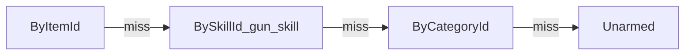

# Weapon Visual (Anim / VFX / Combat SOData map)

> 무기·팔 연출 에셋의 **폴더 = 의존 방향** SSOT. 런타임 계약은 [`GEAR.md`](GEAR.md) · [`LOCOMOTION.md`](../locomotion/LOCOMOTION.md).  
> Family / Leaf / AnimVerb / 동작 줄 클립(Hold/Aim/Attack/Recoil/Blocked). 컨트롤러는 동작 모름: GEAR Terms · LOCOMOTION · `.cursor/rules/arm-anim-layers.mdc`. 총기 Leaf·`burst`: [`BN_BAKE.md`](BN_BAKE.md).

## 의존 (위 → 아래)

```text
Catalog/WeaponPresentationCatalog
  ├─ Presentations/Weapon_*          무기별 동작 목록
  │    └─ Attacks/Attack_*           핸들러 레시피
  │    └─ 동작 줄 Hold/Aim/Attack/Recoil/Blocked  그 무기 그 Leaf 클립 (비면 Catalog)
  │    └─ Overrides (Animator)       클립 배속 테이블 Visual/Anim/CharacterAnimator/Overrides/
  └─ Fallbacks/WeaponCombatFallbacks
       ├─ ArmAnimSlotCatalog         기본 동사 폴백 (Leaf마다 행: Swing/Thrust/Semi/Burst/Auto/Raise)
       └─ WeaponImpactVfxDefaults    Hit 태그 VFX
            └─ Prefabs/Combat/Vfx/

SourceRef                            Visual/Anim/SourceRef/   ← 런타임 밖
CharacterAnimator                    Visual/Anim/CharacterAnimator/
MovementStyle (NPC)                  SOData/Locomotion/       ← Combat 아님
```

## SOData/Combat

| Path | Role | MUST NOT |
|------|------|----------|
| `Catalog/` | 진입 허브만 (`WeaponPresentationCatalog`) | Fallbacks·Attack·클립 |
| `Fallbacks/` | Leaf 기본 동사 Catalog · HitDefaults · HitStop · Fallbacks 묶음 | 컨트롤러에 동작 이름 |
| `Presentations/` | 무기별 `WeaponPresentation` | Catalog·Pipeline |
| `Attacks/` | `WeaponAttack` 레시피 | Presentation·VFX 표 |

## Visual / Scripts

| Path | Role | MUST NOT |
|------|------|----------|
| `Visual/Anim/SourceRef/` | Mixamo 등 **원본/레퍼런스** | 런타임 Override·Pipeline 직접 참조 |
| `Visual/Anim/CharacterAnimator/` | Controller · masks · `Slots/` · `Overrides/` | Pipeline SO |
| `Visual/Prefabs/Combat/Vfx/` | Combat VFX **리프** | Catalog/테이블 SO |
| `Visual/Prefabs/Combat/` | 히트스캔 트레이서·착탄 VFX. `DistProjectile` = 비행 탄 엔티티 | 히트스캔 Attack에 DistProjectile 할당 |
| `Scripts/Entity/Combat/` | Presentation·Pipeline·Attack·VFX 타입 | — |
| `Scripts/Entity/Combat/Vfx/` | 스폰/트레이서 **런타임 유틸** | SO 허브 |
| `SOData/Locomotion/` | NPC `MovementStyle` | Combat 폴더에 두지 않음 |

## 진입점

| 하려는 일 | 연다 |
|-----------|------|
| 아이템 / `gun.skill` / category → Leaf Presentation | `SOData/Combat/Catalog/WeaponPresentationCatalog` |
| 공용 AnimVerb 팔 애니·동작 VFX | `SOData/Combat/Fallbacks/ArmAnimSlotCatalog` |
| bash/cut/bullet Hit VFX | `SOData/Combat/Fallbacks/WeaponImpactVfxDefaults` |
| 자상/절단 피 오버레이 | 같은 Defaults의 `CutBleedVfx` / `SeverBleedVfx` (`Vfx_HitBleed`, `Vfx_HitBleedSever`) |
| 근접 히트스톱 지속 | `SOData/Combat/Fallbacks/CombatHitStopSettings` |
| Attack 레시피 | `SOData/Combat/Attacks/` |
| `spawn_projectile` | Attack.`ProjectilePrefab` 있으면 비행(pierce 0). 없으면 cue 히트스캔. `tracerVfx`는 히트스캔 연출 |
| NPC 이동 프로파일 | `SOData/Locomotion/` · 메뉴 `Dist/Locomotion/Movement Style` |
| thin/라이브러리 클립 시드 | `Dist/MCP/Ensure Arm Anim Pipeline` |
| Animator 레이어 재구성 | `Dist/MCP/Rebuild Arm Overlay Animator` |

Catalog `Resolve` 순서 (아이템 전용 > `gun.skill` > `weapon_category` > Unarmed). BN 총은 `weapon_category`가 없고 `gun.skill`(`pistol`/`rifle`/`smg`/`shotgun`/`launcher`)으로 묶는다. Dist 시드 `gun`도 같은 표.


