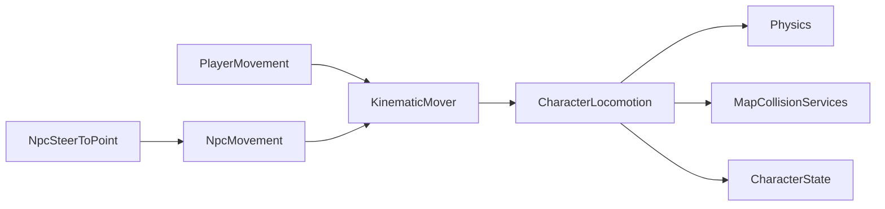

# Character Locomotion

> LLM/에이전트용 Dist 이동 SSOT.
> 인덱스: `docs/README.md` · 룰: `.cursor/rules/locomotion.mdc`
> **Locomotion 스크립트를 쓰거나 고치기 전에 이 문서를 읽는다.**

경로(코드): `Assets/Dist/Scripts/Entity/Locomotion/`

## 책임 경계

- `PlayerMovement`: Input System, 달리기, 관성, `TimeScaleChannel.Player`
- `NpcSteerToPoint`: 목표점/Transform을 월드 XZ 방향으로 변환
- `NpcMovement`: 단순 등속 이동, `TimeScaleChannel.World`
- `KinematicMover`: 플레이어 속도/관성 또는 NPC 등속 desired delta 산출
- `CharacterLocomotion`: CapsuleCast, slide, topology clamp, logical floor,
  depenetration, Rigidbody 이동, `CharacterState` 위치 갱신
- `MapGameplayBootstrap`: 활성/비활성 Player/NPC에 맵 충돌 서비스를 바인딩

`ICharacterLocomotion`은 `PlayerMovement`와 `NpcMovement` MonoBehaviour 파사드의
공통 바인딩·명령 계약이다. 비활성 오브젝트는 `Awake` 전에 바인딩될 수 있으므로
두 파사드는 서비스를 보관했다가 공용 locomotion 생성 직후 다시 적용한다.

## 플레이어 마이그레이션 패리티

공용 locomotion 추출 전후에 아래 계약을 유지한다.

- 카메라 상대 입력과 걷기/달리기/관성 속도 계산
- Physics CapsuleCast와 벽 slide
- 맵 topology 수평 clamp
- logical floor와 낙하
- blocked cell depenetration
- `CharacterState` 그리드/월드 위치 갱신
- 기존 이동 디버그 콜백과 gizmo 조회값
- `TimeScaleChannel.Player`

패리티가 깨지면 `PlayerMovement` 내부 이동 경로로 되돌리고 공용 경로를
표급하지 않는다. 공통 이주 절차는
[`migration-parity.md`](../../../../../.claude/checklists/migration-parity.md)를 따른다.

## 현재 한계

- NPC는 직선 목표점 조향만 지원한다.
- 길찾기, 장애물 우회, stuck 재탐색은 구현하지 않는다.
- 활성 NPC 시뮬레이션은 카메라 청크 로드 범위 안이라는 기존 전제를 따른다.
