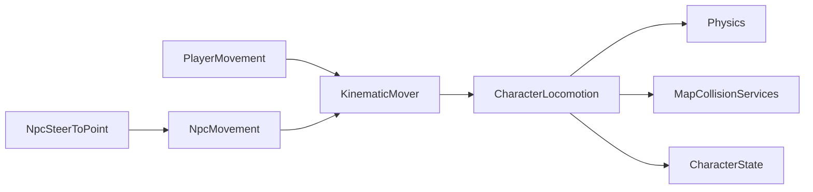

# Character Locomotion

> LLM/에이전트용 Dist 이동 SSOT.
> 인덱스: `docs/README.md` · 룰: `.cursor/rules/locomotion.mdc`
> **Locomotion 스크립트를 쓰거나 고치기 전에 이 문서를 읽는다.**

경로(코드): `Assets/Dist/Scripts/Entity/Locomotion/`

## 책임 경계

- `PlayerMovement`: Input System, 달리기, 관성, `TimeScaleChannel.Player`
- `NpcSteerToPoint`: 목표점/Transform을 월드 XZ 방향으로 변환
- `NpcMovement`: 단순 등속 이동, `TimeScaleChannel.World`
- `KinematicMover`: 플레이어 속도/관성 또는 NPC 등속 desired delta 산출
- `CharacterLocomotion`: CapsuleCast, slide, topology clamp, logical floor,
  depenetration, Rigidbody 이동, `CharacterState` 위치 갱신
- `MapGameplayBootstrap`: 활성/비활성 Player/NPC에 맵 충돌 서비스를 바인딩

`ICharacterLocomotion`은 `PlayerMovement`와 `NpcMovement` MonoBehaviour 파사드의
공통 바인딩·명령·속도 조회 계약이다 (`CurrentSpeed` / `AnimSpeedReference`).
비활성 오브젝트는 `Awake` 전에 바인딩될 수 있으므로
두 파사드는 서비스를 보관했다가 공용 locomotion 생성 직후 다시 적용한다.

## 플레이어 마이그레이션 패리티

공용 locomotion 추출 전후에 아래 계약을 유지한다.

- 카메라 상대 입력과 걷기/달리기/관성 속도 계산
- Physics CapsuleCast와 벽 slide
- 맵 topology 수평 clamp
- logical floor와 낙하
- blocked cell depenetration
- `CharacterState` 그리드/월드 위치 갱신
- 기존 이동 디버그 콜백과 gizmo 조회값
- `TimeScaleChannel.Player`

패리티가 깨지면 `PlayerMovement` 내부 이동 경로로 되돌리고 공용 경로를
표급하지 않는다. 공통 이주 절차는
[`migration-parity.md`](../../../../../.claude/checklists/migration-parity.md)를 따른다.

### Gear 이동 배율 (교차)

`PlayerMovement` 속도 = base × enc × LiftStrain × **`GearEnvPenalties.MoveSpeedFactor`**
(`PlayerGearHost` → `SetEnvMovement`). 계약·상수: [`docs/equipment/GEAR.md`](../equipment/GEAR.md) Phase H.

## 3D 애니 브릿지

컨트롤러: `Assets/Dist/Visual/Anim/CharacterClips/CharacterAnimController.controller`  
드라이버: `CharacterLocomotionAnim` · 클립+VFX SSOT: `ArmAnimSlotCatalog` (Pipeline) + `ArmAnimSlotResolver` / `ArmImpactSlotResolver`  
루트 회전: `CharacterFacingRotator` → `CharacterState.GetFacingDir()`  
스프라이트 8방향: `CharacterFacingAnim` (SpriteSwap 전용, 3D와 별도)

**몸 애니만** Hold/Aim/Attack thin 슬롯과 Impact thin을 쓴다. 무기 메시·외형은 애니 슬롯에 붙이지 않는다 (별 경로).

| Layer | Mask | Weight |
|-------|------|--------|
| Move Layer | none | 1 |
| RightArm Layer | `RightArm.mask` | 오른손 무장·비TwoHand → 1 |
| LeftArm Layer | `LeftArm.mask` | 왼손 무장·비TwoHand → 1 |
| TwoHand Layer | `UpperBody.mask` | `IsTwoHand` → 1 (그때 L/R Arm = 0) |
| Impact Layer | none (v1) | Recoil/Blocked 재생 중 → 1, 평시 0 |

**Action vs Reaction vs Hit:** Action = 동사 자세·시전. Reaction = Recoil/Blocked (`ArmImpactKind`, 애니 Impact Layer). Hit = 특성(bash/cut/bullet) 타격 결과 — `WeaponImpactVfxDefaults`.  
**Hit 키 = 채널 문자열.** 계산기와 Hit 테이블이 같은 키를 쓴다. Action이 채널을 고르지 않는다.  
**Entry 소유권:** `WeaponPresentation.Entry` = 동사 라우팅 행(가용·`attack`·Action VFX). Hit coalesce = Entry → Attack VFX → Defaults[HitTag]. Reaction과 섞지 않음.

팔 SM(손당): **Hold ↔ Aim** (`IsAiming`), **Attack** (trigger). `Action*` 파라미터·모드별 Aim/Attack 상태 없음.  
Impact SM: **Empty** → **Recoil** / **Blocked** (`ImpactRecoil` / `ImpactBlocked` trigger) → ExitTime → Empty.

| Param | Type | Source |
|-------|------|--------|
| `MoveX` / `MoveZ` | float | facing 로컬 `MoveDir` × (`CurrentSpeed / AnimSpeedReference`); 정지·속도 0이면 `(0,0)` → Idle |
| `Speed` | float | 동일 정규화 속도 (디버그·호환; Move 블렌드는 MoveXZ) |
| `IsAiming` | bool | `CharacterState.IsAiming` |
| `AttackR` / `AttackL` / `Attack2H` | trigger | `AttackResolved` 큐 → `AttackOutcome.Hand` |
| `ImpactRecoil` / `ImpactBlocked` | trigger | cue → Recoil; `Obstructed` → Blocked |
| `WeaponPresentation.AnimatorOverride` | Override | **라이브러리 키** 교체 — 외형 메시 아님 |
| `ArmAnimSlotCatalog` + runtime Override | resolve | 동사 행 클립→Action thin, Impact 행→Impact thin. 동사/Impact **VFX는 같은 행** |

Move Layer `Locomotion`: **2D Freeform Directional** (`MoveX`/`MoveZ`). Idle + Walk/Run × 전/후/좌/우 (Walk 링 ≈0.26). 조준 중 루트는 `SightDir` 유지, **발만** facing 대비 상대 방향.

**Thin 키 (Action SM):** `Hold|Aim|Attack_{Left,Right,TwoHand}_Slot`  
**Thin 키 (Impact SM):** `ImpactRecoil_Slot`, `ImpactBlocked_Slot`  
**라이브러리 키:** `Hold|Aim|Attack{Verb}_{Hand}_Slot`, `Impact{Recoil\|Blocked}_{Hand}_Slot`  
`WeaponAction` → 동사 행 클립을 thin에 리맵. `ArmImpactKind` → Impact thin. Action 전환은 **Rebind 없이** thin 키만 갱신. Presentation 교체 시에만 풀 resolve + Rebind.

무기 `AnimatorOverride`는 **라이브러리 키**를 교체한다. thin 키를 직접 바꾸지 않는다.

- Pipeline: `ArmAnimSlotCatalog.asset` (동사 행 = stance+strike+vfx, Impact 행 = clips+thin+vfx)  
- 메뉴: `Dist/MCP/Rebuild Arm Overlay Animator`, `Dist/MCP/Ensure Arm Anim Pipeline`

**액션 확장:** `WeaponAction`(+`WeaponActionMask`) → [`WeaponActionUtil.All`](Assets/Dist/Scripts/Entity/Combat/WeaponAction.cs)에 추가 → `Ensure Arm Anim Pipeline` (클립 시드·행 Ensure). 슬롯 스템 = enum 이름. **Builder/SM 수정 없음.**  
**Impact Kind 확장:** `ArmImpactKind` (Reaction: Recoil/Blocked) + Impact SM 상태·trigger·행.

### 클립 resolve (Animator 밖)

Animator SM에는 `_FB` / `Mirror*` / `Action*` 없음. 손별 클립은 라이브러리 **base만**.

| 필요 손 | 전용 (무기 Override≠base) | 재생 클립 |
|---------|---------------------------|-----------|
| Left / Right / TwoHand | 있음 | 해당 손 라이브러리 전용 |
| Left / Right / TwoHand | 없음 | 해당 손 라이브러리 base |

Aim/Attack 라이브러리 클립이 없으면 같은 손 Hold thin으로 내린다. L↔R·TwoHand 자기미러 폴백 없음. Dominant 교체는 **Pending**.

### 시전 분기 (기어 교차)

| 들기 | 시전 | 애니 |
|------|------|------|
| `IsTwoHand` | 1회 | TwoHand layer + `Attack2H` |
| L·R 듀얼 | Primary→Offhand (`AttackResolved` 체인) | 양팔 overlay 동시 + 시전 트리거만 교대 (이종 Action → 손별 thin 리맵) |
| 한 손만 | 1회 | 해당 Arm layer + AttackR/L |

- 플레이어 동사는 `WeaponAction` 유지. `TriggerPistol` 동명 액션 금지.
- 무기 Override 없거나 비무장 → `_defaultController` + catalog resolve. Presentation 변경 시 Rebind.
- 조준 중 루트는 에임(`SightDir`). `AimYaw` / MoveDir-only 루트 없음 — 스트레이프는 **발(MoveXZ)** 만.
- 애니 시간 = `TimeScaleService`만 (`CharacterLocomotionAnim` 수동 틱).
- Play 중 `Animator.enabled == false`는 **정상**. `_poseRate`(기본 10) 플립북 양자화; `0`이면 연속 틱.
- Locomotion/Arm 클립은 FBX `loopTime` 필요.
- 장애물 판정은 `AttackPerformResult.Obstructed` (Miss와 구분) → Impact `Blocked`.

Collision Inspector는 `CharacterLocomotionCollisionSettings`이며 기본값은 `CharacterLocomotionDefaults` SSOT다.

## 현재 한계

- NPC는 직선 목표점 조향만 지원한다.
- 길찾기, 장애물 우회, stuck 재탐색은 구현하지 않는다.
- 활성 NPC 시뮬레이션은 카메라 청크 로드 범위 안이라는 기존 전제를 따른다.
