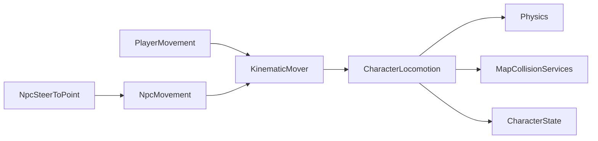

# Character Locomotion

> LLM/에이전트용 Dist 이동 SSOT.
> 인덱스: `docs/README.md` · 룰: `.cursor/rules/locomotion.mdc`
> **Locomotion 스크립트를 쓰거나 고치기 전에 이 문서를 읽는다.**

경로(코드): `Assets/Dist/Scripts/Entity/Locomotion/`

## 책임 경계

- `PlayerMovement`: Input System, 달리기, 관성, `TimeScaleChannel.Player`
- `NpcSteerToPoint`: 목표점/Transform을 월드 XZ 방향으로 변환
- `NpcMovement`: 단순 등속 이동, `TimeScaleChannel.World`
- `KinematicMover`: 플레이어 속도/관성 또는 NPC 등속 desired delta 산출
- `CharacterLocomotion`: CapsuleCast, slide, topology clamp, logical floor,
  depenetration, Rigidbody 이동, `CharacterState` 위치 갱신
- `MapGameplayBootstrap`: 활성/비활성 Player/NPC에 맵 충돌 서비스를 바인딩

`ICharacterLocomotion`은 `PlayerMovement`와 `NpcMovement` MonoBehaviour 파사드의
공통 바인딩·명령·속도 조회 계약이다 (`CurrentSpeed` / `AnimSpeedReference`).
비활성 오브젝트는 `Awake` 전에 바인딩될 수 있으므로
두 파사드는 서비스를 보관했다가 공용 locomotion 생성 직후 다시 적용한다.

## 플레이어 마이그레이션 패리티

공용 locomotion 추출 전후에 아래 계약을 유지한다.

- 카메라 상대 입력과 걷기/달리기/관성 속도 계산
- Physics CapsuleCast와 벽 slide
- 맵 topology 수평 clamp
- logical floor와 낙하
- blocked cell depenetration
- `CharacterState` 그리드/월드 위치 갱신
- 기존 이동 디버그 콜백과 gizmo 조회값
- `TimeScaleChannel.Player`

패리티가 깨지면 `PlayerMovement` 내부 이동 경로로 되돌리고 공용 경로를
표급하지 않는다. 공통 이주 절차는
[`migration-parity.md`](../../../../../.claude/checklists/migration-parity.md)를 따른다.

### Gear 이동 배율 (교차)

`PlayerMovement` 속도 = base × enc × LiftStrain × **`GearEnvPenalties.MoveSpeedFactor`**
(`PlayerGearHost` → `SetEnvMovement`). 계약·상수: [`docs/equipment/GEAR.md`](../equipment/GEAR.md) Phase H.

## 3D 애니 브릿지

컨트롤러: `Assets/Dist/Visual/Anim/CharacterClips/CharacterAnimController.controller`  
드라이버: `CharacterLocomotionAnim` · 루트 회전: `CharacterFacingRotator` → `CharacterState.GetFacingDir()`  
스프라이트 8방향: `CharacterFacingAnim` (SpriteSwap 전용, 3D와 별도)

| Param / Asset | Type | Source | Layer / 역할 |
|---------------|------|--------|----------------|
| `Speed` | float 0..1 | `ICharacterLocomotion.CurrentSpeed / AnimSpeedReference` (Player=`RunMaxSpeed`, NPC=유효 이동속도) | Move (Locomotion 1D BlendTree: Idle→Walk→Run) |
| `IsAiming` | bool | `CharacterState.IsAiming` | Aim 상태머신 + Aim Layer weight (1=조준 / 0=비조준 → Move 전신) |
| `Action` | int | `CharacterAttacker.SelectedAction` (`Swing`/`Stab`/`Trigger`) | Aim: `AimSwing`/`AimStab`/`AimTrigger` (슬롯 클립) |
| `WeaponPresentation.AnimatorOverride` | OverrideController | 장착 무기 | 공유 컨트롤러 슬롯 클립 교체 |

Collision Inspector는 `CharacterLocomotionCollisionSettings`(`PlayerMovement`/`NpcMovement`의 `_collision`)이며, 필드 기본값은 `CharacterLocomotionDefaults` SSOT다.

Override 템플릿: `Assets/Dist/Visual/Anim/CharacterClips/Overrides/CharacterAnim_{Pistol,Bat,Knife}.overrideController`  
Aim 슬롯 클립: `Assets/Dist/Visual/Anim/CharacterClips/Slots/Aim{Swing,Stab,Trigger}_Slot.anim` (내용은 플레이스홀더 — 무기 Override에서 교체)

- 플레이어 동사는 `WeaponAction`을 유지한다. 실루엣(피스톨/배트/나이프)은 Override로만 바꾼다 — `TriggerPistol` 같은 동명 액션을 만들지 않는다.
- 무기 Override가 없거나 비무장이면 `CharacterLocomotionAnim`의 `_defaultController`(공유 베이스)를 쓴다. `SetWeapon` → `WeaponChanged`에서 재적용·Rebind.
- Aim 레이어: `AimIdle` ↔ `AimSwing|AimStab|AimTrigger` (`IsAiming` + `Action`). 레거시 `AimPose`는 미연결.
- `CharacterLocomotionAnim`이 Aim Layer weight를 `IsAiming`에 맞춤 (비조준=0 → 상체도 Move 걷기 유지, 조준=1). `_aimLayerBlendSpeed`(기본 10)로 페이드, `0`이면 스냅.
- 조준 중 루트는 에임(`SightDir`)을 본다. 스트레이프용 `AimYaw` / MoveDir-only 루트는 넣지 않는다.
- 애니 시간은 `TimeScaleService` 채널로만 진행한다 (`CharacterLocomotionAnim`이 Animator 자동 틱을 끈다).
- Play 중 `Animator.enabled == false`는 **정상**(수동 틱). 본 바인딩을 위해 첫 Update에서 enable→`Rebind()` 후 다시 끈다.
- `_poseRate`(기본 10): 채널 시간 기준 초당 포즈 수로 `Animator.Update`를 양자화한다. BlendTree/레이어 유지한 채 플립북 느낌. `0`이면 매 프레임 연속 틱.
- Locomotion/Aim 클립은 FBX `loopTime`이 켜져 있어야 한다. 꺼져 있으면 1회 재생 후 마지막 포즈에 멈춰 “안 움직이는 것처럼” 보인다.

## 현재 한계

- NPC는 직선 목표점 조향만 지원한다.
- 길찾기, 장애물 우회, stuck 재탐색은 구현하지 않는다.
- 활성 NPC 시뮬레이션은 카메라 청크 로드 범위 안이라는 기존 전제를 따른다.
