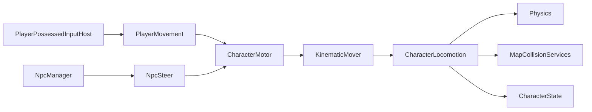

# Character Locomotion

> LLM/에이전트용 Dist 이동 SSOT.
> 인덱스: `docs/README.md` · 룰: `.cursor/rules/locomotion.mdc`
> **Locomotion 스크립트를 쓰거나 고치기 전에 이 문서를 읽는다.**

경로(코드): `Assets/Dist/Scripts/Entity/Locomotion/`

## 책임 경계

- `CharacterMotor`: 공용 물리 파사드. 조종 중(`IsPossessed`)이면 `TimeScaleChannel.Player`, 아니면 `World`. NPC 등속 또는 플레이어 드라이버 desired를 `CharacterLocomotion.Move`에 넘긴다.
- `PlayerMovement`: Input System, 달리기, 관성. `PlayerPossessedInputHost`가 possessed `CharacterMotor`에 바인드. 물리 소유 없음.
- `MapGameplayBootstrap`: 씬 캐릭터 Find + `BindSpawnedCharacter` 증분 바인드
- `NpcSteer`: 목표점/Transform을 월드 XZ 방향으로 변환 (`NpcManager`가 호출, 인스턴스 MB 없음).
- `NpcManager`: 비possessed 유닛 FSM (Patrol/Alert/Chase/Attack/Return/Dead). 상태·웨이포인트는 행 단위.
- `KinematicMover`: 플레이어 속도/관성 또는 NPC 등속 desired delta 산출
- `CharacterLocomotion`: CapsuleCast, slide, topology clamp, logical floor,
  depenetration, Rigidbody 이동, `CharacterState` 위치 갱신
- `MapGameplayBootstrap`: 활성/비활성 `CharacterMotor`에 맵 충돌 서비스를 바인딩

`ICharacterLocomotion`은 `CharacterMotor` 파사드의
공통 바인딩·명령·속도 조회 계약이다 (`CurrentSpeed` / `AnimSpeedReference`).
비활성 오브젝트는 `Awake` 전에 바인딩될 수 있으므로
모터는 서비스를 보관했다가 공용 locomotion 생성 직후 다시 적용한다.

같은 GO에 플레이어 물리 MB와 NPC 물리 MB를 동시에 켜지 않는다. 모터는 하나다.

## 플레이어 마이그레이션 패리티

공용 locomotion 추출 전후에 아래 계약을 유지한다.

- 카메라 상대 입력과 걷기/달리기/관성 속도 계산
- Physics CapsuleCast와 벽 slide
- 맵 topology 수평 clamp
- logical floor와 낙하
- blocked cell depenetration
- `CharacterState` 그리드/월드 위치 갱신
- 기존 이동 디버그 콜백과 gizmo 조회값
- `TimeScaleChannel.Player`

패리티가 깨지면 `PlayerMovement` 내부 이동 경로로 되돌리고 공용 경로를
표급하지 않는다. 공통 이주 절차는
[`migration-parity.md`](../../../../../.claude/checklists/migration-parity.md)를 따른다.

### Gear / body 이동 배율 (교차)

Env 배율 SSOT: `BodyLocomotionPenalties.CombinedMoveSpeedFactor`  
= `GearEnvPenalties.MoveSpeedFactor`(코어 `BodyTemp.Feeling` + wetness) × 절뚝(`MissingThigh`/`MissingFoot`).

`CharacterClimateHost`가 **같은 `factor`**를 넣는다:

- `CharacterMotor.SetEnvMovement(factor)` — 비possessed·NPC 포함 (모터 `EffectiveMoveSpeed × _envSpeedMultiplier`)
- possessed: `PlayerMovement.SetEnvMovement(factor)` — 동일 값 (base × enc × LiftStrain × env)

LiftStrain은 `PlayerGearHost` 별 배율. 계약·상수: [`docs/equipment/GEAR.md`](../equipment/GEAR.md) Phase H · [`docs/body/BODY.md`](../body/BODY.md).

## 3D 애니 브릿지

컨트롤러: `Assets/Dist/Visual/Anim/CharacterAnimator/CharacterAnimController.controller`  
드라이버: `CharacterLocomotionAnim` · 클립+VFX SSOT: `ArmAnimSlotCatalog` (Pipeline) + `ArmAnimSlotResolver` / `ArmImpactSlotResolver`  
루트 회전: `CharacterFacingRotator` → `CharacterState.GetFacingDir()`  
스프라이트 8방향: `CharacterFacingAnim` (SpriteSwap 전용, 3D와 별도)

**몸 애니만** Hold/Aim/Attack thin 슬롯과 Impact thin을 쓴다. 무기 메시·외형은 애니 슬롯에 붙이지 않는다 (별 경로).

**불변 (에이전트·Rebuild):** 컨트롤러에 동작 이름·`LibraryKeys` 금지. Catalog는 **Leaf마다 폴백 행**. 동작 줄=무기×Leaf 클립(Hold/Aim/Attack/Recoil/Blocked, 비면 Catalog). 룰: `.cursor/rules/arm-anim-layers.mdc`.

| Layer | Mask | Weight |
|-------|------|--------|
| Move Layer | none | 1 |
| RightArm Layer | `RightArm.mask` | 오른손 무장·비TwoHand → 1 (`useHold`·Aim/Attack 게이트) |
| LeftArm Layer | `LeftArm.mask` | 왼손 무장·비TwoHand → 1 (동일) |
| TwoHand Layer | `UpperBody.mask` | TwoHand 모드/`ActiveWieldHand` → 1 (동일 게이트; 그때 L/R Arm = 0). Attack도 UpperBody만 (정지 전신 교체는 Idle 발이 어색해 playtest에서 폐기) |
| Impact Layer | none (v1) | Recoil/Blocked 재생 중 → 1, 평시 0 |

**Pending (몸 경로):** Animancer 구매 후 적용 (할인 대기·지금은 Mecanim 유지). 계약 후보: Dynamic Layers(정지=전신·이동=상체) — playtest상 Mecanim Full은 Idle 발이 어색해 미채택. 이주 시 TimeScale 채널 틱·thin 클립 SSOT 유지.

**Action vs Reaction vs Hit:** Action = 동사 자세·시전. Reaction = Recoil/Blocked (`ArmImpactKind`, 애니 Impact Layer). Hit = 특성(bash/cut/bullet) 타격 결과 — `WeaponImpactVfxDefaults`.  
**근접 판정:** `melee_hit`는 `AttackResolved`로 스윙을 올리고, cue에서 `MeleeHitbox` 겹침만 확정 히트. 타깃 없음·사거리 밖이어도 모션은 재생. [`GEAR.md`](../equipment/GEAR.md) Melee connect.  
**Hit 키 = 채널 문자열.** 계산기와 Hit 테이블이 같은 키를 쓴다. Action이 채널을 고르지 않는다.  
**Entry 소유권:** `WeaponPresentation.Entry` = 동사 라우팅 행(가용·`attack`·Action VFX·`useHold`). Hit coalesce = Entry → Attack VFX → Defaults[HitTag]. Reaction과 섞지 않음.

팔 SM(손당): **Hold ↔ Aim** (`IsAiming`), **Attack** (trigger). `Action*` 파라미터·모드별 Aim/Attack 상태 없음.  
`Entry.useHold=false`면 비조준·비Attack일 때 해당 손 arm overlay weight 0 (몸 Locomotion Idle). Aim/Attack 중에는 overlay 유지.  
Impact SM: **Empty** → **Recoil** / **Blocked** (`ImpactRecoil` / `ImpactBlocked` trigger) → ExitTime → Empty.

| Param | Type | Source |
|-------|------|--------|
| `MoveX` / `MoveZ` | float | facing 로컬 `MoveDir` × (`CurrentSpeed / AnimSpeedReference`); 정지·속도 0이면 `(0,0)` → Idle |
| `Speed` | float | 동일 정규화 속도 (디버그·호환; Move 블렌드는 MoveXZ) |
| `IsAiming` | bool | `CharacterState.IsAiming` |
| `AttackR` / `AttackL` / `Attack2H` | trigger | `AttackResolved` 큐 → `AttackOutcome.Hand` |
| `ImpactRecoil` / `ImpactBlocked` | trigger | cue → Recoil; `Obstructed` → Blocked |
| `WeaponPresentation.AnimatorOverride` | Override | 클립 배속 테이블 호스트. Hold/Aim/Attack/Recoil/Blocked는 동작 줄. 컨트롤러에 AnimVerb 키 없음. Speed=`WeaponAnimClipSpeeds`(슬롯 속도 아님) |
| `ArmSpeedR` / `ArmSpeedL` / `ArmSpeed2H` / `ImpactSpeed` | float | Override 클립 배속. 표에 없거나 Catalog 폴백이면 `1`. `Animator.speed` 아님 |
| `ArmAnimSlotCatalog` + runtime Override | resolve | Entry 클립→없으면 Catalog Leaf→Action thin. Recoil/Blocked: Entry→Catalog Impact 행→Impact thin. 동사/Impact **VFX는 같은 행** |

Move Layer `Locomotion`: **2D Freeform Directional** (`MoveX`/`MoveZ`). Idle + Walk/Run × 전/후/좌/우 (Walk 링 ≈0.26). 조준 중 루트는 `SightDir` 유지, **발만** facing 대비 상대 방향.

**Thin 키 (Action SM):** `Hold|Aim|Attack_{Left,Right,TwoHand}_Slot` — 컨트롤러가 아는 전부(동작 이름 없음).  
**Thin 키 (Impact SM):** `ImpactRecoil_Slot`, `ImpactBlocked_Slot`  
**Pipeline 라이브러리 (컨트롤러 밖):** `Hold|Aim|Attack{Leaf}_{Hand}_Slot` — Catalog Leaf 행. SM에 동작 이름/LibraryKeys 없음.

`WeaponAction` **Leaf** → Entry 클립, 비면 Catalog **같은 Leaf** 행을 thin에 리맵. Recoil/Blocked → Entry, 비면 Catalog Impact 행. Action 전환은 **Rebind 없이** thin 키만 갱신. Presentation 교체 시에만 풀 resolve + Rebind.

**층:** Family(UI 묶음) / Leaf(선택·Catalog 폴백 행) / 동작 줄 클립(무기×Leaf, Recoil/Blocked 포함). Terms: [`GEAR.md`](../equipment/GEAR.md). Semi/Burst/Auto는 각자 Catalog 행(클릭 볼리; Auto 홀드 Pending).

무기 `AnimatorOverride`는 배속 테이블. Hold/Aim/Attack/Recoil/Blocked는 동작 줄 → Catalog. 재생 배속은 할당한 클립 기준(`WeaponAnimClipSpeeds`, 기본 1) — thin 슬롯 속도가 아님. cue는 `CueNormalizedTime`이라 정규화 시점은 같고 실제 초만 배속에 비례한다.

- Pipeline(Fallbacks): `Assets/Dist/SOData/Combat/Fallbacks/ArmAnimSlotCatalog.asset` — **Leaf 전부** 행 (Semi/Burst/Auto 포함).  
- 폴더 맵: [`docs/equipment/WEAPON_VISUAL.md`](../equipment/WEAPON_VISUAL.md)  
- 메뉴: `Dist/MCP/Rebuild Arm Overlay Animator` (LibraryKeys **재생성 안 함**), `Dist/MCP/Ensure Arm Anim Pipeline`

**액션 확장 (Leaf):** `WeaponActionUtil.All` + Ensure Pipeline → Catalog 행·슬롯. **컨트롤러 슬롯 증설 없음.**  
**Impact Kind 확장:** `ArmImpactKind` (Reaction: Recoil/Blocked) + Impact SM 상태·trigger·행.

**Pending:** BN `modes` JSON bake → Leaf 마스크 자동 매핑 ([`BN_BAKE.md`](../equipment/BN_BAKE.md)). Auto 홀드 연사(현재 클릭 볼리).

### 클립 resolve (Animator 밖)

Animator SM에는 `_FB` / `Mirror*` / `Action*` 없음. 손별 클립은 라이브러리 **base만**.

| 필요 손 | 동작 줄 클립 | 재생 클립 |
|---------|--------------|-----------|
| Left / Right / TwoHand | 있음 | Entry 그 손 |
| Left / Right / TwoHand | 없음 | Catalog Leaf 손 base → thin |

Aim/Attack 라이브러리 클립이 없으면 같은 손 Hold thin으로 내린다. L↔R·TwoHand 자기미러 폴백 없음. Dominant 교체는 **Pending**.

### 시전 분기 (기어 교차)

| 들기 | 시전 | 애니 |
|------|------|------|
| `IsTwoHand` | 1회 | TwoHand layer + `Attack2H` |
| L·R 듀얼 | Primary→Offhand (`AttackResolved` 체인) | 양팔 overlay 동시 + 시전 트리거만 교대 (이종 Action → 손별 thin 리맵) |
| 한 손만 | 1회 | 해당 Arm layer + AttackR/L |

- 플레이어 동사는 `WeaponAction` 유지. `TriggerPistol` 동명 액션 금지.
- 무기 Override 없거나 비무장 → `_defaultController` + catalog resolve. Presentation 변경 시 Rebind.
- 조준 중 루트는 에임(`SightDir`). `AimYaw` / MoveDir-only 루트 없음 — 스트레이프는 **발(MoveXZ)** 만.
- 애니 시간 = `TimeScaleService`만 (`CharacterLocomotionAnim` 수동 틱).
- Play 중 `Animator.enabled == false`는 **정상**. `_poseRate`(기본 10) 플립북 양자화; `0`이면 연속 틱.
- Locomotion/Arm 클립은 FBX `loopTime` 필요.
- 장애물 판정은 `AttackPerformResult.Obstructed` (Miss와 구분) → Impact `Blocked`.

Collision Inspector는 `CharacterLocomotionCollisionSettings`이며 기본값은 `CharacterLocomotionDefaults` SSOT다.

## 현재 한계

- NPC는 직선 목표점 조향만 지원한다 (`NpcSteer`).
- 길찾기, 장애물 우회, stuck 재탐색은 구현하지 않는다.
- 활성 NPC 시뮬레이션은 카메라 청크 로드 범위 안이라는 기존 전제를 따른다.
- 청크 컬링·공간 해시는 후속. `NpcManager`는 씬 활성 유닛만 틱한다.
