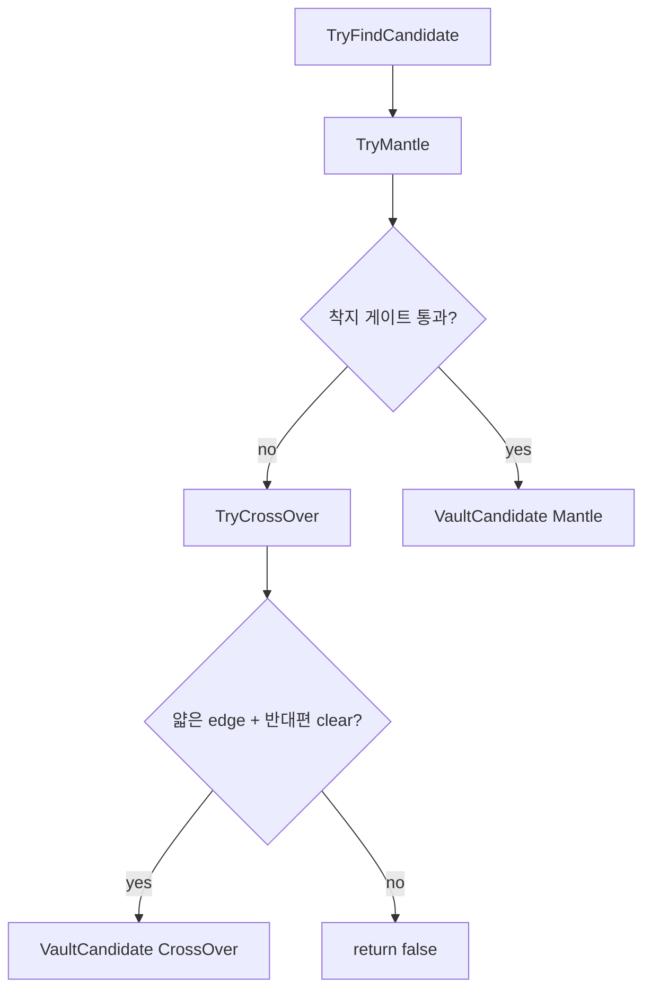
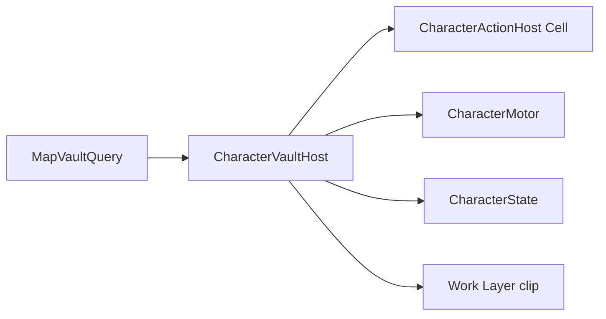

# Vault / Fence Vault (담넘기 · 벽넘기)

> Dist 담·벽 넘기 SSOT.
> 인덱스: `docs/README.md` · 이동 일반: [`LOCOMOTION.md`](LOCOMOTION.md)
> **Vault 스크립트를 쓰거나 고치기 전에 이 문서를 읽는다.**

경로:
- `Assets/Dist/Scripts/Map/MapCollision/MapVaultQuery.cs` · `VaultConsts.cs`
- `Assets/Dist/Scripts/Entity/Locomotion/CharacterVaultHost.cs` · `VaultClipCatalog.cs`

---

## Probe 순서 (착지 가능 동작 기준)

장애물 **종류(Slim/Thick 이름)로 먼저 가르지 않는다.** Mantle 착지를 먼저 보고, 실패할 때만 얇은 edge CrossOver.

| 단계 | 조건 | 결과 |
|------|------|------|
| **Mantle** | 전방(`ahead`) XZ 열에서 발 Y **초과** walkable (`CellHasFloor`). `deltaY > footprint.y/2`, `clearSpan > footprint.y`, footprint 볼륨 clear. 벽/구조물 이름 不分 · 얇은 edge **상단** walkable도 동일 게이트 | `VaultCrossStyle.Mantle` |
| **CrossOver** | Mantle 실패 후만. `BlocksEdge` · `sizeUnit.y ∈ {1,2}` · 반대편 같은 feet Y + floor + footprint clear | `VaultCrossStyle.CrossOver` |

`MapVaultQuery`는 후보를 최대 1개 반환한다.

---

## 두꺼운 벽 / ThickWall Mantle (맵 전제) — 찾기용

> 키워드: ThickWall · 두꺼운 벽 · 올라가기 · Mantle · 상단 floor · `ProvidesLogicalFloor`

**솔리드만 있는 ThickWall 위로는 Mantle이 안 된다.** CrossOver도 edge가 아니라서 해당 없음.

| 전제 | 이유 |
|------|------|
| 착지 칸에 **`CellHasFloor` (= `ProvidesLogicalFloor`)** | Mantle은 walkable만 본다. `ThickWall_*` SO는 `providesLogicalFloor: 0` · solid만 |
| 상단 floor = 전방(`ahead`) **1칸** 열 · 벽 밀착 시 현재 `feet` 열 | ahead 우선, 벽에 서 있으면 feet 열 |
| `deltaY ≥ 1` | ThickWall `size.y=1` + 바로 위 floor → **1셀 단차 Low Mantle** 허용 |
| `clearSpan ≥ footprint.y` | 몸 footprint 높이만큼 헤드룸 (`FootprintVolumeBlocks`와 패리티) |

맵: 솔리드 스택 **위 walkable 칸**에 logical floor를 둔다. 솔리드 정의만으로는 “위에 설 수 있음”이 아니다.

관련 SO 예: `Assets/Dist/SOData/Tile/ThickWall/` (`size.y` 보통 1, floor 플래그 0).

---

## 높이 등급 (상호 배타)

| 스타일 | Low | High |
|--------|-----|------|
| **Mantle** | `deltaY ≤ footprint.y` | `deltaY > footprint.y` |
| **CrossOver** | `sizeUnit.y == 1` | `sizeUnit.y == 2` |

Mantle 분류 SSOT: `MapVaultQuery.ClassifyMantleHeight`. CrossOver는 edge `sizeUnit.y`만.

기본 footprint `(1,2,1)` 예: Mantle `deltaY=1`~`2` → Low, `deltaY≥3` → High. CrossOver Low=1 / High=2. **달리기 자동**은 `deltaY`(또는 edge span) ≤ `footprint.y/2`(기본 1칸)만.

---

## Mantle 상세

- 스캔: `ahead`(1칸) 우선 → 실패 시 **현재 `feet` 열**(벽 밀착). 깊이 SSOT `VaultConsts.MantleProbeMaxAheadCells`(1). 발 Y+1 … 상한, **가장 낮은** 유효 landing
- `deltaY ≥ 1`, `clearSpan ≥ footprint.y`, `CellHasFloor`, `!FootprintVolumeBlocks`
- **ThickWall** → 위 [두꺼운 벽 Mantle 맵 전제](#두꺼운-벽--thickwall-mantle-맵-전제--찾기용) 참고

---

## CrossOver 상세

- thin edge only (`TryGetEdgeBetween` + `EdgeBlocksPassage`)
- solid / 같은 층 너머 폴백 **없음** (ThickWall CrossOver 없음)
- 착지 = 반대편 셀 · 같은 feet Y

---

## 입력

| 등급 | 진입 |
|------|------|
| Low | **달려오던 속도**로 전방 막힘 → 자동(**≤ footprint.y/2**만) **또는** **E 홀드** (`VaultConsts.HoldSeconds`) |
| High | **E 홀드만** (동일 `HoldSeconds`) |

- E = `InputActions.Player.Interaction` (`<Keyboard>/e`).
- `InputManager`: `PlayerInteractStarted` / `Performed` / `Canceled`.
- 홀드 판정은 InputActions Hold가 아니라 `CharacterVaultHost` 타이머 (전역 Interaction 지연 방지).
- E **짧은 탭**(홀드 미달): vault 후보가 있어도 시전하지 않고, 릴리즈 시 기존 `IInteractable` 상호작용(`TryInteractFocused`).
- vault 홀드 확정 시 해당 press의 상호작용은 억제.
- 달리기 자동 vault: Shift + MoveDir + 프로브 성공 + `IsAutoSprintEligible`(≤ footprint.y/2) + 전진 속도 ≥ `AutoSprintMinApproachSpeedMps`. 조준 중 금지.

---

## 런타임 흐름

| 단계 | 동작 |
|------|------|
| Probe | 발밑 + **이동 입력(MoveDir)** 방향 (E·달리기 자동 공통) |
| Busy | `CharacterActionKind.Cell` (행동큐) · ESC `CancelAll` |
| Motion | `BeginScriptedLocomotion` + `SetMoveLocked` · 키프레임 `Rigidbody.MovePosition` · `SnapWorldPosition` · duration = 기본×`ResolveDurationScale`(시전 순간 접근 속도) · Work Layer `Animator.speed` 동기화 |
| Time | `TimeScaleChannel.Player` (possessed) · `ActionTickScale` |
| Anim | `VaultClipCatalog` → `CharacterWorkLayerAnim` Work Layer (`ACTION.md` §Work Layer). Mantle 손 IK: `CharacterVaultIkHost`. CrossOver IK 없음 |

---

## 상수

`VaultConsts` — `HoldSeconds`, `AutoRetryCooldown`, `MantleProbeMaxAheadCells`, `AutoSprintMinApproachSpeedMps`, `DurationScaleWalkSpeedMps`/`DurationScaleSprintSpeedMps`/`DurationMinScale`, Low/High × Cross/Mantle duration, Cross peak 비율, Mantle IK (`MantleIkGrab*`, `MantleIkHandHalfSpanCells`, …).

클립 SO: `VaultClipCatalog` — SSOT 한곳 `Assets/Dist/SOData/Gameplay/Locomotion/VaultClipCatalog.asset` (`SerializeField` / Ensure 메뉴).

---

## 패리티 / 게이트

- topology slide·depenetration은 vault 중 비활성 (스크립트 궤적만).
- 수영·Dive·Pain `SetMoveLocked` 중 시전 불가.
- 플레이어 possessed만 입력·자동. NPC 길찾기 연동 없음 (1차).

---

## 검증

- thin y=1 상단 walkable 없음 → CrossOver Low (달리기 자동 · E 홀드).
- thin + 상단 walkable·clear → **Mantle** (edge를 CrossOver로 먼저 안 봄).
- edge 없는 턱, `deltaY≥1`/`clearSpan` 게이트 통과 → Mantle.
- `deltaY < 1` 또는 `clearSpan < sy` → Mantle 거부 후 CrossOver 시도.
- thin y=2 → CrossOver High (E 홀드만 · 달리기 자동 없음).
- **ThickWall solid만(상단 floor 없음) → Mantle·CrossOver 모두 실패**.
- **ThickWall + 상단 floor (deltaY=1) → Low Mantle** (달리기 자동 · E 홀드). **벽 바로 앞 1칸**에서만 프로브.
- E 짧은 탭: vault 미시전 + 문/상자 상호작용 유지.
- ESC: vault 취소, 현재 위치 고정.
