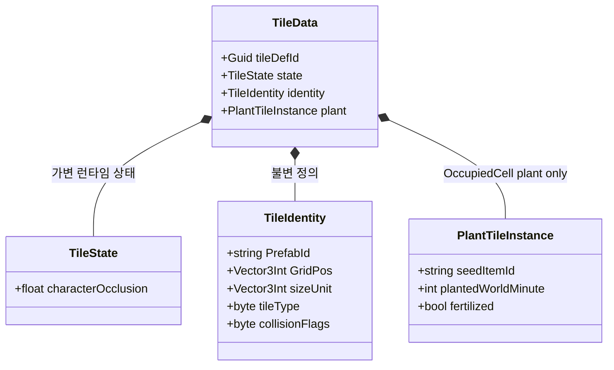

# Internal — 핵심 데이터 구조체

Unity 비의존 순수 구조체. 시스템 전체에서 공유.

## 좌표 규약

### 점유 인덱스를 우선 신뢰한다

**단일 진실원**은 bake 후 `FloorMapIndex.RebuildOccupancy`가 만든 점유 인덱스다.  
월드 좌표·시선·가시성에서 「어떤 셀에 타일이 있나」를 물을 때는 **인덱스 조회를 먼저** 한다.

에디터 셀 와이어 박스: `TileHelper.DrawOccupiedCellWire` (`ConvertGridToWorldPos` 중심). TileView Selected·캐릭터 스폰 마커가 공유한다.

- 존재 여부: `CellHasOccupancy(x, z, y)` / `HasAnyTile`
- 셀 내용: `TryGetCellTiles` + incident 면/엣지 (`CollectStructuralOccludersAtOccupiedCell` 등)
- 전역 스캔: `EnumerateOccupiedCells` (필요할 때만)

**바닥(HorizontalFace)은 그리드 층 사이 면**이지만, bake가 `CellBelow`·`CellAbove` **둘 다** 인덱스에 넣는다.  
따라서 시선·차단 코드에서 **런타임 y±1 수동 탐색을 추가하지 않는다** — 위·아래 등록은 인덱스가 이미 담당한다.

| 용어 | 의미 |
|------|------|
| **점유셀** | 인덱스에 등록된 `(x,y,z)` — 볼륨 footprint, edge 양쪽, floor `CellAbove`/`CellBelow` |
| **walkable 셀** | Floor `CellAbove` (`ProvidesLogicalFloor` 바닥 **위** 점유셀). **통행 가능 타일과 다름** |
| **막힘** | `BlocksOccupiedCells` / `BlocksEdge` 등 `collisionFlags` |
| Floor `GridPos` | 저장 앵커 = `CellBelow`. 게임플레이·가시성 좌표는 점유 인덱스 셀 |

### 월드 → 셀 (용도별 — 혼용 금지)

| 용도 | API | 설명 |
|------|-----|------|
| **플레이어가 몇 층 바닥 위?** | `OccupiedCellCoord.ResolveFromWorld` | seed `(x,y0,z)`에서 **`y--` 하향**, `CellHasOccupancy` + `CellHasFloor` + 발 높이 이하 **첫 바닥** |
| **시선 샘플·건물 차단·근접 블렌드** | `OccupiedCellCoord.TryResolveSightOccupiedCell` / `GridAtSightSampleHeight` | 차단: `ConvertWorldToGrid` + `CellHasOccupancy`. 블렌드 슬라이스: 높이만 그리드화 |
| **identity → 대표 점유셀** | `OccupiedCellCoord.PrimaryCellFromIdentity` | hub 불필요 |

**하지 말 것**

- 시선·차단·블렌드에 `ResolveFromWorld` (발밑 바닥 찾기 → 시선이 1층으로 끌려감)
- 시선 샘플마다 y±1 수동 probe (bake 인덱스와 중복·불일치)
- `ConvertWorldToGrid`만으로 **플레이어 층** 확정
- 맵 전역 Y `HashSet`/`int[]` (`distinctOccupiedCellYs`, `bandSet`), `(x,z)` 기둥 인덱스, `EnumerateOccupiedCells` 전수 필터로 층 찾기

**Y band 금지** (층 집합 캐시). **건물 sector 허용**: `buildingId`, `roomId`, bake `(buildingId, cellY)` slice.

타일 대표 점유셀(identity만): `OccupiedCellCoord.PrimaryCellFromIdentity` — hub 불필요.

---

## 필드 메모

| 필드 | 설명 |
|------|------|
| `tileDefId` | Guid — 런타임 바인딩 키. 저장하지 않으며 로드 시 `Guid.NewGuid()`로 생성. `TileMapVisualizer`가 TileData → TileView를 찾을 때 사용 |
| `characterOcclusion` | BFS 후보 여부 안에서 플레이어와 거리 등으로 표시 차단 정도 결정 (`0`=해제) |
| `PrefabId` | `TilePrefabDB` 딕셔너리 키 |
| `sizeUnit` | 점유 그리드 크기 (예: `2,1,1`) |
| `placementSlot` | `1`=OccupiedCell, `2`=VerticalFace, `3`=HorizontalFace — 배치 위치 |
| `wallFace` | VerticalFace일 때 `WallFace` (+X/+Z) |
| `floorFace` | HorizontalFace일 때 `FloorFace.PosY` (1) 필수 |
| `buildingId` | bake: `0` 미할당, `-1` 광장 Floor, `>0` 건물 |
| `roomId` | 같은 buildingId·cellY 내 방 번호 |

### HorizontalFace 좌표 규칙

| 필드 | 의미 |
|------|------|
| `GridPos` | **anchor** = `CellBelow` (EdgeWall의 앵커와 동일한 역할) |
| walkable 셀 | 저장하지 않음 — `OccupiedCellCoord.PrimaryCellFromIdentity` = `CellAbove` 파생 |
| 월드 pose Y | `CellAbove.y * cellSize` (격자 경계, 정수) |
| JSON | `floorFaces[]`의 `x,y,z` = anchor. `tiles[]` Floor 로드 없음 |

### placementSlot vs collisionFlags

| 역할 | 필드 |
|------|------|
| 배치 위치(셀/면), building bake·visibility | `placementSlot` |
| 점유 셀 통행·논리 바닥·Physics Collider·엣지 통행·BFS 오클루전 후보 | `collisionFlags` |

런타임 저장: **셀** `TileMapModel.tiles` + **면** `TileFaceBinder` (수직·수평 registry).

### 맵 혈흔 (`bloodStamps[]`)

`tiles` / `wallEdges` / `floorFaces`와 **별 레이어**. 구 JSON에 없으면 empty.

| 필드 | 의미 |
|------|------|
| `wx,wy,wz` | 스탬프 월드 좌표 (로드 시 셀 중심 재스냅 금지) |
| `yaw, scale, alpha` | 수평 회전·크기·진하기 |
| `cx,cy,cz` | 소속 walkable 셀 (`OccupiedCellCoord.ResolveFromWorld`) — 청소/쿼리용 |

SSOT 런타임: `MapBloodOverlay` (`MapBloodHost`). 그리기: `MapBloodStainRenderer` (`DrawMeshInstanced`, 스탬프당 GO 없음). 쓰기: 출혈 drip · 자상/절단 히트 콘 spray · (선택) 피 VFX 파티클 착지 샘플. 청소: `ClearCell` API (UI 없음).

### 맵 액체 (`liquidAuthoringFaces[]` + `liquidCells[]`)

`tiles` / `wallEdges` / `floorFaces`와 **별 레이어**. 물은 `TileData`가 **아니다** — 계약 SSOT는
[`docs/map/LIQUID.md`](LIQUID.md).

| 레이어 | 의미 |
|--------|------|
| `liquidAuthoringFaces[]` | 에디터 저작 마커. `FloorFaceSaveData`와 같은 형태이며 `x,y,z` = 바닥 +Y 면 앵커(`CellBelow`) |
| `liquidCells[]` | 시뮬 상태. 셀 좌표는 앵커의 `CellAbove`(= walkable). `tempDeciC`는 0.1 °C 단위 |
| `hasLiquidSnapshot` | true면 `liquidCells`를 그대로 신뢰(재시드 금지) |
| `hasLiquidTemperature` | true면 `tempDeciC`가 유효. false면 기본 기온으로 초기화 — `0`이 물의 어는점과 겹쳐 그대로 읽으면 전부 얼어버린다 |

물은 점유 인덱스·`FloorMapIndex`·building bake에 등록되지 않는다. 얼어붙은 액체의 바닥 지지는
`MapTopologyQuery.CellHasFloor`에서만 합성된다(이동·지각 seam 한 곳).

구 JSON은 물이 `floorFaces`에 Floor 타일로 들어 있고, `TileMapSerializer.Read`가 로드 경계에서
`liquidAuthoringFaces`로 one-way 승격한다.

### 맵 식물 (OccupiedCell `tiles[]` + 시계 스냅샷)

Plant는 **별 레이어가 아니라** OccupiedCell `tiles[]`다. `Furniture/Plant_*` prefabId + 아래 인스턴스 필드.

| `TileSaveData` 필드 | 의미 |
|------|------|
| `seedItemId` | Dist `ItemData.id` (비어 있으면 non-plant) |
| `plantedWorldMinute` | 심은 시점 월드 분 (`ItemRot.CurrentWorldMinute`) |
| `fertilized` | 비료 1회 |
| `lastFruitHarvestWorldMinute` | Tree 과일 수확 시각 (생략/≤0 → 미수확) |

경작 표면: `Floor/Tilled` HorizontalFace (덮어쓰기). 별도 `tilledCells` 없음.

**레거시** `plantCells[]`: 로드 시 `MapPlantHost`가 Plant 타일(+ `tilled`→Floor/Tilled)로 승격 후 폐기. 신규 세이브는 `plantCells=null`.

시계 스냅샷 (`hasClockSnapshot`이 true일 때만 로드 시 `WorldClock.SetTime`):

| 필드 | 의미 |
|------|------|
| `dayIndex` | `WorldClock.DayIndex` |
| `minuteOfDay` | `WorldClock.MinuteOfDay` |

SSOT 런타임: `MapPlantHost` + `TileMapModel`. Stage/wither는 inspect/harvest/load CatchUp (`PlantGrowth` + prefab stage patch). 심기: `TilePlaceUtil` + floor/`PLANTABLE`/Planter 게이트. 계약: [`docs/farming/FARMING.md`](../farming/FARMING.md).

### TileDefinition 필수

모든 타일은 `TilePrefabDB`에 등록된 `TileDefinition`을 가져야 합니다. JSON 로드·씬 export·배치 시 `prefabId`로 Definition lookup → `collisionFlags`·`sizeUnit` bake. Definition 없으면 **오류 로그 후 해당 타일 스킵** (tileType/prefabId 추론 폴백 없음).
