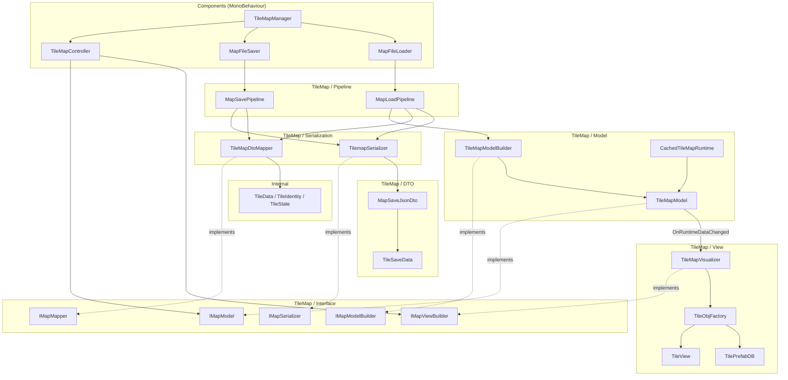
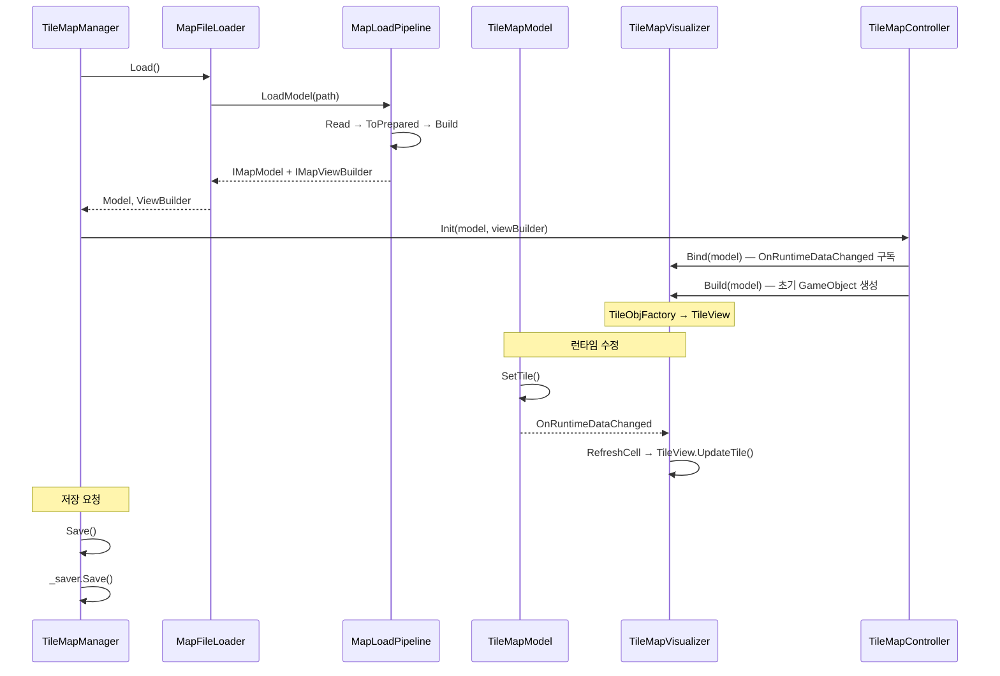

# Map System — 전체 개요

> LLM/에이전트용 Dist 맵 SSOT 진입점.
> 인덱스: `docs/README.md` · 룰: `.cursor/rules/map-system.mdc`
> **맵·타일맵 스크립트를 쓰거나 고치기 전에 이 문서와 아래 세부를 읽는다.**

패턴: MVC + Pipeline + Observer  
세부 문서: [COMPONENTS.md](COMPONENTS.md) | [DATA.md](DATA.md) | [TILEMAP.md](TILEMAP.md)  
경로(코드): `Assets/Dist/Scripts/Map/`

---

## 의존성 다이어그램

**청크 스트리밍 desired** = `CameraGroundView` 지면 footprint + `CameraChunkMargin` (`TileMapChunkStreamer`). 지면 AABB 수학은 `CameraGroundView`, 청크 변환만 `TileViewportBounds`.

### 맵 혈흔

경로: `Assets/Dist/Scripts/Map/Blood/`. `TileMapManager`가 `MapBloodHost`를 바인딩·DTO 로드. 세이브 시 `MapSavePipeline`이 `bloodStamps`를 JSON에 병합. 모델(스탬프)은 청크 unload와 무관하게 유지; 뷰는 인스턴스 드로우만.

### 맵 식물

경로: `Assets/Dist/Scripts/Map/Plant/`. `TileMapManager`가 `MapPlantHost`를 바인딩·DTO 로드. 세이브 시 `MapSavePipeline`이 `plantCells`를 JSON에 병합. 모델은 청크 unload와 무관하게 유지; 뷰는 Dist 오버레이 GO만 (BN furniture 스프라이트 아님). 계약: [`docs/farming/FARMING.md`](../farming/FARMING.md).

---

## 데이터 흐름 요약

---

## 레이어별 역할

| 레이어 | 위치 | 역할 |
|--------|------|------|
| Coordinator | `Components/` | `TileMapManager` — 생명주기 조율, wiring |
| Entry | `Components/` | `MapFileLoader`, `MapFileSaver`, `TileMapController` |
| Data | `Internal/` | 순수 구조체 (Unity 비의존) |
| Interface | `TileMap/Interface/` | 레이어 간 계약, 결합도 최소화 |
| DTO | `TileMap/DTO/` | JSON 직렬화 전용 포맷 |
| Model | `TileMap/` | 런타임 상태, BFS 오클루전 |
| View | `TileMap/` | GameObject 생성·갱신 |
| Pipeline | `TileMap/` | 단계 조합 (교체 가능) |
