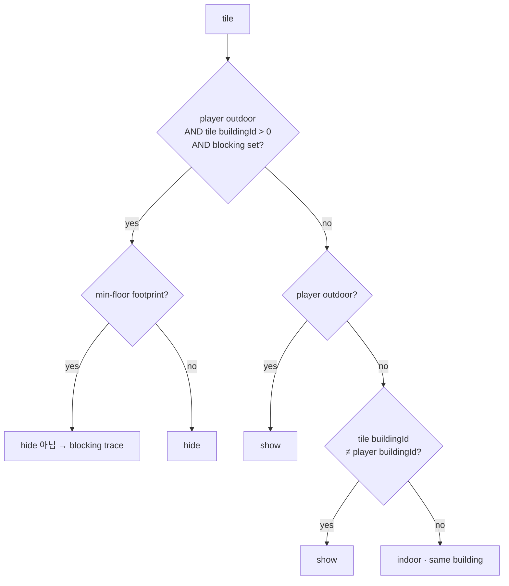
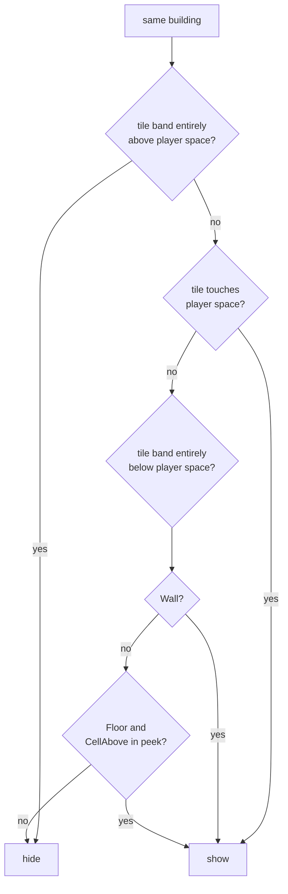
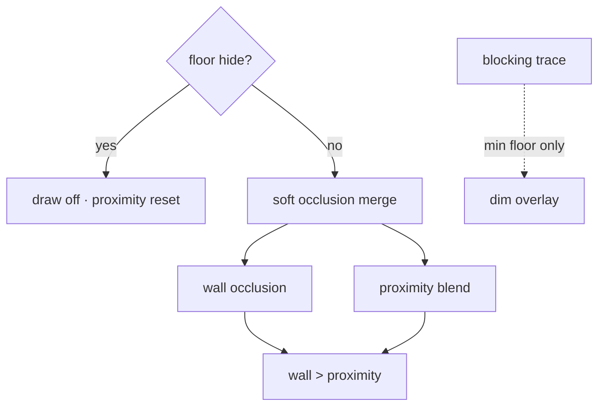
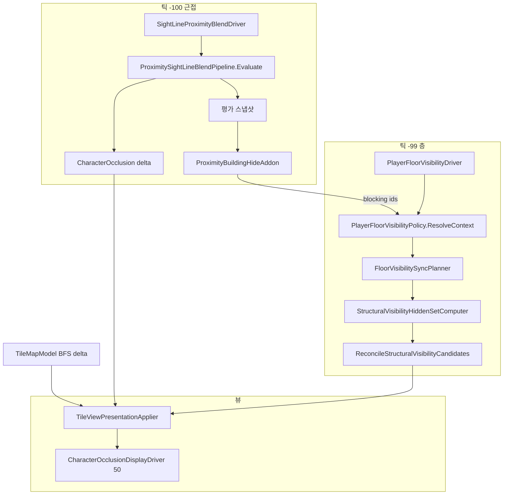

# TileMap — 가려짐·가시성 조건

## 좌표 규약

**구현·좌표 매핑은 이 절만 본다.** [가리기 논리](#가리기-논리)의 player floor·buildingId·peek 등이 코드에서 어떻게 읽히는지는 여기서 정의한다.

**점유 인덱스를 우선 신뢰한다** (`CellHasOccupancy`, bake `RebuildOccupancy`). 가시성·시선에서 셀 후보는 **인덱스에 등록된 점유셀만** 쓴다.

| 대상 | 월드 → 셀 |
|------|-----------|
| **가시성 evaluate 월드** | `PlayerVisibilityWorldResolve` — 조준 중 `AimWorldPoint`, 아니면 `BodyWorldPoint`(비조준 시 발높이 오프셋은 층 드라이버만). **근접·BFS·층 가시성 드라이버 동일.** |
| **가시성 evaluate 셀** | `PlayerFloorVisibilityPolicy.ResolvePlayerOccupiedCell(visibilityWorld)` — 조준·비조준 **동일**. (`policy` 없을 때만 `GridPos` fallback) |
| **플레이어 층** | `OccupiedCellCoord.ResolveFromWorld` (발밑 바닥, `y--` 하향) |
| **시선 높이 슬라이스** (근접 블렌드·야외 blocking 후보) | `GridAtSightSampleHeight` (높이 그리드, 점유 무관) |
| **타일 대표 셀** | `OccupiedCellCoord.PrimaryCellFromIdentity` |

**가리기 논리 ↔ 구현 대응** (규칙 수정 시 이 표만 따라 코드를 찾는다)

| 논리 용어 | 구현에서의 읽기 |
|-----------|----------------|
| visibility evaluate world | `PlayerVisibilityWorldResolve` / `CharacterState.ResolveVisibilityWorldPoint` — 조준 시 조준점만 대상 |
| visibility evaluate cell | `ResolvePlayerOccupiedCell(visibilityWorld)` — 조준·비조준 동일 (`PlayerVisibilityWorldResolve`) |
| player floor | evaluate cell Y (fallback·peek 기준) |
| player space band | `SpaceRegistry`의 player `SpaceId` floor cells `minY..maxY` |
| tile structural band | `SpaceVisibilityUtil.TryGetStructuralBand` |
| buildingId | 타일·플레이어 `identity.buildingId` (0 = terrain) |
| blocking building set | context blocking building id 집합 |
| peek cells | player floor room BFS hole → below-floor room cells (room은 개방 floor 묶음일 수 있음 — [bake §5.1](TILEMAP_BUILDING_BAKE.md)) |
| min-floor footprint | building registry MinCellY Floor tile |
| walkable / CellAbove | Floor `CellAbove` |

바닥은 그리드 층 사이 면이나 bake가 `CellBelow`/`CellAbove` 둘 다 인덱스에 넣는다 → 시선에서 y±1 수동 탐색 **금지**.

- walkable = Floor `CellAbove` (논리 바닥 위 점유셀). 통행 가능과 **다른 용어**.
- Y 층 band/`distinctOccupiedCellYs` **금지**. XZ Chebyshev만 `RadiusCells`.
- 상세: [DATA.md §좌표 규약](DATA.md), [TILEMAP.md §좌표 규약](TILEMAP.md).

---

타일맵에서 “안 보이게” 만드는 경로는 **서로 독립된 3개 시스템**이다.

| 시스템 | 목적 | 적용 단위 | 상태 저장 |
|--------|------|-----------|-----------|
| **층 가시성** | 야외 시선 차단·실내 층/스코프 | 건물·층 | applier 숨김 집합 |
| **근접 시선 블렌드** | 카메라↔플레이어 시선 XZ 반경 | 타일별 | entry `CharacterOcclusion` |
| **시선 차단 건물 흔적** | 야외 차단 building **건물별 최하층** 바닥 윤곽 | MinCellY Floor | `_appliedSightLineTrace` (applier) |

**스트리밍(`TileMapStreamingVisualizer`)은 청크 로드/언로드만 담당한다.** 층 가시성은 despawn하지 않으며 `TileViewPresentationApplier`가 처리한다.

---

## 구현 원칙

**논리는 단순하게, 코드는 땜빵 없이 근본적으로.**

| 원칙 | 의미 |
|------|------|
| **판정 SSOT 1곳** | show/hide·space band·peek은 `PlayerFloorVisibilityPolicy` + `SpaceVisibilityUtil`만. 뷰·드라이버·모델에 같은 규칙을 다시 쓰지 않는다. |
| **evaluate 기준점 SSOT** | 가시성·오클루전 **입력** 월드·셀은 `PlayerVisibilityWorldResolve` 한 곳. 조준 중에는 **조준점이 대상**일 뿐이며 경로·우선순위는 비조준과 동일하다. |
| **표현 SSOT 1곳** | 화면 상태는 `TileViewPresentationApplier.Resolve` → `ApplyResolved` 한 경로. `TileView` 로컬 플래그는 캐시일 뿐 진실원이 아니다. |
| **표현 진입점** | 게임플레이·UI 코드는 `TileViewPresentationApplier`를 직접 호출하지 않는다. 신규 월드 표현 요청은 `TilePresentationSystem`을 경유한다. |
| **structural parity** | Floor·EdgeWall 등 `IsStructural`은 같은 indoor pipeline을 따른다. 단, Floor는 walkable cell, EdgeWall은 incident cell band로 읽는다. |
| **채널 분리** | structural hide(완전 숨김)와 CharacterOcclusion(반투명)은 **다른 목적**. policy가 hide면 occlusion을 씌우지 않는다 — **입력 단계에서 차단**, apply 후 필터·전환 후보 patch로 막지 않는다. |
| **전환은 reconcile** | indoor↔outdoor·blocking 변경은 “stale 타일 목록을 또 하나 더”가 아니라 **ctx diff universe 전체 reconcile** 한 번으로 끝낸다. |
| **땜빵 금지** | 증상별 `if (전환) Clear…`, `AppendTransition…`, 위치 gate 우회, apply 시 filter만 추가하는 패턴은 **임시**다. 같은 버그가 두 번 나오면 **발생 경로를 제거**하는 쪽으로 리팩터한다. |

**허용되는 복잡도**: 3개 독립 시스템(층 가시성 · 근접 블렌드 · BFS wall occlusion)은 **도메인상** 분리다. 복잡도가 문제인 곳은 **틱·상태 저장소가 3벌**인 지점이다.

---

## 가리기 논리

**판정 규칙 전용 절.** code 필드명·API 이름 없음.

- **규칙 변경** → 이 절만
- **좌표·index 변경** → [좌표 규약](#좌표-규약)만
- **tick·diff·store** → §2~§4

**대상은 구조 타일뿐이다.** 액체(물·얼음)는 타일 모델에 없어 이 절의 어느 판정에도 들어오지 않는다 —
가려짐 예외 플래그가 아니라 구조적 부재다. 수면은 자체 렌더러가 그리고, 얼어붙은 액체의 바닥 지지도
이동·지각 seam에서만 합성된다. 계약: [`docs/map/LIQUID.md`](LIQUID.md).

### 용어

| 용어 | 의미 |
|------|------|
| **player floor** | 플레이어가 서 있는 점유 cell Y (fallback·peek 기준) |
| **player space** | 플레이어 점유 floor cell의 SpaceId. 같은 space의 walkable Y 전체를 한 structural 층으로 본다 |
| **tile structural band** | 타일이 차지하는 structural Y 구간. Floor는 walkable cell, EdgeWall은 incident cell band |
| **buildingId** | 타일·player 소속 building. 0 = terrain |
| **blocking building set** | outdoor에서 sight에 걸려 통째 hide할 building 목록 |
| **peek cells** | player floor hole 아래 slice에서 보이는 room cells |
| **min-floor footprint** | hide된 building의 가장 아래 Floor face |

### context (판정 전)

| context | 의미 |
|---------|------|
| player outdoor | 점유 cell 기준. buildingId만으로 outdoor 추론 금지 |
| player floor | 발밑 floor 기준 Y |
| player space band | player SpaceId floor cells의 `minY..maxY` |
| player buildingId | indoor일 때 소속 |
| tile buildingId · tile structural band | 판정 대상 타일 |
| blocking building set | outdoor 통째 hide 대상 |
| peek cells | indoor · player floor 아래 expose 집합 |

blocking set은 **proximity evaluate 이후** 채움 (outdoor · feature on).

peek cells: player floor **room BFS**로 hole 찾고, player space 아래 connected room cells 수집.

**buildingId 출처 (bake SSOT)**: [TILEMAP_BUILDING_BAKE.md](TILEMAP_BUILDING_BAKE.md) — **floor SSOT**, structural shell은 **occupied-cell flood** ([TILEMAP.md](TILEMAP.md) §점유셀). indoor hide는 tile `buildingId` vs player `buildingId`; **shell-disconnected**(id 0)은 step ③ **show** (의도).

---

### 판정 종류

| 종류 | 단위 | 결과 |
|------|------|------|
| **floor hide** | tile | show / hide (draw off) |
| **proximity blend** | tile | occlusion 0~1 (반투명) |
| **blocking trace** | tile | hide된 building min-floor 어둡게 |
| **wall occlusion** | tile | indoor BFS occlusion (blend와 합성) |

floor hide와 proximity blend는 **병렬**. apply 시 floor hide 우선.

---

### floor hide — 판정 순서

타일마다 **아래 순서**. Hide 나오면 종료.



**indoor · same building**:



| step | 조건 | 결과 |
|------|------|------|
| ① outdoor block | outdoor + blocking set building | hide (min-floor footprint **제외**) |
| ② outdoor default | outdoor + ① 아님 | show |
| ③ indoor other building | tile buildingId ≠ player | show |
| ④ above space | same building + tile structural band 전체가 player space 위 | hide |
| ⑤ player space | same building + tile이 player space floor cell에 접촉 | show |
| ⑥ below space | same building + tile structural band 전체가 player space 아래 | Wall은 show, Floor는 peek cell에 포함 시 show |

**structural face parity**: HorizontalFace(Floor)와 VerticalFace(EdgeWall)는 같은 indoor pipeline을 따른다. Floor는 `CellAbove`, EdgeWall은 anchor·neighbor incident cell band로 player space 접촉 여부를 판정한다. 구현: `SpaceVisibilityUtil`.

outdoor block은 **player floor 변경과 무관** — blocking set 같으면 동일.

indoor ④~⑥은 **player space band·peek** 변경에 반응.

---

### blocking building set

**전제** (하나라도 아니면 empty): player outdoor · outdoor building hide on.

proximity evaluate **filter 통과 tile** 기준 (occlusion 0이어도 포함). 여기서 filter의 핵심은 [사분면 필터](#사분면-필터-quadrant--제거-금지) — 통과 범위를 넓히면 blocking set이 커져 건물 단위 hide가 폭발한다.

| hit tile | set |
|----------|-----|
| buildingId > 0, ≠ player buildingId | add |
| terrain (0) | skip → blend only |
| = player buildingId | skip |

set에 들어간 building **전 tile**이 ① 대상 (min-floor footprint 제외).

---

### proximity blend

| 항목 | 규칙 |
|------|------|
| range | camera↔player sight line, sample height에서 XZ radius |
| cells | occupancy index만 (Y ±1 manual 금지) |
| filter | quadrant · floor exempt 등 (실내 벽 포함 — BFS와 병렬, apply 시 BFS 우선) |
| output | hit tile마다 occlusion strength |
| building | 무관 — terrain·building 모두 blend 가능 |

**blend ≠ floor hide.** draw off 안 함.

#### 사분면 필터 (quadrant) — 제거 금지

시선 반경으로 모은 occupancy 셀·occluder는 **플레이어 XZ 기준 +X·-Z 사분면**(`dx ≥ 0`, `dz ≤ 0`)만 evaluate에 통과한다. 구현: `SightLineOcclusionStrength.PassesPlayerDownXQuadrant` · `PassesPlayerDownXQuadrantForOccluder` (`ProximitySightLineBlendPipeline` **입력** 단계, apply 필터 아님).

| 제거 시 | 결과 |
|---------|------|
| 사분면 필터 없음 | 반경 내 **모든 방향** 건물이 evaluate 스냅샷·`EvaluatedHits`에 들어감 |
| 야외 + blocking on | `ProximityBuildingHideAddon`이 hit의 `buildingId`를 blocking set에 추가 → [floor hide ①](#floor-hide--판정-순서) **통째 hide** |
| 맵 체감 | **+Z(북쪽) 등 카메라 반대편** 건물까지 blocking 대상이 되어 북쪽 맵이 통째로 사라질 수 있음 |

**북쪽(+Z) 맵을 통째로 날리고 싶지 않다면 사분면 필터를 지우지 않는다.** 반경만 키우거나 apply 쪽에서 우회하는 패턴도 동일 계열 버그다 (§[구현 원칙](#구현-원칙) 땜빵 금지).

---

### blocking trace

| 조건 | 표시 |
|------|------|
| ① 예외 tile | building **min-floor footprint** |
| floor hide | 별도 track |

---

### apply 우선순위



| priority | 규칙 |
|----------|------|
| floor hide | 최우선 — soft skip |
| soft | wall occlusion vs proximity — **stronger wins** (wall 우선) |
| blocking trace | floor hide와 병행 (footprint only) |
| Ghost · Selected | floor hide와 독립 |

floor hide 전환 시 proximity state **reset**.

---

### context diff 시 re-eval

| change | scope |
|--------|-------|
| blocking set only (outdoor) | add/remove building tiles |
| player floor · peek (indoor) | player building + peek symmetric diff |
| outdoor ↔ indoor | prior hide + both sides |
| context equal | floor hide sync skip |

chunk spawn tile은 **그 tile 하나**만 re-eval.

---

## 전체 흐름 (구현·틱)



**틱 순서**: `SightLineProximityBlendDriver` (`-100`) → `CharacterVisibilityBroadcaster` (`-99`) → `PlayerFloorVisibilityDriver` (`-98`) → `CharacterOcclusionDisplayDriver` (`50`) → 청크 스트리밍.

세 evaluate 드라이버는 모두 `PlayerVisibilityWorldResolve`로 월드·evaluate 셀을 맞춘 뒤 각 채널(근접 blend · BFS occlusion · structural reconcile)만 담당한다. **조준 여부는 기준점 선택만 바꾼다** — apply·우선순위(`Resolve`)는 동일.

> **2026-07**: occlusion evaluate가 floor structural reconcile **이전**에 돌아야 outdoor 전환 시 policy-invisible 타일이 BFS에 남지 않는다. `TileVisibilityTick` 단일 오케스트레이터는 미도입(§7.2).

`PlayerFloorVisibilityDriver`는 `FloorVisibilityContext.Equals`가 바뀔 때만 `SyncFloorVisibility`를 호출한다.

---

## FloorVisibilityContext

| 필드 | 용도 |
|------|------|
| `IsPlayerOutdoor` | 야외 blocking·실내 pipeline 분기 |
| `PlayerFloorCellY` | fallback·peek 기준 |
| `PlayerBuildingId` | 실내 scope·에드온 exclude |
| `PlayerSpaceId`, `PlayerSpaceMinY`, `PlayerSpaceMaxY` | 실내 structural hide의 층 단위 |
| `PlayerBlockingBuildingIds` | 야외 통째 hide 대상 (근접 에드온 주입) |
| `VisibleBelowCells` | indoor peek cells |

---

## 1. 플레이어 실내/야외 판정

`TileMapCacheHub.IsOutdoorEvaluation(cellY, x, z)` — **`buildingId == 0`만으로 야외를 추론하지 않는다.**

**Space bake는 두 가지에만 쓴다.** `IsPlayerOutdoor` 분기와, 실내에서 player space vertical band를 한 structural 층으로 보는 판정. 근접/BFS occlusion은 별도 채널이다.

| 순서 | 규칙 |
|------|------|
| 1 | plaza (`IsPlazaFloor`) → **야외** |
| 2 | building floor 없음 / `buildingId <= 0` → **실내** (`false`) |
| 3 | 점유 floor에 `SpaceId` → `SpaceBakeResult.isOutdoor` |
| 4 | building floor인데 Space 없음 → **야외** (`true`) — bake 누락·개방 area indoor pipeline 고착 방지 |

`isOutdoor` 산출: [건물 bake §7](TILEMAP_BUILDING_BAKE.md) — `SpaceLeakEvaluator` topology (`buildingId`·footprint·extent). **`collisionFlags` leak 금지** — [대전제](TILEMAP_BUILDING_BAKE.md).

**room / `roomId`와 혼동하지 않는다.** room은 §5.1 slice floor 묶음(peek용). 실내/야외와 structural 층 단위는 Space.

**§5.1.1 (비대칭):** 논리로 닫힌 루프면 bake 그래프상 밀폐로 볼 수 있으나, **비트가 비었다고 비밀폐로 단정하지 않음.** `isOutdoor=false`도 밀폐 증명이 아님.

플레이어 점유셀: `PlayerVisibilityWorldResolve` → `ResolvePlayerOccupiedCell(visibilityWorld)` ([좌표 규약](#좌표-규약)).

---

## 2. 층 가시성 (presentation)

**규칙**: 위 [가리기 논리 §floor hide](#floor-hide--판정-순서)

**SSOT**

| 역할 | 담당 |
|------|------|
| 누가 숨길지 (판정) | 층 가시성 정책 |
| 어떻게 그릴지 (합성·적용) | `TileViewPresentationApplier.Resolve` → `ApplyResolved` |
| 구조적 숨김 표현 | `StructuralHidePresentationMode` — 기본 GameObject off, Renderer off (`TileMapManager`) |

**적용**: `_structuralHidden`은 **현재 구조물 숨김 대상 캐시**이다. 판정 SSOT는 policy+ctx이며, 후보 타일 sync 시 캐시 갱신 후 무조건 `ApplyResolved`한다. 후보 0이면 **no-op** (야외·차단 목록 불변 시 층만 바뀌어도 기존 숨김 유지).

### 2.1 분기·레이어

`IsTileVisible`은 **선행** `BlockingBuildingFullHideLayer`(야외만) 후 outdoor/indoor pipeline.

실내 `IndoorTileVisibilityPipeline` 순서: `SpaceAboveHideLayer` → `SpaceMembershipShowLayer` → `BelowSpaceLayer`.

player space band는 `FloorVisibilityContext`, tile structural band·space 접촉은 `SpaceVisibilityUtil`.

| 플레이어 | 타일 | 결과 |
|----------|------|------|
| **야외** | `buildingId ∈ PlayerBlockingBuildingIds` | Hide, **최하층 Floor** 제외 → §4 흔적 |
| **야외** | 그 외 | Show |
| **실내** | `buildingId != PlayerBuildingId` | Show |
| **실내** | 같은 building | indoor pipeline |

### 2.2 야외 blocking (근접 에드온)

- **주**: `ProximitySightLineBlendPipeline.Evaluate` (블렌드 수식 동일)
- **에드온**: `ProximityBuildingHideAddon` — 스냅샷 `EvaluatedHits` 중 `buildingId > 0 && != PlayerBuildingId` → `SetProximityBlockingBuildingIds`
- **조건**: `IsPlayerOutdoor` + `OutdoorSightLineBuildingHideEnabled`
- **실내**: blocking 비움

스냅샷 타일 = quadrant·실내 구조·Floor 면제 필터 **통과 후** occlusion 평가에 들어간 타일 (occ 강도와 무관). quadrant = +X·-Z 사분면만 — 제거 시 blocking set·북쪽 통째 hide ([§사분면 필터](#사분면-필터-quadrant--제거-금지)).

### 2.3 sync 후보 universe (`FloorVisibilitySyncPlanner`)

| ctx 변경 | 후보 타일 |
|----------|-----------|
| 야외 blocking만 | blocking added∪removed building 타일 |
| 실내 | `PlayerBuildingId` building + peek symmetric diff |
| 실내↔야외 | `_structuralHidden` + 양쪽 blocking/building/peek |
| 동일 ctx | sync 생략 (driver) |

청크 스폰: `SyncPresentationForTile` — **해당 타일 1개**만 `IsTileVisible` 판정.

---

## 3. 근접 시선 블렌드

`SightLineProximityBlendDriver` → `Evaluate` → `ApplyProximityBlendDelta`.

- 청크 스트리밍과 무관. 스폰된 `TileView`만 대상.
- `_structuralHidden` 타일은 occlusion display tick 스킵.
- hide 전환 시 proximity entry reset.
- player space 안에서 structural show된 뒤 벽·시선상 벽도 **proximity evaluate에 포함**. BFS(`BfsWallOcclusion` 100)가 engaged이면 그 scalar가 우선, 없을 때만 proximity(50)가 메운다.

### BFS 벽 오클루전

`TileMapModel.OnTileOcclusionPresentationDelta` → `ApplyOcclusionDelta(BfsWallOcclusion)` (실내).

### entry store (CharacterOcclusion만)

| Concern | Source | Priority |
|---------|--------|----------|
| `CharacterOcclusion` | `BfsWallOcclusion` | 100 |
| `CharacterOcclusion` | `ProximitySightLine` | 50 |
| `GhostAmount` | `Ghost` | 10 |

구조물 숨김·흔적은 entry가 아닌 applier `_structuralHidden` / `_appliedSightLineTrace`.

---

## 4. 시선 차단 건물 흔적

차단 building의 MinCellY Floor — `SetSightLineBuildingHidden` + `_SightLineBuildingHidden` 셰이더. hide 집합과 별도 diff.

---

## 5. Ghost · 선택

`SetGhosted` / `SetSelected` — 층 가시성과 별도.

---

## 6. 디버그

| 플래그 | 용도 |
|--------|------|
| `TileBuildingIdLabels` | buildingId 라벨 |
| `TileIndoorOutdoorOverlay` | 야외/실내 판정 |
| `TileSightLineBuildingOverlay` | 근접 에드온 blocking (policy `LastSightLineDebug`) |

---

## 7. 리팩터링 후보 (구조 단순화)

현재 동작은 맞춰졌으나 **땜빵이 겹친 구간**이 있다. 아래는 근본 정리 시 우선 검토할 목록이다. 새 증상 패치 전에 이 표를 본다.

### 7.1 상태 저장소 통합 (최우선)

| 현재 | 문제 | 목표 | 상태 |
|------|------|------|------|
| `TileMapModel` `_hiddenWallTileIds` + `_lastAppliedOcclusion` | BFS SSOT가 모델에 있음 | BFS membership·scalar를 **applier entry store 단일**로 | **미완** (evaluate는 model, emit은 entry) |
| `TilePresentationEntryStore` + `_characterOcclusionDisplay` | target vs display 이중 | display는 tick용 파생 | 유지 |
| `PresentationEntryQueries` → model fallback | entry 없을 때 model 재조회 | fallback 제거, delta 경로만 | **완료** |

**효과**: `AppendTransitionOcclusionCandidates`·`ShouldSkipCharacterOcclusionForTile` **제거 완료**. `ClearWallCharacterOcclusion`은 model outdoor early-out·policy invisible rebuild에만 잔존.

### 7.2 틱 오케스트레이션 1곳

| 현재 | 문제 | 목표 | 상태 |
|------|------|------|------|
| `SightLineProximityBlendDriver` (-100) | 각자 ctx·위치 gate | `TileVisibilityTick` (가칭) **단일 LateUpdate** | **부분** (실행 순서만 정렬) |
| `CharacterVisibilityBroadcaster` (-99) | occlusion evaluate | ③ occlusion evaluate | **완료** (`UpdateWallOcclusionFromPlayer`) |
| `PlayerFloorVisibilityDriver` (-98) | floor sync만 | ② structural reconcile | 순서 **완료** |
| `CharacterOcclusionDisplayDriver` (50) | display만 | 마지막 단계로 유지 | 유지 |

**효과**: indoor↔outdoor 시 “누가 먼저 clear하는가” 순서 버그 **구조적으로 불가능**.

### 7.3 reconcile API 단일화

| 현재 | 문제 | 목표 | 상태 |
|------|------|------|------|
| `SyncFloorVisibility` + `SyncPresentationForTile` | 거의 같은 apply | `ReconcileTilePresentation` **하나** | **완료** |
| `StructuralVisibilityHiddenSetComputer` | policy 래퍼 40줄 | inline `!IsTileVisible` | 후보 |
| `AppendTransitionOcclusionCandidates` | stale occlusion universe patch | planner 전수 후보로 대체 | **삭제 완료** |

### 7.4 occlusion 입력 차단을 apply가 아닌 evaluate로

| 현재 (땜빵) | 근본 | 상태 |
|-------------|------|------|
| `ShouldSkipCharacterOcclusionForTile` (apply 시 filter) | `WallOcclusionFinder` / proximity evaluate가 **policy invisible 타일 제외** | **완료** (`IsOcclusionTileVisible` + `UpdateWallOcclusionFromPlayer`) |
| `SyncFloorVisibility` → applier `ClearWallCharacterOcclusion` | outdoor 전환 시 BFS **빈 delta** + entry clear | **완료** (model outdoor + `forceClearOcclusion`) |
| `CharacterVisibilityBroadcaster` ctx gate | indoor/outdoor ctx 변경 시 위치 동일해도 재평가 | **완료** |

### 7.5 명칭·문서 정리 (낮은 비용)

- 논리 용어 `floor hide` → 문서상 **structural hide**로 통일 (policy 도메인 `FloorVisibility*`는 유지).
- [`TilePresentationResolved.cs`](Presentation/TilePresentationResolved.cs) 등 표현 타입은 이미 `Structural*` — 문서 §2 표 제목만 맞추기.

### 7.6 하지 말 것

- sync 밖 전환 훅 (`RecoverIndoor…`, building 전체 `ApplyResolved` 루프) **재도입 금지**.
- slot별 hide 예외 **재도입 금지**.
- **근접 evaluate 사분면 필터 제거** — 북쪽(+Z) 등 반대편 건물이 blocking set으로 들어가 통째 hide ([§사분면 필터](#사분면-필터-quadrant--제거-금지)).
- `MaterialPropertyBlock` / 머티리얼 스왑으로 가림 우회 **금지** ([URP 규약](../../../.cursor/rules/urp-rendering.mdc)).

---

## 8. 관련 소스

| 주제 | 파일 |
|------|------|
| 층 정책 | `PlayerFloorVisibilityPolicy.cs` |
| hide diff | `StructuralVisibilityHiddenSetComputer.cs`, `FloorVisibilitySyncPlanner.cs` |
| 레이어 | `TileVisibility/VisibilityLayers.cs`, `IndoorTileVisibilityPipeline.cs` |
| 근접·에드온 | `ProximitySightLineBlendPipeline.cs`, `ProximityBuildingHideAddon.cs` |
| presentation | `TileViewPresentationApplier.cs`, `TilePresentationResolved.cs`, `TileView.cs` |
| 드라이버 | `SightLineProximityBlendDriver.cs`, `PlayerFloorVisibilityDriver.cs`, `CharacterVisibilityBroadcaster.cs` |
| evaluate 기준점 | `PlayerVisibilityWorldResolve.cs`, `CharacterState.ResolveVisibilityWorldPoint` |
| slice Y | `TileVisibilityCellUtil.cs` |
| bake | `BuildingGroupBuilder.cs`, `BuildingGroupRegistry.cs` |

---

## 9. 치트시트

```
타일이 안 보인다?
├─ 청크 밖 → 스트리밍 (가시성 무관)
├─ draw off, despawn 아님 → §2 floor hide
├─ 반투명/윤곽 → §3 CharacterOcclusion
└─ 1층 바닥만 어둡다 (야외) → §4 SightLineBuildingHidden
```
