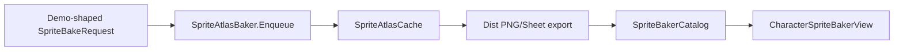

# SpriteBaker

> LLM/에이전트용 벤더 엔진 SSOT.
> 인덱스: `docs/README.md`
> **SpriteBaker를 쓰거나 Dist에 연동하기 전에 이 문서를 읽는다.**

경로(코드): `Assets/Plugins/SpriteBaker/`  
asmdef: `SpriteBaker` (+ `SpriteBaker.Editor`)

## 역할

에디터 베이크 씬에서 플러그인 **stock `Enqueue`** 로 아틀라스를 만들고,
Dist는 Output 시트만 Catalog/`Register` → ASR로 재생한다.
Dist가 bake 루프·Animator 배치·Sample 경로 해석을 **재구현하지 않는다**.

## 책임 경계

| 층 | 소유 | 허용 |
|----|------|------|
| `Assets/Plugins/SpriteBaker` | 벤더 | Enqueue · SampleAnimationTargetPath · Controller/Avatar · ASR · KeepCpuReadable |
| Dist | 어댑터 | 요청 필드 채우기 · Catalog export · View Tick |
| `Demo/SpriteBakerDemo.cs` | 참고 구현 | 요청 형태 SSOT. Dist는 이에 맞춤 |

## Kenney vs Humanoid

| 경로 | 언제 | Dist 설정 |
|------|------|-----------|
| **AnimatorController + Avatar** | Humanoid 리타겟 (캐릭터 교체) | Controller + AvatarOverride. Sample path 무시 |
| **Loose + Sample path** | 동일 Generic 리그 raw 클립만 | Controller=null, path=암ature 루트 |

테스트 기준: `gameunitsample` (Humanoid) + Input Idle/Run/Jump (Humanoid) + `BakeAnimController`.

## 베이크 씬

`Assets/Dist/Scenes/SpriteBakerBake.unity` · `SpriteBakerBakeSceneRunner`  
메뉴: `Dist/SpriteBaker/Open Bake Scene` · `Play Bake Scene`

Character는 **프로젝트 프리팹/FBX 에셋** 참조 (Demo와 동일).  
yaw/pitch 기본 0. Catalog용으로만 KeepCpuReadable + row crop export.  
라이트: Demo와 동일 `CaptureLighting.Default` (캡처 스테이지 전용 Key/Fill 리그).

## MUST NOT

- SpriteBaker를 Dist로 흡수
- Dist에서 PreCapture로 Animator Destroy/이전 등 **원본이 이미 하는 일** 재구현
- 플러그인 bake 루프·RT·Sample 패치 (동의 없이)
- 런타임 playbackSpeed UI

## Pending

- FacingAnim Mode 교체
- Humanoid 공유 클립 세트 (Controller 경로)
