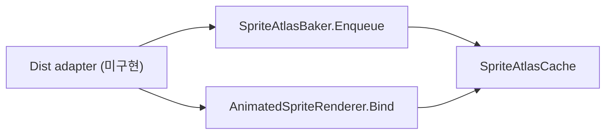

# SpriteBaker

> LLM/에이전트용 벤더 엔진 SSOT.
> 인덱스: `docs/README.md`
> **SpriteBaker를 쓰거나 Dist에 연동하기 전에 이 문서를 읽는다.**

경로(코드): `Assets/Plugins/SpriteBaker/`

## 역할

런타임에 3D 스키닝 캐릭터 애니메이션을 2D 스프라이트 아틀라스로 베이크하고,
`AnimatedSpriteRenderer` 쿼드로 재생한다. Dist 게임플레이 SSOT가 아니다.

## 책임 경계

| 층 | 소유 | 허용 |
|----|------|------|
| `Assets/Plugins/SpriteBaker` | 벤더/포크 | 버그·성능·업스트림 동기만. Dist 규칙·타임·맵 API 금지 |
| Dist 어댑터 | Dist | `Enqueue` / `Bind` / `SetRow` / `SetFacing` / 캐시 키 / 3D↔스프라이트 전환만 |
| `Demo/` | 검증용 | 본편 씬·프리팹에 직접 배선 금지 |

## 진입 API

- `SpriteAtlasBaker.Instance.Enqueue(SpriteBakeRequest)`
- `SpriteAtlasCache.TryGet` / `Evict`
- `AnimatedSpriteRenderer.Bind` + `SetRow` / `SetFacing`

템플릿 머티리얼: `Resources/SpriteBakerAtlasUnlitTemplate.mat`  
(에디터 `EnsureAtlasTemplateMaterial`이 WebGL 스트리핑 방지용으로 생성·유지)

## MUST NOT

- SpriteBaker를 Dist 폴더/네임스페이스로 흡수
- Demo를 본편 소비자로 승격
- Dist가 베이크 큐·카메라·아틀라스 내부 구현을 직접 조작
- asmdef 추가·네임스페이스 변경 (승인 전)

## Pending

- Dist 어댑터 (캐릭터 뷰 1 소비자)
- Runtime/Editor asmdef 분리
