# SpriteBaker

> LLM/에이전트용 벤더 엔진 SSOT.
> 인덱스: `docs/README.md`
> **SpriteBaker를 쓰거나 Dist에 연동하기 전에 이 문서를 읽는다.**

경로(코드): `Assets/Plugins/SpriteBaker/`  
asmdef: `SpriteBaker` (+ `SpriteBaker.Editor`)

## 역할

에디터 **베이크 전용 씬**에서 3D 스키닝 캐릭터 애니메이션을 2D 스프라이트 아틀라스로 **사전베이크**하고,
런타임은 Output 시트만 `Register` → `AnimatedSpriteRenderer`로 재생한다.
Dist 게임플레이 SSOT가 아니다.

## 책임 경계

```mermaid
flowchart LR
    BakeScene["BakeScene Runner settings"] --> Enqueue["SpriteAtlasBaker.Enqueue"]
    Enqueue --> Export["PNG / Mat / SheetAsset"]
    Export --> Catalog["SpriteBakerCatalog"]
    Catalog --> Register["SpriteAtlasCache.Register"]
    Register --> View["CharacterSpriteBakerView"]
    View --> ASR["ASR Tick ExternalClock"]
```

| 층 | 소유 | 허용 |
|----|------|------|
| `Assets/Plugins/SpriteBaker` | 벤더/포크 | `Register` · ASR `Tick`/`ExternalClock` · `Enqueue` · `KeepCpuReadable`. Dist 타임·맵 API 금지 |
| Dist 어댑터 | Dist | BakeScene Runner · Catalog/Sheet · `CharacterSpriteBakerView` |
| `Demo/` | 검증용 | 본편 씬·프리팹에 직접 배선 금지 |

## 체감 속도 vs 게임 시계

| 개념 | 조절 위치 | 재베이크 |
|------|-----------|----------|
| **durationScale** | BakeScene Runner (클립 오버라이드 가능). `FrameDuration = (1/FrameRate) × durationScale` | **필요** |
| **TimeScaleService** | 런타임 채널 → ASR `Tick(delta)` (일시정지/슬로우) | 불필요 |

런타임 **playbackSpeed 필드/UI 없음** — 의도된 길이는 베이크 Output에 고정.

## 베이크 전용 씬 (Dist)

씬: `Assets/Dist/Scenes/SpriteBakerBake.unity`  
호스트: `SpriteBakerBakeSceneRunner` (씬에 설정 전부 — CaptureRecipe SO 없음)

| 필드 | 내용 |
|------|------|
| Character Prefab | 스키닝 메시 FBX |
| Sample path | 예: `Root` (암ature). 비우면 프리팹 루트 |
| Clips | Idle/Run/Jump 등 `AnimationClip` + Loop / durationScale |
| Bake | yaw8 + iso pitch `35.264°`, frame size/rate |
| Output | 폴더 + optional Catalog upsert |
| Play | `Enqueue` → `IsReady` → PNG/Sheet export → (옵션) Play 종료 |

메뉴:
- `Dist/SpriteBaker/Open Bake Scene`
- `Dist/SpriteBaker/Play Bake Scene`

테스트 스캐폴드: `Assets/Dist/SOData/SpriteBaker/Input/`, `Output/_Test/`

런타임 소비 SO만 유지: **Catalog** · **SheetAsset** (아틀라스/머티리얼).

## 진입 API

### 플러그인 (Dist가 호출하는 최소 표면)

- `SpriteAtlasBaker.Enqueue(SpriteBakeRequest)` — Play Mode 사전베이크 (프레임 yield)
- `SpriteBakeRequest.KeepCpuReadable` — PNG export용 CPU 픽셀 유지
- `SpriteAtlasCache.Register` / `TryGet` / `Evict` — Register는 프로젝트 에셋 비소유
- `AnimatedSpriteRenderer.Bind` + `SetRow` / `SetYaw` + `Tick` + `ExternalClock`

### Dist

- `SpriteBakerBakeSceneRunner` + 위 메뉴
- `SpriteBakerCatalog.RegisterAll`
- `CharacterSpriteBakerView.Play(animId)` — 원샷 완료 → Idle, 재생 중 재입력 무시

템플릿 머티리얼: `Resources/SpriteBakerAtlasUnlitTemplate.mat`  
(에디터 `EnsureAtlasTemplateMaterial`이 WebGL 스트리핑 방지용으로 생성·유지)

## MUST NOT

- SpriteBaker를 Dist 폴더/네임스페이스로 흡수
- Demo를 본편 소비자로 승격
- Dist가 베이크 큐·카메라·아틀라스 **내부 구현**을 직접 조작
- Dist 편의로 bake 루프·Sample·skin flush를 **위 API 밖에서** 멋대로 패치
- 런타임 배속 슬라이더/필드 추가 (durationScale은 BakeScene·재베이크)
- Unity IMGUI 전용 `CustomEditor` 신규 (Odin `[Button]`만). `OdinSerializer` 금지
- CaptureRecipe / Dist `BakeSync` 에디터 경로 재도입 (동의 없이)

## Pending

- FacingAnim Mode 전면 교체 / Mecanim CrossFade 연동
- 런타임 Enqueue·디스크 캐시 (본 경로는 사전베이크 Output만)
