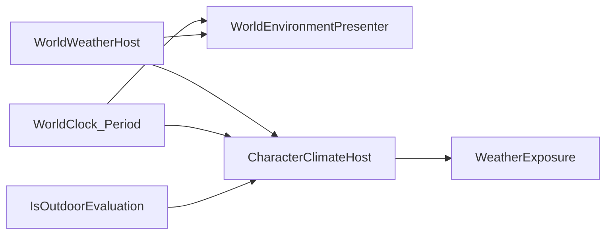

# Weather (Dist)

> Dist 날씨 SSOT. 체온·습윤 공식은 [`body/BODY.md`](../body/BODY.md) · Gear Phase G는 [`equipment/GEAR.md`](../equipment/GEAR.md).  
> 시계·Period: [`time/TIME.md`](../time/TIME.md). 농사 배율: [`farming/FARMING.md`](../farming/FARMING.md).

---

## Ship status

| Layer | Status |
|-------|--------|
| Phase G ambient (`WeatherExposure.Resolve`) | Shipped |
| `WorldWeatherHost` Kind SSOT + `TryGetKindAt` stub | Shipped |
| `WeatherKind.Snow` | Shipped |
| Global season scheduler (`WorldWeatherSettings`) | Shipped (Phase D 전 임시) |
| Period lighting + Kind VFX (`WorldEnvironmentPresenter`) | Shipped |
| XZ Perlin weather field + BN climate bake | **Parked (Phase D)** |

---

## Boundary SSOT

| Concern | Owner |
|---------|--------|
| World Kind | `WorldWeatherHost.CurrentKind` / `SetKind` |
| Spatial sample API | `WorldWeatherHost.TryGetKindAt(x, z)` — Phase 1 stub returns `CurrentKind` |
| Period / outdoor → ambient | `CharacterClimateHost` → `WeatherExposure.Resolve(kind, period, outdoor)` |
| Gear UI forward | `PlayerGearHost.WorldWeatherKind` (read-only forward) |
| Farm grow factor | `MapPlantService` via `TryGetKindAt(cell.x, cell.z)` |
| Lighting + VFX | `WorldEnvironmentPresenter` (Period + Kind; mute when indoor) |

---

## WeatherKind

| Kind | Ambient °C (outdoor Day) | Wetness/s | Farm grow factor |
|------|--------------------------|-----------|------------------|
| Clear | `ClearAmbientTempC` (18) | 0 | 1 |
| Rain | `RainAmbientTempC` (10) | 0.02 | 0.75 |
| Wind | Clear − `WindChillDegreesC` (4) | 0.002 | 1.25 |
| Snow | `SnowAmbientTempC` (−4) | 0.004 | 1.25 |

Outdoor Night/Dawn offsets: [`WeatherExposure`](../../Assets/Dist/Scripts/Gameplay/Gear/WeatherExposure.cs) (`NightAmbientOffsetC` / `DawnAmbientOffsetC`). Indoor ignores kind wetness and period offsets.

Snow Night ≈ −10°C → frostbite onset (`FrostbiteOnsetTempC` 0°C) reachable — see BODY.md.

---

## Global scheduler (temporary until Phase D)

`WorldWeatherHost` listens to `WorldClock.MinuteChanged`.

- After `WorldWeatherSettings.MinDurationWorldMinutes` on the same Kind, rolls `PickKind(season, seed)`.
- Season weights: Spring/Summer/Autumn/Winter on `WorldWeatherSettings`.
- Disable via `SchedulerEnabled` (Environment Runtime Debug).

**Phase D:** scheduler stops setting Kind directly; adjusts field seed/amplitude or global bias only. Consumers keep `TryGetKindAt`.

---

## Scene / MCP

| Menu | Role |
|------|------|
| `Dist/MCP/Time/Ensure World Weather Settings Asset` | `WorldWeatherSettings.asset` |
| `Dist/MCP/Time/Ensure World Weather In Open Scene` | `WorldWeatherHost` + `WorldEnvironmentPresenter` + VFX children under System/Time |
| `Dist/MCP/Time/Setup Canvas In Open Scene` | Also wires weather stack |
| `Tools/Environment Runtime Debug` | Kind / Scheduler / Period / Outdoor |

Default settings path: `Assets/Dist/SOData/Gameplay/Time/WorldWeatherSettings.asset`.

---

## Phase D — XZ grid + Perlin (Parked)

**Goal:** sample weather at world cell `(x, z)` so large maps / region travel feel spatially varied. BN `regional_map_settings` / `weather_type` feed bake + Kind buckets — not a full `weather_gen.cpp` port.

### Field design

- Low-res grid: `WeatherFieldCellSize` (e.g. 8–16 tiles). Y ignored (2D field).
- Inputs: `worldSeed` + `dayIndex` + `WorldSeason` + optional `RegionClimateSettings` (bake).
- Noise layers (example): `temperatureNoise`, `humidityNoise`, `windNoise`.
- `WeatherField.Sample(x, z)` → continuous values → discretize to `WeatherKind` (or BN bucket table).
- Refresh slowly (world-minute boundary or every N minutes) — no per-frame full-field Perlin.

### BN data (when promoted)

| BN | Dist |
|----|------|
| `regional_map_settings.weather` | `RegionClimateSettings` SO / bake JSON |
| `weather_type` (15+) | Kind buckets + optional `sight_penalty` / `ranged_penalty` later |
| `weather_gen` continuous | Perlin + season base (lightweight) |
| Overmap cell weather | XZ sample (works without overmap) |

Bucket example: `clear/sunny/cloudy`→Clear, `drizzle/rain/thunder`→Rain, high-wind→Wind, `flurries/snowing/snowstorm`→Snow.

### Upper dependencies (why Parked)

| Dependency | Dist now | Note |
|------------|----------|------|
| Map XZ extent | Single local map; camera-only chunk stream | Grid weather needs **felt spatial range** or region travel — primary Parked reason |
| Overmap / multi-region | BN mapgen/overmap Parked | Optional; single Region OK to start |
| Chunk streaming | Mesh unload; model stays in memory | Weather field lives in **model/cache memory**, not chunk meshes |
| Indoor | `IsOutdoorEvaluation` | Sample applies outdoors; indoor rules unchanged |
| Save stack | Not shipped | Seed + world minute (later low-res field DTO) after save design approval |

### Parked start gate

1. This document’s Phase D design accepted.
2. Map XZ exceeds single-screen feel **or** region travel is on the roadmap.
3. (Optional) BN `regional_map_settings` + `weather_type` bake promoted.

### Migration parity (global → field)

| Before (global scheduler) | After (Phase D) |
|---------------------------|-----------------|
| `CurrentKind` is world Kind | `CurrentKind` = player-cell sample (HUD/debug) |
| Scheduler sets Kind | Scheduler tweaks field params / bias |
| `TryGetKindAt` stub | Real `WeatherField` sample |

Checklist: [`.claude/checklists/migration-parity.md`](../../.claude/checklists/migration-parity.md).

### Chunk streaming

[`tile-chunk-streaming.mdc`](../../.cursor/rules/tile-chunk-streaming.mdc): desired chunks = camera footprint only. Weather field must **not** reintroduce player-focus streaming. Field storage is independent of mesh spawn.

---

## Related

- Debug outdoor override: `CharacterClimateHost.DebugOutdoorOverride` (editor Play)
- Save/load of Kind: Pending with world save stack ([`PLAN.md`](../PLAN.md))
